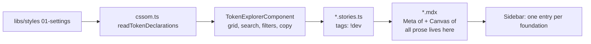

# Foundations: MDX-consumes-CSF documentation pattern

## What the Bridgestone setup does, and what we do today

Their pattern: a CSF file owns the Angular component and stories; an MDX file attaches with `<Meta of={Stories} />` and pulls in canvases with `<Story of={Stories.X} />`; prose lives outside the component; some foundations get several MDX pages off one CSF (`Base Palette` + `Semantic Palette`, `Generic Typography` + `Semantic Typography`).

We currently diverge in three ways:

- Prose lives in `docs.description.component` / `docs.description.story` strings inside the CSF metas, and long-form guidance lives in [libs/ui/src/storybook/token-guidance.ts](libs/ui/src/storybook/token-guidance.ts) which `TokenExplorerComponent` renders *inside the canvas*.
- Seven foundations use `tags: ['autodocs']` (auto-generated page), six use `tags: ['!autodocs']` (no docs page at all), and only `iconography` follows the MDX pattern.
- No table of contents, and every CSF story is listed individually in the sidebar.

Two things from the reference we deliberately do **not** copy: `temp_storybook_styles/_foundations-tokens.scss` is 3,100 lines of hand-maintained `@extend %u-border--…` mirrors of every utility class, which is the duplication [.ai/rules/10-css-ssot.md](.ai/rules/10-css-ssot.md) forbids and which our CSSOM readers already replace; and the `./x.md?raw` + `<Markdown>` indirection, since inline MDX prose is one less moving part and needs no raw-loader config.

## Target flow



## 1. Global Storybook config

In [libs/ui/.storybook/preview.ts](libs/ui/.storybook/preview.ts), add the TOC alongside the existing `backgrounds` / `layout` parameters:

```ts
docs: {
  toc: {
    headingSelector: 'h2, h3',
    title: 'On this page',
  },
},
```

`headingSelector` matters: our pages use `h1` for the title and `h2`/`h3` for sections, and story-block headings are excluded by default.

## 2. Hide CSF stories, let MDX be the page

Every foundation CSF meta gets `tags: ['!dev']`, replacing whatever `autodocs` / `!autodocs` it has now. `dev` only controls sidebar rendering, so stories stay in the index and still resolve inside `<Canvas of={…}>`. An attached MDX supplies the docs entry on its own — no `autodocs` needed — which is already proven by [libs/ui/src/foundations/iconography.mdx](libs/ui/src/foundations/iconography.mdx).

Risk to verify first, before touching 15 files: confirm that `!dev` at meta level does not also strip the attached MDX docs entry from the sidebar. Check with one file (`spacing`). If the MDX entry disappears, the fallback is to apply `!dev` on each individual story export instead of the meta.

## 3. Page inventory

Split only where a foundation has genuinely distinct stories; single page everywhere else. Existing top-level titles stay as they are to avoid needless URL churn.

- `Foundations/Colors/Semantic` and `Foundations/Colors/Ramps` — needs two new stories in [colors.stories.ts](libs/ui/src/foundations/colors.stories.ts) using the explorer's existing `groups` input to scope semantic roles vs numbered ramps. `StubbedProvidePlectrum` becomes a closing canvas on the Semantic page under a "Pre-bootstrap fallback" heading.
- `Foundations/Typography/Roles` and `Foundations/Typography/Primitives` — the `Roles` and `Primitives` stories already exist.
- Single page, one canvas: `Spacing`, `Radius`, `Shadows`, `Transitions`, `Focus`, `Token contracts`.
- Single page, many canvases (the `grid/Docs.mdx` shape, prose between each): `Borders` (6), `Flex Grid` (14, plus `<ArgTypes of={Stories} />`), `Grid (CSS)` (10, plus `ArgTypes`), `Layout` (7), `Scroll Shadow` (4).
- `Iconography` — MDX already exists; only add `!dev` and align headings to the TOC selector.

Blocks import from `@storybook/addon-docs/blocks` (Storybook 10 removed `@storybook/blocks`). `@storybook/addon-designs` is not installed, so Figma references stay as markdown links rather than `<Figma>` embeds.

## 4. Strip prose out of the explorer

Per the "all prose to MDX" decision, `TokenExplorerComponent` becomes purely interactive.

- [token-explorer.component.html](libs/ui/src/storybook/token-explorer.component.html): delete the `c-token-explorer__guide` header (summary, How to use, When to reach for it, example, source files) and the `section.when` paragraph. Keep the playground controls but drop their explanatory paragraphs — the typography `<label>` stays since it labels an input; the motion and focus paragraphs move to MDX.
- [token-explorer.component.ts](libs/ui/src/storybook/token-explorer.component.ts): drop the `guidance()` computed and the `TOKEN_GUIDANCE` import.
- Replace `token-guidance.ts` with a slim `token-sections.ts` carrying only `{ label, sections: [{ key, label }] }` per category. That is section ordering and labelling, which rule 10 explicitly allows as static metadata; every prose field (`summary`, `howTo`, `use`, `avoid`, `example`, `source`, `classes`, section `when`) migrates into the MDX pages.
- [token-contracts.stories.ts](libs/ui/src/foundations/token-contracts.stories.ts): its inline `<header>` reuses `c-token-explorer__guide` / `__rules` / `__rule--use` for the Figma / code-owned / not-declared legend. That legend moves to MDX prose too, so the header goes.
- Then remove the orphaned `__guide`, `__summary`, `__panel*`, `__steps`, `__rules`, `__rule*`, `__example`, `__meta`, `__section-when` blocks from [_components.token-explorer.scss](libs/styles/src/06-components/_components.token-explorer.scss) and any now-unused tokens in [_settings.token-explorer.scss](libs/styles/src/01-settings/_settings.token-explorer.scss).
- Update [token-explorer.component.spec.ts](libs/ui/src/storybook/token-explorer.component.spec.ts) for the removed guidance rendering.

## 5. Verify and clean up

Run `ng test ui`, `npm run tokens:lint`, `npm run tokens:check-prefix`, and a Storybook build. Confirm in the browser that each foundation appears once, the TOC lists its sections, canvases render, and copy-to-clipboard still toasts.

Finally delete `libs/ui/.storybook/temp_guidelines/` and `libs/ui/.storybook/temp_storybook_styles/` — reference material shouldn't stay in the repo once the pattern is ported.
