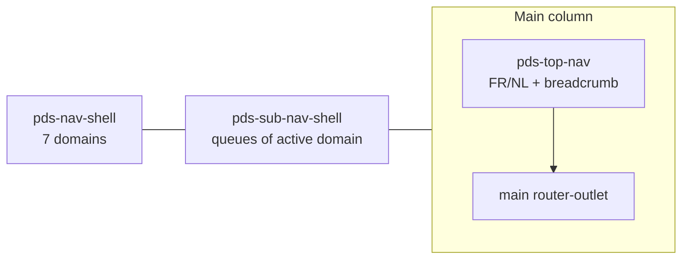

# iGED app POC

Source of truth for product IA: [danielbodi/iged](https://github.com/danielbodi/iged) ([live](https://danielbodi.github.io/iged/)). Do **not** copy its local theme, ITCSS, or custom `first-level-nav` / `second-level-nav` / `top-bar`. Rebuild on our shell and Plectrum.

Decisions already made:

- Language control is **optional on shared `pds-top-nav`**, shown in iGED, hidden in iSHARE.
- POC includes **both live screens** plus the **full first/second-level nav** (other items are stubs).
- No iGED logo SVG — domain icons are Bootstrap classes.

## Target shell



- **NavShell** = iGED domains (Dashboard, A.C., Soins de santé, Médical, Indemnités, Juridique, Population) with `iconSource: 'class'` (e.g. `bi bi-calculator`). This is **not** the iCRM/iShare app switcher — that would flatten Indemnités and lose AT & DC as a section.
- **SubNavShell** = sections of the active domain. Indemnités maps 1:1 to existing `SubNavShellSection`s (`AT & DC`, `AUTRES`, `ENCODAGE`, `GESTION`). Stub domains get one “coming soon” section, not the old `MOCK_FLAT_ITEMS` list.
- **TopNav** = existing header; `showSubNavToggle` true; `showLocaleSwitcher` true only in iGED.
- Layout clones the iSHARE frame in [apps/ishare/src/app/layout/app-shell.component.html](apps/ishare/src/app/layout/app-shell.component.html), plus SubNavShell (iSHARE hides it).

## Runtime FR/NL (shared, then app copy)

Today [`PDS_LOCALE`](libs/ui/src/lib/i18n/locale.ts) is a static token and `injectPdsMessages` returns a snapshot — Storybook remounts, apps cannot switch live.

1. Add `PdsLocaleService` in `libs/ui/src/lib/i18n/`: `locale` signal, `setLocale()`, persist `localStorage` key `pds-locale`, set `document.documentElement.lang`. Seed from stored value, else `PDS_LOCALE` (default **fr**).
2. Change `injectPdsMessages` to return `computed(() => dictionary[locale()])`. Update the 7 consumers (`top-nav`, `list`, `profile-card`, `profile-drawer`, `copyable-text`, `delay-prediction-card`, `transactions-cics-modal`) from `messages.x` → `messages().x`. Specs that only `provide: PDS_LOCALE` stay valid.
3. On `pds-top-nav`, add `showLocaleSwitcher` (default `false`). Render PrimeNG `p-selectbutton` in `c-top-nav__end` **after help, before avatar**, options `FR` / `NL`, `allowEmpty` false. It calls `PdsLocaleService.setLocale`. Add FR/NL aria-labels in [top-nav.i18n.ts](libs/ui/src/lib/top-nav/top-nav.i18n.ts). Update [top-nav.metadata.ts](libs/ui/src/lib/top-nav/top-nav.metadata.ts), stories, and unit tests. iSHARE leaves the input unset.
4. iGED screen/nav copy lives in **app dictionaries** (`apps/iged/src/app/i18n/`), keyed by `PdsLocale` — not in `libs/ui`. POC-quality Dutch is fine; you will verify later.
5. When locale changes, also update PrimeNG translation (paginator, etc.) via the PrimeNG config service. `providePlectrum()` does not set locale today.

No `@angular/localize`, no full reload.

## App scaffold (`apps/iged`)

Mirror **iSHARE**, not iCRM: [angular.json](angular.json) project, [apps/ishare/tsconfig.app.json](apps/ishare/tsconfig.app.json) paths, `prefix: app`, styles = Bootstrap Icons + `libs/styles/src/main.scss` only. No `apps/iged` stylesheet, no copied `theme/`.

```
apps/iged/src/app/
  app.config.ts          # providePlectrum(), provideRouter, registerPlectrumIcons
  app.routes.ts          # shell parent + children
  layout/app-shell.*     # nav-shell + sub-nav-shell + top-nav
  layout/nav.config.ts   # 7 domains + sections (from iged nav-config, translated)
  i18n/*.ts              # fr/nl dictionaries
  overview/              # Vue d’ensemble
  document-queue/        # AT & DC Demande de paiement
  stub/                  # empty-state for unimplemented queues
```

Scripts: `start:iged`, `build:iged` in [package.json](package.json). Register `iged` in [tools/scripts/generate-index.ts](tools/scripts/generate-index.ts) `workspace.apps` (the generator keeps the existing apps list if present — it will not pick up iGED unless the script lists it). Then `npm run generate-index`.

## Routes and screens

| Path                                                                                          | Screen                                                                   |
| --------------------------------------------------------------------------------------------- | ------------------------------------------------------------------------ |
| `/`                                                                                           | Redirect to `/indemnites/at-dc-demande` (same default as the source app) |
| `/dashboard/vue-ensemble`                                                                     | Vue d’ensemble                                                           |
| `/indemnites/at-dc-demande`                                                                   | Document queue                                                           |
| `/dashboard/mon-panier`, `/dashboard/abonnements-alertes`, other Indemnités ids, stub domains | `StubPage` + `pds-empty-state`                                           |

**Vue d’ensemble** (compose, do not invent a `pds-file-card`):

- `p-tabs`: Avancement de la journée / Indicateurs de traitement (same card grid for the POC, as the source).
- Favorites + “other files” grouped by domain.
- KPI cards via `p-card` / `p-tag` / `o-flex` (Reçus, Attribués, En traitement, Incomplets, Rappels, Clôturés). Mock numbers in-app.
- TopNav search filters cards. Favorite star is in-memory.

**Document queue**:

- Page title + `pds-toolbar` (not the source’s custom toolbar / saved-filter overlay). Simplified filters: search (NISS / name), Doctype, O.A., Statut, a couple of toggles, Apply.
- Document list = PrimeNG `p-table` + paginator (do **not** use `pds-list`). Columns from the source: O.A., Ter., Source, Identification, Nom, Type, dates, État. Small mock set. Row actions as PrimeNG text buttons (Voir / Ouvrir). Card overflow menu optional via `p-menu`.

Stay **app-local**. Do not run `pds:component` or add `Patterns/iGED` Storybook entries for these screens.

## GitHub Pages + CI

Current deploy ([.github/workflows/deploy-ishare-pages.yml](.github/workflows/deploy-ishare-pages.yml)) puts iSHARE at the site root and Storybook at `storybook/`.

```
npx ng build iged --configuration=production --base-href=/solidaris-plectrum/iged/
# copy dist/apps/iged/browser → dist/pages/iged/
```

Public URL: [https://solidaris-danielbodigil.github.io/solidaris-plectrum/iged](https://solidaris-danielbodigil.github.io/solidaris-plectrum/iged)

GH Pages only honors the **root** `404.html` (today a copy of the iSHARE index). Inject a short script at the top of that 404: if the path contains `/iged`, stash the remainder in `sessionStorage` and `replace` to `/solidaris-plectrum/iged/`. iSHARE deep links stay unchanged (script no-ops; Angular still boots from the original URL). iGED reads the stash on bootstrap and `navigateByUrl`.

CI ([.github/workflows/ci.yml](.github/workflows/ci.yml)): also `ng build iged`. Coverage can stay `ui` + `ishare` until iGED has tests.

Out of scope for this POC: adding iGED to iSHARE’s NavShell (needs an `href` on `NavItem`; do not block).

## What we will not port

- Local `src/theme/` and `src/styles/` from iged
- Custom shell components, expandable-search, saved-filter overlay
- Notifications / messages badges, extra top-bar action icons
- Auth, APIs, real data
- An iGED logo
- Promoting file-card / document table into `libs/ui`

## Verification

- `ng serve iged` — switch FR/NL (nav, screens, TopNav chrome, table paginator); both real screens; stub items; sub-nav follows domain.
- `ng build iged --configuration=production --base-href=/solidaris-plectrum/iged/` succeeds.
- `npm run contracts:check` after TopNav metadata change; `npm run generate-index` dirty only as expected.
- Existing TopNav / i18n unit tests and Storybook locale toolbar still work.
- Browser: language toggle on the right of TopNav; no iGED logo in the rail.
