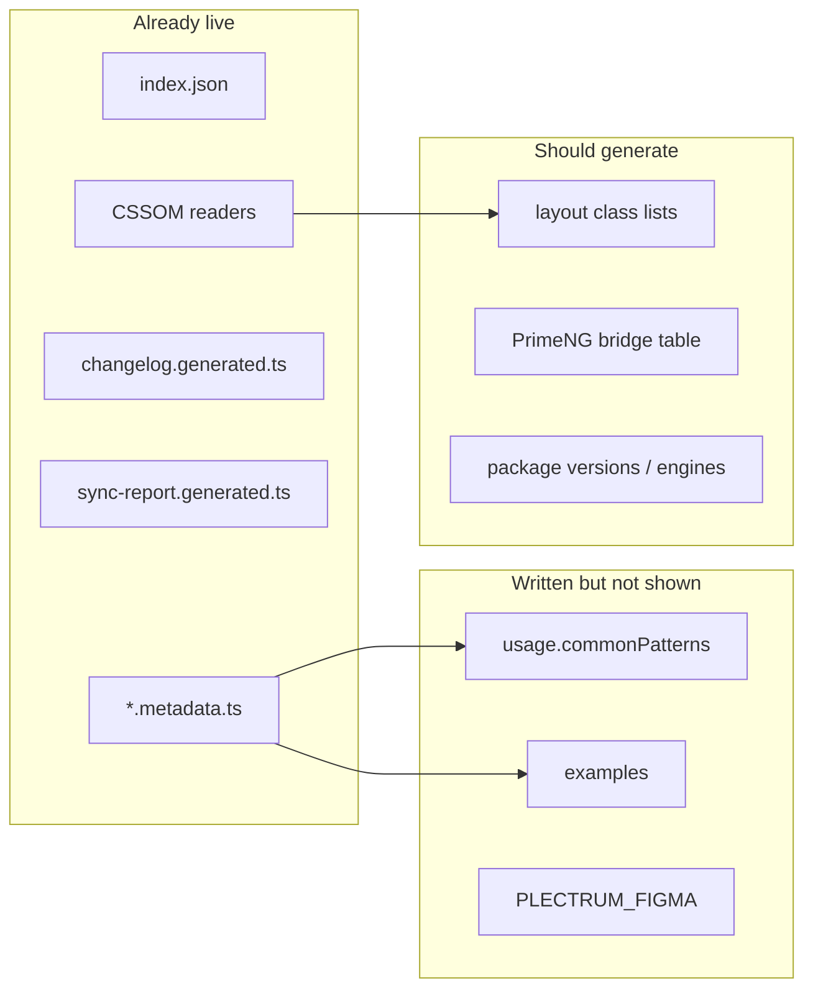

# Storybook docs audit

> **Status, 22 September 2026.** Folded into [storybook_10_10_programme](../storybook_10_10_programme_e768e37b.plan.md). Done here: `solidaris-nx` fix, versions read from `package.json`, Figma map page (`PrimeNG/UI kit` from `plectrum-figma.ts`), Introduction Hero/FirstHour (replaced by the Designers/Developers figure). Superseded by owner decisions: the component MDX order is now Status → primary canvas → Usage → Variants → Anatomy (see `.ai/rules/03-storybook.md`), and Overview does carry a short "Words we use" glossary. Everything else in sections 1 and 2 is carried by W0 and W1 of the programme.

Full-catalogue read of 14 process pages, 17 foundations pages, 20 component pages, and 5 PrimeNG galleries. Storybook MCP was down, so this plan is source-based. After implementation, verify in a running Storybook (`npm run storybook`) — a screenshot is not enough.

## Voice — match today’s Contribute rewrite

Do not invent a new “plain language” register. The expected tone is the copy written today on [Get started / Contribute](libs/ui/src/docs/get-started-contribute.stories.ts) (`ProposeEarly`, `AlreadyBuilt`, `DevLoop`) and [Use Plectrum in an app](libs/ui/src/docs/get-started-consume.stories.ts) (`BeforeYouInvent`). See [Core team process docs](cd5d9f7d-a9c8-47d5-b096-471029c84872).

**Do this**

- Say what to do, then stop. One action per sentence.
- Second person: “you”, “your team”, “they do not import yours.”
- Spoken English. “Talking first is cheaper than two teams building the same thing.”
- Keep names the reader already uses: PrimeNG, Core, Storybook, Figma, proposal, Candidate.
- Commands stay when they *are* the action (`npm run pds:component`). Drop the pipeline around them.
- Positive instruction first; a prohibition only when it prevents a real mistake, with the alternative next to it.

**Do not do this**

- Swap jargon for other jargon (“single source of truth”, “stylesheet layer placement”, “BEM mixes”).
- Pack a step with internals (ITCSS, BEMIT, CSSOM, MCP, `index.json`, `rule 07 §3`, `@forward`).
- Write like a protocol or an audit note (“the audit measured 20 of 39…”).
- Rewrite the Contribute / Before you invent steps again — they are the reference.

Still true from [`.ai/rules/03-storybook.md`](.ai/rules/03-storybook.md): noun headings, no narrative framing, no rhetorical questions. The playgrounds plan C05 table is supporting (e.g. “Combine layout classes on the element”, not “object-class BEM mixes”) — today’s stories win if they disagree.

**Gold standard vs leftover on the same pages**

| Keep (today’s voice) | Still old voice — rewrite to match |
|----------------------|-------------------------------------|
| `DevLoop`, `ProposeEarly`, `AlreadyBuilt` | `AppLayer` — “drift stays contained by tooling — not by trust” plus `01-settings` / `rule 09 §9` |
| `BeforeYouInvent` | `InstallFlow` — packed install/wire/boot sentences |
| | Introduction `Hero` / `FirstHour` — “one source of truth”, “A sample application is used to verify” |
| | `Roles` cards — denser than DevLoop; tighten, do not empty |

**Shared glossary:** optional, and only for terms that must stay on maintainer pages (ITCSS, CSSOM, DTCG). It does not replace writing like Contribute. Do not add a Glossary to Introduction or What’s new just to host acronyms.

---

## 1. Copy rewrite

Match leftover pages to the Contribute voice. A shared [`glossary.ts`](libs/ui/src/docs/glossary.ts) figure is optional on pages that already have a Glossary (CSS architecture, Token pipeline, AI strategy, Writing stories) — fill gaps there, do not add new Glossary sections to landing pages.

When a term must stay, say it in a clause, then move on: “Agents read typed contracts first — metadata files, a generated index, and short protocols.” Do not open with the acronym.

### Process pages — leftover copy only

| File | Adapt (in today’s voice) |
|------|--------|
| [`introduction.stories.ts`](libs/ui/src/docs/introduction.stories.ts) | Hero: “Shared components, tokens and layout for every Solidaris app.” FirstHour: “Install the packages, add the stylesheet, and call `providePlectrum()`. A sample app is there to check the install.” Then “Render `pds-form-field` around a PrimeNG text input — the full example is on Use Plectrum in an app.” |
| [`introduction.mdx`](libs/ui/src/docs/introduction.mdx) | Maintainers CSS line: “Where styles live, how classes are named, and how we theme PrimeNG.” Core / Candidate: “Core is shared. Candidate and app-specific work stays with the app team until the core team promotes it.” |
| [`get-started-consume.stories.ts`](libs/ui/src/docs/get-started-consume.stories.ts) `InstallFlow` | Same voice as `BeforeYouInvent`. “Install the three `@solidaris` packages and the PrimeNG peers. Until the first release, use the packed tarballs from `npm run pack:libs`.” Do not expand APF/ITCSS on this page. |
| [`get-started-contribute.stories.ts`](libs/ui/src/docs/get-started-contribute.stories.ts) `AppLayer` + MDX | Keep `DevLoop`. Rewrite AppLayer: “While your team owns it, lint and token checks still apply — CI fails hex, px and unknown token names.” Fix `cd solidaris-nx` → `solidaris-plectrum`. Delete the dated September 2026 component list — Component status already reads `index.json`. |
| [`story-authoring.mdx`](libs/ui/src/docs/story-authoring.mdx) L79 | Delete the migration-ledger / “temporary home” sentence. |
| [`writing-stories-figures.stories.ts`](libs/ui/src/docs/writing-stories-figures.stories.ts) | Delete “20 of 39 use cases…” |
| [`ai-strategy.mdx`](libs/ui/src/docs/ai-strategy.mdx) + stories | Split the long Process paragraph. Architect card: “Keeps one catalogue and puts styles in the right folder.” Say “typed contracts” before CDD. |
| [`css-architecture.mdx`](libs/ui/src/docs/css-architecture.mdx) | “Paint order (one source): PrimeNG defaults, then the Plectrum theme…” Nested block rule: “Do not nest blocks. Use `c-drawer__profile-name`, not `c-profile-drawer__name`.” |
| Token pipeline trio | Split the long transport rows. CSS-first: “Use `var(--pds-*)` and the layout classes. Do not call PrimeNG theme helpers from component code.” Dark mode: “Some colours stay on the Figma fallback. They will not change in dark mode.” Child pages open with 2–3 sentences and link back — do not repeat Organization vs Enterprise. |
| [`token-sync-status.mdx`](libs/ui/src/docs/token-sync-status.mdx) | “Each successful sync saves a report here. You do not need GitHub to read it.” Preset coverage: “Every token the theme needs exists in the Figma export.” |
| [`whats-new.mdx`](libs/ui/src/docs/whats-new.mdx) | “Major is breaking, minor is a feature, patch is a fix.” |
| [`releases.mdx`](libs/ui/src/docs/releases.mdx) | “Changesets is the release tool. It bumps the three `@solidaris` packages together.” |
| [`primeng-customizations.mdx`](libs/ui/src/docs/primeng-customizations.mdx) | “This page lists the PrimeNG changes we chose to make. Everything else stays stock, themed by `providePlectrum()`.” Drop “rule 09 §13” from the Tag row. |

### Foundations — designer-facing + rule 10

| File | Adapt |
|------|--------|
| [`radius.mdx`](libs/ui/src/foundations/radius.mdx) L10 | **Forbidden value restatement.** Remove the 6px / 8px line and the old-SCSS history. “Use a named stop. The preview shows the real corner.” |
| [`spacing.mdx`](libs/ui/src/foundations/spacing.mdx) L8 | Do not restate `0.5rem = 7px`. “Spacing is built on the 14px root. The scale below is live.” |
| [`layout.mdx`](libs/ui/src/foundations/layout.mdx) L15 vs L183 | **Contradiction.** One breakpoint table, rem from [`_settings.breakpoints.scss`](libs/styles/src/01-settings/_settings.breakpoints.scss). Optional computed px from `getComputedStyle`. Plectrum is `1rem = 14px` — do not paste Bootstrap’s 768px table. |
| [`layout.mdx`](libs/ui/src/foundations/layout.mdx), [`flex-grid.mdx`](libs/ui/src/foundations/flex-grid.mdx) | “Add these classes in the HTML, next to `o-flex`. Do not write spacing in the component stylesheet.” Delete inline inventories (`Scale: 0 0-25…`). |
| Colors / Token finder | “In app code, use a named role like text, not a palette step like gray-900.” Hybrid: “Some colours follow the theme. Toggle the toolbar to see which ones change.” |
| [`typography-primitives.mdx`](libs/ui/src/foundations/typography-primitives.mdx) | “Letter spacing is zero everywhere.” |
| [`focus.mdx`](libs/ui/src/foundations/focus.mdx) | “Show the ring for keyboard users, not every mouse click.” |
| [`scroll-shadow.mdx`](libs/ui/src/foundations/scroll-shadow.mdx) | “The edges fade as you scroll. No JavaScript. Chrome and Edge today; other browsers show a normal scroll.” |
| Elevation vs Shadows | “Pick the shadow for the surface (card, panel, drawer), not the one that looks darkest.” One line: Elevation is the class, Shadows is the token list. |

### Component metadata (lead + usage only)

Leads should read like a Contribute step: what it is and when to reach for it. Move `control.invalid && …`, Clipboard API, and `--p-accordion-*` into `behavior` / `aiHints`.

Priority leads: [`form-field.metadata.ts`](libs/ui/src/lib/form-field/form-field.metadata.ts) (drop `control.invalid && …` from designer-facing text), [`list.metadata.ts`](libs/ui/src/lib/list/list.metadata.ts), [`accordion.metadata.ts`](libs/ui/src/lib/accordion/accordion.metadata.ts), [`copyable-text.metadata.ts`](libs/ui/src/lib/copyable-text/copyable-text.metadata.ts) (`Clipboard API` is fine in Behavior, not the lead), [`delay-prediction-card.metadata.ts`](libs/ui/src/lib/delay-prediction-card/delay-prediction-card.metadata.ts) (keep French UI strings in examples, English lead).

---

## 2. Highest-value SSOT reuse — yes

**Already generated (do not re-author):** Component status ← [`index.json`](.ai/contracts/index.json); Sync status ← `sync-report.generated.ts`; What's new ← `changelog.generated.ts`; token catalogues / playgrounds / anatomy positions ← [`cssom.ts`](libs/ui/src/storybook/cssom.ts).

**Written, never shown — wire this now.** [`docs-contract.component.html`](libs/ui/src/storybook/docs-contract.component.html) already renders `patterns` and `examples`. Zero component stories export them. Every `.metadata.ts` has `commonPatterns`; several have `examples`.

- Add `Patterns` / `Examples` / missing `Variants` (Toolbar) via `contractStory(...)`.
- Embed in MDX after Usage (Patterns) and after the last canvas (Examples), only when the block has content.
- Extend [`check-docs-ssot.mjs`](tools/scripts/check-docs-ssot.mjs): if metadata has `commonPatterns` / `examples` / `variants`, the MDX must embed the figure.

This is the largest designer-facing gap: Do cards are **titles only** (`usageToDoDont` maps `useCases` → `{ title }`). The how-to lives in unused `commonPatterns`.

**Hardcoded lists that must read an SSOT:**

| Today | Source of truth | Action |
|-------|-----------------|--------|
| [`layout.mdx`](libs/ui/src/foundations/layout.mdx) + [`layout.stories.ts`](libs/ui/src/foundations/layout.stories.ts) class/value walls | CSSOM (`o-layout--*`) | Same pattern as [`borders-playground.ts`](libs/ui/src/foundations/borders-playground.ts), or Exception B + spec like [`object-class-lists.ts`](libs/ui/src/foundations/object-class-lists.ts) |
| Breakpoint tables | [`_settings.breakpoints.scss`](libs/styles/src/01-settings/_settings.breakpoints.scss) | One runtime table; delete L15 and L183 duplicates |
| [`radius.mdx`](libs/ui/src/foundations/radius.mdx) px | CSSOM explorer | Delete literals |
| Icon `SIZE_OPTIONS` | `--pds-icon-size-*` | Derive or Exception B test vs CSSOM |
| Figma/API rows in [`primeng/*.mdx`](libs/ui/src/primeng/actions.mdx) | [`plectrum-figma.ts`](libs/ui/src/primeng/plectrum-figma.ts) | One `pds-docs-link` row from the map; stop pasting URLs |
| Repeated “Endorsed composition” bullets | Shared figure | One `!dev` story reused by all five galleries |
| Package `0.1.0` / Node range / clone folder | `libs/*/package.json`, `package.json` `engines`, repo name | Read at build or import JSON |
| PrimeNG customizations tables | `01-settings/_settings.*.scss` + `06-components/_components.*.scss` | Generate rows (scan + hand-authored “what changes” keyed by file). Phase this after the copy pass if the scanner is large. |
| Contribute CI job table | `.github/workflows/ci.yml` | Link the workflow or generate; do not maintain a second table |
| CSS architecture shared `c-` block list | `index.json` + CSSOM | Generate or drop the inventory |

**Do not generate from PrimeNG MCP at build time.** MCP is a live authoring aid, not a CI input. Gallery *stories* stay hand-authored theme proofs. Prop tables may stay in [`gallery-arg-types.ts`](libs/ui/src/primeng/gallery-arg-types.ts) with an Exception B-style drift test later.

---

## 3. UX, UI, and technical proposals

**Implement in this pass**

- Copy leftover pages in the Contribute voice (glossary only on existing Glossary sections).
- Wire Patterns / Examples / missing Variants; hide empty contract sections instead of “No patterns recorded…”.
- Companion / nested tags in [`docs-contract.component.html`](libs/ui/src/storybook/docs-contract.component.html) become docs links (same resolver as [`docs-component-index.component.ts`](libs/ui/src/storybook/docs-component-index.component.ts)).
- Anatomy legend shows the **part name** (BEM / slot), then the role — today it shows the role only ([`docs-anatomy.component.ts`](libs/ui/src/storybook/docs-anatomy.component.ts)).
- Component MDX order: Status → Usage → **primary canvas + Controls** → Anatomy → other canvases → optional figures. Fix Accordion, Icon, Avatar, Profile Card (Variants before Default) and Form Field (Anatomy mid-canvas).
- Token pipeline IA: overview owns the story; child pages do not repeat Organization vs Enterprise / transports 1–7.
- Elevation vs Shadows: one-line “which page”.

**Propose, do not build now**

- **Do card detail:** optional `useCases: { title, detail }[]` schema change — only if titles stay too thin after Patterns are visible.
- **Foundations class explorer** for `o-layout` / `o-flex` (search + filter like Token explorer). Layout CSSOM feed is the prerequisite.
- **Audience chips** on process pages (Designer / Developer / Maintainer) — useful, not blocking.
- **Generate PrimeNG customizations** from SCSS + a small prose map; then gallery “What Plectrum changes” becomes a filter of that table.
- **Index CSS-only blocks** in `index.json` (Accordion, Timeline, Drawer, Detail List, Skeleton Slot) so Component status matches the sidebar.
- **French gallery labels vs English docs** — keep FR UI strings (apps are FR/NL); keep docs English. Say so once on PrimeNG / Actions.
- **Storybook search / homepage** — Introduction CTAs are enough; do not custom-skin the manager.

**Technical hygiene**

- `docs:check` gains Patterns / Examples / Variants embeds.
- Layout inventories get CSSOM or Exception B tests ([`.ai/rules/10-css-ssot.md`](.ai/rules/10-css-ssot.md)).
- No new hardcoded token values in MDX.
- Verify copy and figures in the browser after the rewrite.

---

## 4. Out of scope

- Rewriting `.ai/rules` into customer voice (rules stay agent-facing).
- New Figma node URLs for components that have none.
- PrimeNG MCP codegen.
- Renaming `story-authoring.mdx` (sidebar title is already “Writing stories”).
