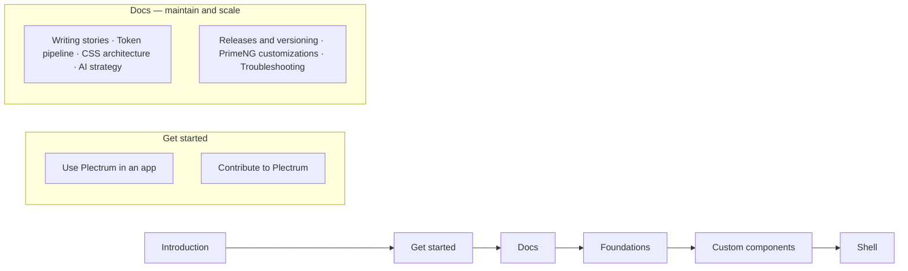

# Storybook Docs Audit and Improvement Plan

## Audit findings

**Orientation — weakest area.** No Introduction/landing page, no `storySort`: visitors land on _Custom components/Accordion_ (alphabetical). The Docs section (Writing stories, Token pipeline ×3, AI strategy, CSS architecture) explains _maintaining_ the system well, but nothing explains _starting_: no install/consume guide, no contributor onboarding, no releases/versioning page, no troubleshooting.

**Branding — absent.** No `manager.ts`, no theme, no favicon. `libs/assets/Logo.svg` + `Logomark.svg` exist and are already copied to `/assets` by the Storybook builder — just not wired into the manager chrome. Zeroheight is auth-walled, so theme values come from the token source (`tokens.json`: primary `#487395`, Agenda/Open Sans).

**Foundations — good catalog, no guidance.** `pds-token-explorer` already does search/filter/click-to-copy/live previews (better than most). Missing vs the reference Storybook: Controls-driven **Playground/Generate** stories (compose what you want visually → copy the matching class/token), an intent-based token finder ("I'm styling a border → use this role"), and a contrast checker.

**Modified-from-stock gaps — yes, you are missing several.** Customized but undocumented:

- `Toolbar` (`pds-toolbar`) — shared libs/ui component, **no story, no metadata**
- `c-timeline--content-only`, AutoComplete restyles, Tabs bridge, Tag tweak, global `p-card-title` spacing — PrimeNG restyles with no catalogue entry
- `c-drawer` (generic shell), `c-detail-list`, `c-skeleton-slot` — shared primitives visible only inside other stories
- 4 app-only iSHARE shells (`c-affiliate-details`, documents-toolbar, document-detail, search-panel) with `--p-card-*`/tabs bridges, zero pages
- `c-accordion--chromeless` — bridge exists but is **unused** (dead code candidate)
- `metadata: false` on DelayPredictionCard, DocDemoBox, Toolbar, TransactionsCicsModal

## Proposed sidebar IA

## Phase 1 — Orientation and onboarding

- Create `libs/ui/src/docs/introduction.mdx` (`Meta title="Introduction"`): what Plectrum is, three entry paths (app developer / design-system contributor / AI agent), links to zeroheight, Figma UI Kit, GitHub Pages build. PrimeNG-figure cards via a sibling `introduction.stories.ts` (`tags: ['!dev']`).
- Create `get-started-consume.mdx` (`Get started/Use Plectrum in an app`): install `@solidaris/ui|styles|plectrum`, `providePlectrum()`, Sass include path, fonts/icons, first component, how version bumps arrive (Renovate). Source: `tools/packaging/consumer-app/` + Figma-sync page's package section.
- Create `get-started-contribute.mdx` (`Get started/Contribute`): clone → `npm install` → `npm run storybook`; `pds:component` scaffold; ITCSS/BEMIT pointers; agent-first workflow; CI gates. Largely links to existing pages rather than duplicating them.
- Add `options.storySort` in [libs/ui/.storybook/preview.ts](libs/ui/.storybook/preview.ts): Introduction → Get started → Docs → Foundations → Custom components → Shell.

## Phase 2 — Brand theme

- Create `libs/ui/.storybook/manager.ts` with `@storybook/theming` `create()`: `brandTitle: 'Plectrum'`, `brandImage: './assets/Logo.svg'`, `brandUrl` → zeroheight, colors from token values (cited by comment: `primary.600 #487395`, surface tones), `fontBase` Open Sans.
- `manager-head.html` for favicon (Logomark.svg) + font preload; align docs preview typography via `preview.ts` docs theme.
- Follow-up (optional, keeps rule 10 spirit): emit theme colors from `tokens:build` as a generated file instead of hand-cited constants.

## Phase 3 — Foundations playgrounds (find the right token)

- Add a Controls-driven `Playground` story per foundation, reference-Storybook style, output = live preview + copyable `var(--pds-*)` / `u-*` / `o-layout--*` snippet: Spacing (scale picker on a card), Borders/Radius ("Generate" a border), Elevation (level picker), Typography (role picker on editable text), Colors (role picker on a sample tile).
- New `Foundations/Token finder` page: intent-based decision flow ("What are you styling?" → text / surface / border / spacing / shadow / motion → suggested semantic tokens + classes). Reuses `token-explorer` internals; all option lists enumerate from the CSSOM (rule `10-css-ssot`).
- Extend the color explorer with a WCAG AA contrast checker for text/surface pairs (thresholds from `rules/06-accessibility.md`).

## Phase 4 — Catalogue completeness (modified-from-stock)

- New page `Docs/PrimeNG customizations`: DocsTable inventory — PrimeNG component → bridge file → scope → what changed → story link. This permanently answers "am I missing any?".
- Add missing stories: **Toolbar** (top priority), generic **Drawer shell**, **Detail List**, **Skeleton Slot**, **Timeline content-only**; one combined "PrimeNG tweaks" page with canvases for the small restyles (AutoComplete, Tabs, Tag, Card title).
- Document the 4 iSHARE-only shells as a new **Patterns** section (documenting, not moving code); flag promotion to `libs/ui` as a separate decision.
- Backfill `.metadata.ts` ×4 (DelayPredictionCard, DocDemoBox, Toolbar, TransactionsCicsModal); delete or wire the unused `c-accordion--chromeless` bridge.

## Phase 5 — Maintain and scale docs

- `Docs/Releases and versioning`: changesets, fixed-version group, publish flow, consumer bumps.
- `Docs/Troubleshooting`: `--p-*` empty before `providePlectrum()` boots, packed-Storybook mode, common CI gate failures, Windows watcher quirks.
- Cross-link all new pages from existing Related-pages lists.

## Phase 6 — Component tests (stories as the test suite)

Current state: 21 Karma specs across 16 `libs/ui` components (runs headless in CI via `npm test`; the Angular karma builder switches to single-run when `CI` is set). `addon-a11y` is a manual panel only. **Zero** interaction (`play`) tests, **zero** story smoke tests, **no** visual regression, **no** a11y gate.

- **Story smoke tests**: add `@storybook/test-runner` (Playwright-based — works with the Angular webpack builder, unlike the Vitest addon). New `test-storybook` script + CI job against the built `storybook-static`: every story must render without error. This turns the existing catalogue plus the "every component needs a story" rule into an executable test suite.
- **A11y gate**: wire `axe-playwright` into the test-runner hooks so every story is checked against WCAG 2.1 AA (thresholds already defined in `.ai/rules/06-accessibility.md`). Start as non-blocking report, flip to blocking once existing violations are fixed.
- **Interaction tests**: add `play` functions (`storybook/test`) to the interactive components — Form Field (error display), Input Clear (clear action), Copyable Text (copy), List (selection/expand), Accordion (toggle). These run in the same test-runner pass.
- **Spec template**: upgrade the `pds:component` spec stub from a bare "should create" to the Tester-agent checklist (semantic element, BEM host class, modifier bindings, output events, slot projection).
- **Docs**: a "Testing" section on the Get started/Contribute page — what runs where (Karma unit, test-runner smoke + a11y + interactions, Tester subagent for manual QA).
- **Visual regression — decision needed**: Chromatic (hosted, zero-config with the existing `build-storybook`, free tier) vs test-runner screenshot snapshots (self-hosted, noisy on fonts/AA). Recommendation: Chromatic trial on the free tier; skip if the team objects to a SaaS. Not wired into CI until decided.

All pages follow the established conventions: noun headings, `DocsTable`, PrimeNG figures via `!dev` sibling stories, no hardcoded token lists.
