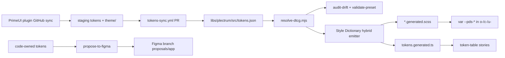

# Bidirectional Token Pipeline + CSS-First Surface

Merge of [plan-bidirectionalFigmaRepoTokenPipeline.prompt.md](.github/prompts/plan-bidirectionalFigmaRepoTokenPipeline.prompt.md) and [plan-cssFirstTokenConsumptionSurface.prompt.md](.github/prompts/plan-cssFirstTokenConsumptionSurface.prompt.md). CSS-first **replaces** parent Phase 2 steps 7–8 and adds prefix migration + Storybook.

**Locked decisions**
- Full pipeline, including packaging, Figma I/O, and consumer templates.
- **Do not retire `Plectrum_v0.6/`.** Keep the Storybook toggle. Fix the docs/code mismatch by documenting the real default (`v0.6` in [preset-storage.ts](libs/plectrum/src/lib/preset-storage.ts)), not by flipping production to v1.
- Tokens Studio is out. Preset TS stays plugin-produced and **validated**, not regenerated.
- Figma writes never target the main file; abort if the named branch is missing.
- Dark mode, PrimeUI mapping rebuild, and Nx stay out of scope.

**Current state (nothing of this pipeline exists yet)**
- [tokens.json](libs/plectrum/src/tokens.json) is a 7-set DTCG dump (3,501 leaves) and is unused at runtime.
- `style-dictionary` ^4.4.0 is installed; no config, no `tokens:*` scripts, no `tools/tokens/`.
- SCSS is hand-authored. ~120 unprefixed `--spacing-*` / `--text-*` / `--font-*` declarations. Colors already use `--#{$pds-prefix}-*`.
- Known drift the Phase 0 auditor **must fail on before any value rewrite**: PDS `--pds-color-primary-600: #3f5870` vs Figma/v1 `#487395`; radius `md`/`lg` vs v1; `#487395` hardcode in [_settings.delay-prediction-card.scss](libs/styles/src/01-settings/_settings.delay-prediction-card.scss).
- Libraries are path-alias only: no `ng-package.json`, no per-lib `package.json`, no changesets.

---

## Wave 1 — Drift detection (parent Phase 0)

Build the detector **before** any generated SCSS or value “fixes”. First CI run must be red on known drift.

1. Add `tools/tokens/resolve-dtcg.mjs` — flatten all 7 sets in [tokens.json](libs/plectrum/src/tokens.json), resolve `{alias}` chains, detect cycles, emit a JSON map of path → resolved literal.
2. Add `tools/tokens/audit-drift.mjs` — three-way Figma / v1 preset / SCSS. Import the real v1 default export via `tsx` (do not regex-scan like [audit-preset-refs.mjs](libs/plectrum/scripts/audit-preset-refs.mjs)). Report: missing aliases, hex mismatches (primary ramp, radius md/lg), hardcoded hex in 01-settings.
3. Add `tools/tokens/validate-preset.mjs` — every `{token.path}` in `Plectrum_v1/ts` must resolve against tokens.json. Replaces `KNOWN_BLOCKERS` / `V06_ONLY`.
4. Wire npm scripts: `tokens:resolve`, `tokens:audit`, `tokens:validate-preset`.
5. Add a non-blocking `tokens:audit` step to [.github/workflows/ci.yml](.github/workflows/ci.yml). Flip to blocking only after Wave 3 lands and remaining diffs are either generated-away or explicitly allowlisted.

**Gate:** `node tools/tokens/audit-drift.mjs` exits non-zero and names radius md/lg + the primary ramp.

---

## Wave 2 — Prefix migration (CSS-first Phase A)

Do this **before** generation so N future consumers never inherit bare `--spacing-*` / `--text-*`.

1. Rename declarations in [_settings.spacing.scss](libs/styles/src/01-settings/_settings.spacing.scss), [_settings.typography-primitive.scss](libs/styles/src/01-settings/_settings.typography-primitive.scss), [_settings.typography-semantic.scss](libs/styles/src/01-settings/_settings.typography-semantic.scss), [_settings.grid.scss](libs/styles/src/01-settings/_settings.grid.scss) to `--#{$pds-prefix}-*`. Also prefix `--base-unit`, `--spacingUnit`, `--letter-spacing-*`, `--grid-cols`.
2. Add [_settings.legacy-aliases.scss](libs/styles/src/01-settings/_settings.legacy-aliases.scss) redeclaring the old bare names as `var(--pds-*)`, forwarded **last** in [_settings.core.scss](libs/styles/src/01-settings/_settings.core.scss), marked deprecated (one-release removal).
3. Repoint first-party consumers: `$spacing-scale` in spacing settings, [_tools.spacing.scss](libs/styles/src/02-tools/_tools.spacing.scss), objects/elements/components, apps, `libs/ui` metadata `tokens.consumed`. **BEM class names stay** (`o-layout--gap-2` unchanged).
4. CI grep: reject new `--spacing-` / `--text-` / `--font-` / `--line-height-` **declarations** outside the legacy file.

**Gate:** computed styles of `c-nav-shell` and `c-affiliate-overview-card` stay byte-identical (legacy aliases keep old `var(--spacing-*)` working during the cutover).

---

## Wave 3 — Hybrid Style Dictionary (CSS-first Phase B; replaces parent Phase 2)

1. **Foundations Phase 0 (blocks spacing/typography generation):** inspect Figma file `jH0paYnBCco2Ye6ysNcWrr` via Desktop MCP `get_variable_defs`. If Display/Heading/label/Body and the 8pt scale are **variables**, emit them from tokens. If they are text styles only, keep spacing/typography **code-owned** (still prefixed; generate from a checked-in DTCG excerpt derived from current SCSS, not the Figma API).
2. Add `tools/tokens/alias-map.json` — reviewed `--pds-color-*` → `--p-*` map. Missing entry = emit a literal. Add a CI warning when a `--pds-color-*` resolves to the same tokens.json node as an unmapped `--p-*` (auto-suggest).
3. `tools/tokens/sd.config.mjs` + custom formatter:
   - Mapped: `--pds-color-brand: var(--p-primary-600, <literal-from-tokens.json>);`
   - Unmapped: `--pds-radius-md: <literal>;`
   - Wrapper: `--#{$pds-prefix}-*` (SD cannot emit the Sass interpolation itself — formatter owns that).
4. Emit `*.generated.scss` for: colors-primitive, colors-semantic, radius, shadows, transitions, focus, plus spacing/typography **only if Phase 0 says yes**. Keep hand-authored: prefix, borders, globals, grid maps, breakpoints, ~20 feature files, all PrimeNG bridges (accordion pattern in [_settings.accordion.scss](libs/styles/src/01-settings/_settings.accordion.scss) stays verbatim).
5. Slot generated files into [_settings.core.scss](libs/styles/src/01-settings/_settings.core.scss); delete or shrink the hand-authored counterparts they replace.
6. Scripts: `tokens:build`. CI: `npm run tokens:build && git diff --exit-code`.
7. Delay-prediction `#487395` becomes an alias (`var(--p-primary-color, …)` or mapped primary), not a hardcoded hex.

**Gate:** `tokens:build` is clean; alias-map breakage fails Wave 4 auditor; snapshots of the two sample components are identical **under v0.6** (aliased `--p-*` still come from the live preset; fallbacks only show when `providePlectrum` is stubbed).

---

## Wave 4 — Storybook + guardrails (CSS-first Phases C–D)

1. Third SD target: `libs/ui/src/storybook/tokens.generated.ts` — `{ name, cssVar, category, group, figmaRef, primeNgVar? }`.
2. `libs/ui/src/storybook/token-table.component.ts` — category input, live `getComputedStyle(document.documentElement)`, warning when a mapped `--p-*` resolves empty.
3. Foundation **stories** (not MDX) under [libs/ui/src/foundations](libs/ui/src/foundations): colors, typography, spacing, radius, shadows, transitions, focus. Match [iconography.stories.ts](libs/ui/src/foundations/iconography.stories.ts) quality. `--p-*` only exists inside bootstrapped Angular.
4. Component Docs: join each `.metadata.ts` `tokens.consumed` against the manifest (contract already exists in 12 components).
5. Docs hygiene: [TOKENS_REFERENCE.md](libs/plectrum/TOKENS_REFERENCE.md) default is v0.6; [copilot-instructions.md](.github/copilot-instructions.md) Storybook path → `libs/ui/.storybook/main.ts`.
6. Extend `audit-drift.mjs`: fail if an `alias-map.json` target `--p-*` is never emitted by the resolved v1 preset.
7. Lint: no `--p-*` **declarations** outside `01-settings/_settings.{component}.scss`; no `$dt` / `dt` / `usePreset` / `updatePreset` imports from `@primeuix/themes` in apps or `libs/ui`.
8. Strip dead `@apply` / Tailwind guidance from [.ai/rules/02-scss-tokens.md](.ai/rules/02-scss-tokens.md) and `.github/copilot-instructions.md`. Leave `libs/ui/.storybook/temp_guidelines/` untouched.

**Gate:** stub `providePlectrum()` in one story — table still shows fallback literals. Break one alias-map entry — auditor names it.

---

## Wave 5 — Figma → repo (parent Phase 1)

Code we own; plugin settings are designer-owned.

1. Staging tree (never overwrite `Plectrum_v1/ts` in place): e.g. `libs/plectrum/sync/tokens.json` + `libs/plectrum/sync/theme/`.
2. Doc the plugin GitHub Settings: fine-grained PAT (Contents R/W, this repo only), **branch `design-tokens/sync` — never `main`**, Tokens File + Theme Directory → staging paths. Record confirmed plugin behaviour (direct commit vs PR; overwrite vs merge; DTCG shape).
3. [.github/workflows/tokens-sync.yml](.github/workflows/tokens-sync.yml) on push to `design-tokens/sync`: run Wave 1 audits + Wave 3 `tokens:build`, then open a PR promoting staging → [tokens.json](libs/plectrum/src/tokens.json) and (only if validation passes) theme → `Plectrum_v1/`. Hand-fixes stay in [extend.ts](libs/plectrum/src/Plectrum_v1/ts/extend.ts) if present; never rely on silent local patches of generated theme files.
4. `tools/tokens/pull-figma.mjs` — scheduled `GET /v1/files/{key}/variables/local` safety net: flag Figma variables changed but never plugin-pushed. Needs `FIGMA_TOKEN` repo secret. Lower priority than 2–3.

---

## Wave 6 — Publishable libraries (parent Phase 4)

Can start in parallel with Waves 1–4; required before any repo split.

1. Register `plectrum` and `styles` in [angular.json](angular.json). Add `ng-package.json` + `build` for `libs/ui` (APF). Per-lib `package.json` with `peerDependencies` on Angular + PrimeNG.
2. `@solidaris/styles` ships **SCSS source**: `files` includes `src/**/*.scss`; relative `@use '../01-settings/...'` must resolve in the tarball. Document `stylePreprocessorOptions.includePaths` → `node_modules/@solidaris/styles/src`.
3. Registry-agnostic `publishConfig` + templated `.npmrc`. Add [changesets](https://github.com/changesets/changesets) for versioning on merge.
4. CI consumer smoke test: `npm pack` all three → install tarballs into a throwaway Angular app (no path aliases) → `ng build`.
5. Second Storybook CI mode: build Storybook against packed tarballs (local `npm run storybook` stays on source).

---

## Wave 7 — repo → Figma (parent Phase 5)

1. `propose-to-figma` CLI — diff code-declared `--pds-*` vs Figma; emit `proposed.dtcg.json` + report for code-only tokens (`--pds-color-emutnav-*`, `--pds-color-surface-75`). Publish as a bin from the packaged CLI so app repos do not copy scripts. Map dotted paths → Figma `/` grouping (names cannot contain `.` `{` `}`).
2. `apply-to-figma` — `GET /v1/files/:key?branch_data=true`, resolve `proposals/{app}`, `POST /v1/files/:branchKey/variables`. **Dry-run default. Abort if branch missing — never fall back to mainFileKey.** Real write: `workflow_dispatch` + GitHub Environment approval. Figma branch creation stays a manual Full-seat UI action (no API).
3. `LIBRARY_PUBLISH` webhook receiver to re-run `pull-figma` after designer merge + publish. Rate-limit / 4MB / atomic 400 constraints documented in the CLI help.

---

## Wave 8 — N-consumer sync (parent Phase 6)

1. Renovate or Dependabot template for app repos (DS package bump PRs).
2. Token-usage linter in the same CLI: fail on hardcoded hex/px and unknown `--pds-*` names.
3. Short promotion doc: app-authored component → PR into this DS repo → publish → app deletes its copy and imports `@solidaris/ui`. No cross-repo Storybook aggregation.

---

## Explicitly not in this implementation

- Delete `Plectrum_v0.6/` or change `resolvePresetVersion()` default to `v1`.
- Dark mode, PrimeUI mapping rebuild, Nx, Tokens Studio.
- Editing `libs/ui/.storybook/temp_guidelines/`.

---

## Verification (merged)

- Wave 1 auditor fails on radius md/lg + primary ramp **before** generation.
- After Wave 2: no new bare `--spacing-` / `--text-` / `--font-` declarations outside legacy aliases; object class names unchanged.
- `npm run tokens:build && git diff --exit-code`.
- Stub `providePlectrum` — token table still shows generated fallbacks.
- Break `alias-map.json` — auditor names the token.
- `apply-to-figma --dry-run` prints payload + resolved branch key, zero writes.
- First real apply only on a throwaway Figma branch.
- Pack + scratch-app build succeeds without path aliases.
- `npm run build-storybook`, `npm run build`, `npm test` stay green; a11y addon clean on new foundation pages.
