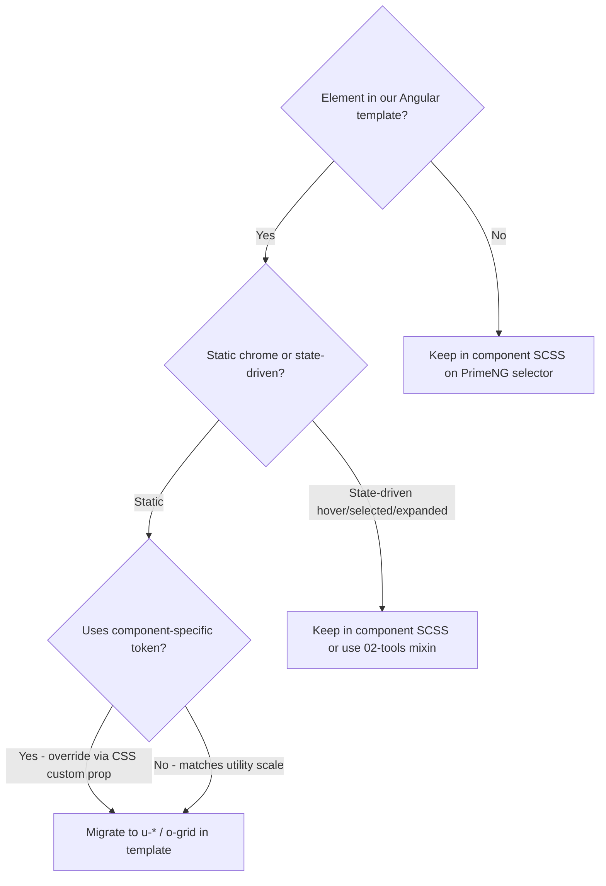

# Adopt Borders / Shadows / Grid Utilities

## Goal

Put the new foundation layer into practice **where it reduces duplication** without fighting component tokens, hover/selected states, or PrimeNG internals. This is an **opportunistic migration**, not a forced sweep.

## Decision rules (when to migrate vs keep)



| Migrate to template utilities                                                 | Keep in component SCSS                                                             |
| ----------------------------------------------------------------------------- | ---------------------------------------------------------------------------------- |
| Static panel divider (`panel-border`, `content-border`)                       | Accordion stacked radii (`:first-child` / `[aria-expanded]`) — already uses mixins |
| Equal-column layouts (`repeat(3, 1fr)`)                                       | List row hover/selected border + shadow                                            |
| `u-shadow-md` on a static elevated surface                                    | Nav-shell expand shadow, iconography card hover shadow                             |
| `u-radius-{token}` when radius is a global stop                               | Badge radii using `calc()` / component tokens                                      |
| Bespoke grid via Tier 2: `style="--sds-grid-template-columns: …"` on `o-grid` | Pulse/keyframe `box-shadow` animations                                             |

Reference: enforcement contracts in [`_objects.grid.scss`](libs/styles/src/05-objects/_objects.grid.scss) and [`_objects.flex-grid.scss`](libs/styles/src/05-objects/_objects.flex-grid.scss).

---

## Phase 0 — Policy update (do first)

Update [`libs/styles/AGENTS.md`](libs/styles/AGENTS.md):

- Replace exception **"CSS grid — no o-grid utility yet"** with `o-grid` rules (Tier 1 cols/auto-fit, Tier 2 `--sds-grid-template-*`, Tier 3 component SCSS for named areas).
- Add a **Visual chrome utilities** subsection:
  - Borders: `u-border-{side}` + optional `u-border-thick` / `u-border-dashed` / `u-border-{status}`; override color with `--sds-border-color`, width with `--sds-border-width`.
  - Radius: `u-radius-{stop}` / `u-radius-{side|corner}-{stop}` on owned elements.
  - Shadows: `u-shadow-{sm|md|xl|overlay-*}` on owned elements.
- Remove `c-panel-chrome--border-bottom` from the custom-classes list once Phase 1 lands (replaced by `u-border-bottom`).

---

## Phase 1 — High-confidence border migrations (templates + SCSS strip)

These are **identical** to foundation story examples and have **template hooks**.

### 1.1 Drawer shell dividers

**Today** — border in SCSS:

```15:21:libs/styles/src/06-components/_components.drawer.scss
.c-drawer__header {
  border-block-end: 1px solid var(--#{$sds-prefix}-color-panel-border);
}
.c-drawer__toolbar {
  border-block-end: 1px solid var(--#{$sds-prefix}-color-panel-border);
}
```

**Action:**

- Add to both drawer header elements in templates:
  - [`affiliate-detail-drawer.component.html`](libs/ui/src/lib/affiliate-detail-drawer/affiliate-detail-drawer.component.html) — `u-border-bottom` on `<header class="c-drawer__header …">`
  - [`document-more-details-drawer.component.html`](apps/ishare/src/app/affiliate-details/affiliate-document-detail/document-more-details-drawer/document-more-details-drawer.component.html) — same
- Set panel color via host/style binding or inline custom property: `--sds-border-color: var(--sds-color-panel-border)` (can be a shared constant in drawer TS module next to `SDS_DRAWER_*` if repeated).
- Remove `border-block-end` rules from `_components.drawer.scss` (keep typography-only rules on `__header` if any remain).

### 1.2 Replace `c-panel-chrome--border-bottom`

**Today** — only consumer is [`affiliate-overview-card.component.ts`](libs/ui/src/lib/affiliate-overview-card/affiliate-overview-card.component.ts) `cardStyleClass`.

**Action:**

- Swap `c-panel-chrome--border-bottom` → `u-border-bottom` + `--sds-border-color: var(--sds-color-panel-border)` on the `p-card` `styleClass`.
- Delete [`_components.panel-chrome.scss`](libs/styles/src/06-components/_components.panel-chrome.scss) and its forward in [`_components.core.scss`](libs/styles/src/06-components/_components.core.scss).

### 1.3 List shell chrome (host class)

**Today** — [`list.component.ts`](libs/ui/src/lib/list/list.component.ts) host:

```scss
border + border-radius on .c-list in _components.list.scss
```

**Action:**

- Extend host `class` with `u-border-all u-radius-xl`.
- Add host `style` or binding for component tokens:
  - `--sds-border-color: var(--sds-color-panel-border)`
  - `--sds-border-width: var(--sds-border-width-list)`
- Remove `border` + `border-radius` from `.c-list` in [`_components.list.scss`](libs/styles/src/06-components/_components.list.scss); keep background and inner row logic.

### 1.4 List footnote top rule

**Today:** `border-block-start` on `.c-list__footnote` in SCSS.

**Action:** Add `u-border-top` to the footnote `<button>` in [`list.component.html`](libs/ui/src/lib/list/list.component.html) with `--sds-border-color` / `--sds-border-width` overrides; strip border from SCSS.

**Verification:** existing list + drawer specs (`affiliate-details`, `affiliate-document-detail`, `affiliate-detail-drawer`, `affiliate-overview-card`).

---

## Phase 2 — Grid migrations

### 2.1 Doc spacing swatch grid (Tier 1)

**Today** — raw grid in [`_components.doc-demo-box.scss`](libs/styles/src/06-components/_components.doc-demo-box.scss):

```scss
.c-spacing-swatch__grid {
  display: grid;
  grid-template-columns: repeat(3, 1fr);
  gap: var(--spacing-1);
}
```

**Action:**

- In the Storybook/doc template that uses `c-spacing-swatch__grid`, switch to `o-grid o-grid--cols-3 o-layout--gap-1` (gap stays on `o-layout` per contract).
- Remove `display` / `grid-template-columns` / `gap` from `.c-spacing-swatch__grid` (keep swatch bar styles).

### 2.2 Affiliate details category grids (Tier 2 escape hatch)

**Today** — bespoke grids in [`_components.affiliate-details.scss`](libs/styles/src/06-components/_components.affiliate-details.scss):

- `__category-tab`: `auto | {token-min} | max-content`
- `__category-panel-header`: `{token-min} | max-content`

**Action:**

- Move layout to templates in [`affiliate-details.component.html`](apps/ishare/src/app/affiliate-details/affiliate-details.component.html):
  - Add `o-grid o-layout--gap-*` + `style="--sds-grid-template-columns: …"` using existing CSS variables from [`_settings.affiliate-details.scss`](libs/styles/src/01-settings/_settings.affiliate-details.scss).
  - Add alignment modifiers: `o-grid--align-items-center`, `o-grid--justify-items-start` as needed.
- Strip `display: grid` / `grid-template-columns` from SCSS; keep disabled state, typography, scroll-margin, PrimeNG hooks.
- Update the file header comment (remove "no o-grid utility").

**Verification:** `affiliate-details.component.spec.ts` selectors on `.c-affiliate-details__category-tab` / `__category-panel-header` unchanged.

### 2.3 Iconography browser grid (optional — visual review)

**Today** — flex wrap + responsive `o-flex__item--{n}@bp` in [`iconography-page.component.html`](libs/ui/src/foundations/iconography-page.component.html).

**Option A (recommended defer):** keep flex — breakpoint behavior is intentional (6→4→3→2 columns).

**Option B:** replace with `o-grid o-grid--auto-fill o-layout--gap-2` + tune `--sds-grid-min` to approximate current breakpoints; requires Storybook visual sign-off before merging.

---

## Phase 3 — Shadow migrations (narrow)

Only migrate **static** elevations; skip pseudo-class / parent-hover shadows.

### 3.1 List selected row

**Today:** `.c-list__item--selected { box-shadow: var(--sds-shadow-list-row-selected); }` where token aliases [`--sds-shadow-md`](libs/styles/src/01-settings/_settings.list.scss).

**Action (optional, low priority):**

- Toggle `u-shadow-md` via `[class.u-shadow-md]="selected"` on document row template **only if** border-width/color state rules stay in SCSS.
- If the class toggle complicates tree templates, **leave as-is** — token indirection is already correct.

### 3.2 Defer (do not migrate)

- [`_components.nav-shell.scss`](libs/styles/src/06-components/_components.nav-shell.scss) — shadow on `:hover/:focus-within` panel
- [`_components.iconography.scss`](libs/styles/src/06-components/_components.iconography.scss) — shadow on `.item:hover .card`
- [`_components.affiliate-document-detail.scss`](libs/styles/src/06-components/_components.affiliate-document-detail.scss) — pulse animation shadows

---

## Phase 4 — Radius / inset borders (defer or partial)

Drawer **family tile** and **note** use component tokens (`--sds-radius-affiliate-detail-drawer-*`, content-border) with hover on tile.

**Defer** moving to `u-border-all u-radius-lg` unless we also introduce the planned `c-inset-surface` primitive from the drawer follow-up plan — otherwise we trade one component rule for two utility classes + custom props without much gain.

**Do migrate** simple global radii where the element is in a template and uses a standard stop — e.g. iconography `focus-visible` radius on `__item` could become `u-radius-md` in template if focus ring is on the `<li>` (verify focus target).

---

## Phase 5 — Doc/demo + chrome leftovers (lower priority)

| File                                                                                             | Opportunity                                                        | Notes                                                                   |
| ------------------------------------------------------------------------------------------------ | ------------------------------------------------------------------ | ----------------------------------------------------------------------- |
| [`_components.doc-demo-box.scss`](libs/styles/src/06-components/_components.doc-demo-box.scss)   | `u-border-all u-radius-md` on frame; `u-border-top` on footer/code | Doc primitive — exception in AGENTS.md; migrate only if templates exist |
| [`_components.top-nav.scss`](libs/styles/src/06-components/_components.top-nav.scss)             | `u-border-bottom` on host in top-nav template                      | Single rule                                                             |
| [`_components.sub-nav-shell.scss`](libs/styles/src/06-components/_components.sub-nav-shell.scss) | `u-border-bottom` on section header in template                    | Check template hook                                                     |

---

## Execution order

1. Phase 0 (AGENTS.md)
2. Phase 1.1 → 1.2 → 1.3 → 1.4 (drawers, panel chrome, list) — highest ROI, lowest risk
3. Phase 2.1 → 2.2 (grids with clear wins)
4. Phase 3–5 only if time / after visual review

## Test plan

- `npx sass libs/styles/src/main.scss` — no new warnings
- Targeted specs:
  - `affiliate-detail-drawer`, `affiliate-overview-card`, `affiliate-details`, `affiliate-document-detail`, `list` (if list tests exist)
- Storybook smoke: Foundations/Borders, Foundations/Elevation, Foundations/Grid (CSS), Flex Grid, iconography page (if Phase 2.3 attempted)
- Manual: affiliate details category tabs alignment; drawer header divider; list shell border; overview card bottom rule

## Out of scope

- Migrating every `border-radius` in component SCSS
- Replacing PrimeNG `--p-card-*` token bridges with utilities
- `transactions-cics-modal`, apps outside `libs/ui` + `apps/ishare` affiliate flows (unless touched incidentally)
- Deleting `libs/ui/.storybook/temp_guidelines/*` legacy stories
