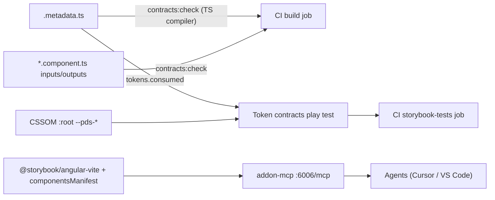

# Close the three AI-strategy gaps

## Context

- Contracts live in colocated `{name}.metadata.ts` (20 files under `libs/ui/src/lib/**`); `props` follow a fixed convention already used by [libs/ui/src/storybook/arg-types-from-props.ts](libs/ui/src/storybook/arg-types-from-props.ts): inputs = type-argument text (`IconSize`, `boolean`), `required` from `input.required`, `default` = literal without quotes; models = `model<T>`; outputs = `output<T>`.
- Token contract check exists only as a page: [libs/ui/src/foundations/token-contracts.stories.ts](libs/ui/src/foundations/token-contracts.stories.ts) reads the CSSOM via `readTokenDeclarations()` but has a hand-maintained `METADATA` array (12 of 20) and no assertion. `test-storybook:ci` already runs every story (incl. `!dev`) in CI, so a `play` gate needs no new infrastructure and stays inside rule 10 (read the CSSOM, never re-parse SCSS).
- Storybook: `@storybook/angular` 10.4 (webpack), `angular.json` targets use `browserTarget: ishare:build:development`, `compodoc: false`. Angular 21.2 / TS 5.9 already meet `@storybook/angular-vite` requirements. Latest: `storybook` 10.6.0, `@storybook/angular-vite` 10.6.0 (peers: `vite >=8`, `@analogjs/vite-plugin-angular >=2`, `@angular/build >=21` — present only transitively at 21.2.14 via the CLI, so it must become a direct devDep; the lockfile's `vite` is 7.3.2 pulled in by `@angular/build`, so Vite 8 will sit next to Vite 7 in the tree), `@storybook/addon-mcp` 10.6.0 (peer `storybook ^10.6`; `addon-vitest` optional). Webpack-only code in the repo is small: `webpackFinal` in [libs/ui/.storybook/main.ts](libs/ui/.storybook/main.ts), `require.context` in [libs/ui/src/foundations/iconography.stories.ts](libs/ui/src/foundations/iconography.stories.ts), and ~60 files importing from `@storybook/angular`.

## 1. Props ↔ Angular inputs check (CI)

New `tools/scripts/check-metadata-props.ts` (tsx, TypeScript compiler API — `typescript` is already a devDep; same style as [tools/scripts/generate-index.ts](tools/scripts/generate-index.ts)).

- Discover every `libs/ui/src/lib/**/*.metadata.ts`, `await import()` it (type-only `@solidaris/contracts` import erases; tsx honours tsconfig paths).
- If `component.path` is an existing `.component.ts`: `ts.createProgram` with root `tsconfig.json` options, find the `@Component` class, collect public API from property initializers `input()`, `input.required()`, `model()`, `model.required()`, `output()`, `outputFromObservable()` and from `@Input()` / `@Output()` decorators. Public name honours `alias`. Type text: explicit type argument if present, otherwise `checker.typeToString()` of the signal's type argument (`input(false)` → `boolean`); models → `model<T>`, outputs → `output<T>` (`void` when none). Default: first-argument source text with quotes stripped, only when it is a literal (`'xs'`, `false`, `{}`, `undefined`).
- Compare with `metadata.props`: missing/extra names, `required` mismatch, normalized `type` mismatch, `default` mismatch (when a literal). CSS-only blocks (no component class: accordion, timeline, drawer, detail-list, skeleton-slot) must have `props: []`.
- Report grouped per component, exit 1 on any finding.
- Wire: `"contracts:check": "tsx tools/scripts/check-metadata-props.ts"` in [package.json](package.json); CI step in [.github/workflows/ci.yml](.github/workflows/ci.yml) right after `docs:check`.
- Generator: [tools/generators/sds-component/index.ts](tools/generators/sds-component/index.ts) currently scaffolds a fake `TODO` prop (line ~297) — change to `props: []` so a fresh scaffold passes and drift is real drift.
- Run once and fix any existing metadata drift surfaced by the script (expected: small, given `argTypesFromProps` already consumes these lists).

## 2. tokens.consumed vs CSSOM as a CI gate

- New `libs/ui/src/storybook/component-metadata.ts`: `ALL_COMPONENT_METADATA` barrel importing all 20 metadata files. `check-metadata-props.ts` also asserts the barrel matches the files on disk, so the list cannot drift (rule 10 Exception B: a static list must be asserted).
- New `libs/ui/src/storybook/token-contracts.ts`: pure `checkTokenContracts(metadata, declared)` extracted from the story (`CONTRACTS`, `origin`, `declared`), so page and test share one implementation.
- [libs/ui/src/foundations/token-contracts.stories.ts](libs/ui/src/foundations/token-contracts.stories.ts): replace the hand-maintained `METADATA` with the barrel; add `play` to `Consumed` that waits for `readTokenDeclarations().size > 0` and asserts zero `not declared` rows, failing with `Component → --pds-x` per broken contract (helpers from `libs/ui/src/storybook/story-tests.ts`). This runs in the existing `storybook-tests` CI job via `test-storybook:ci`.
- Reconcile the 8 metadata files the page never covered (Toolbar, TransactionsCicsModal, DelayPredictionCard, CSS-only blocks) before enabling — the gate must start green.
- Optional follow-up (not in this scope): bidirectional check from CSSOM rules scoped to `bemBlock` (tokens used but not listed / listed but unused).

## 3. Storybook → `@storybook/angular-vite` + Storybook MCP

Staged behind a spike gate: all steps on one branch; merge only when the verification list passes.

- Dependencies ([package.json](package.json)): bump `storybook`, `@storybook/addon-a11y`, `@storybook/addon-docs` to 10.6; remove `@storybook/angular`; add `@storybook/angular-vite@10.6`, `@storybook/addon-mcp@10.6`, `vite@^8`, `@analogjs/vite-plugin-angular@^2`, `@angular/build@^21.2`, `vite-tsconfig-paths`, `sass` (explicit). Keep `@storybook/test-runner` (peer range covers 10.6), `@storybook/addon-coverage` (ships `vite-plugin-istanbul`), `@chromatic-com/storybook`, `@storybook/addon-designs`. Keep the `webpack` override (apps still build with it). Unchanged: root `test-runner-jest.config.js` (ejected only for `testTimeout`) and `chromatic.config.json` (`buildScriptName`, `storybookConfigDir`).
- [angular.json](angular.json) `ui:storybook` / `ui:build-storybook`: builders → `@storybook/angular-vite:start-storybook` / `:build-storybook`; drop `browserTarget` and `compodoc`; keep `configDir`, `port`, `outputDir`, `assets`, `styles`, `stylePreprocessorOptions`; add `"zoneless": false` (repo ships zone.js; preserve current behaviour, revisit later).
- [libs/ui/.storybook/main.ts](libs/ui/.storybook/main.ts): `StorybookConfig` from `@storybook/angular-vite`; `framework: { name: '@storybook/angular-vite', options: { tsconfig: 'libs/ui/.storybook/tsconfig.json', propsTable: 'inputs' } }`; `features: { componentsManifest: true }`; add `'@storybook/addon-mcp'`; replace `webpackFinal` with `viteFinal` → `mergeConfig(config, { plugins: [tsconfigPaths()], ...(pagesPublicPath ? { base: pagesPublicPath } : {}) })` (`@solidaris/contracts` / `@solidaris/plectrum` aliases are not mapped by Vite). `propsTable: 'inputs'` keeps server-side docgen from adding protected members to the metadata-driven Controls tables; verify and adjust.
- [libs/ui/src/foundations/iconography.stories.ts](libs/ui/src/foundations/iconography.stories.ts): replace `require.context` (+ hardcoded fallback list) with `import icons from 'bootstrap-icons/font/bootstrap-icons.json'` → `Object.keys(icons).sort()` — bundler-agnostic, `resolveJsonModule` already on.
- Import rename `@storybook/angular` → `@storybook/angular-vite` in ~60 `*.stories.ts`, [libs/ui/.storybook/preview.ts](libs/ui/.storybook/preview.ts), [libs/ui/src/docs/docs-figure-stories.ts](libs/ui/src/docs/docs-figure-stories.ts), and the generator template (`tools/generators/sds-component/index.ts` line ~169). Scripted find/replace (or `npx storybook automigrate`), then type-check.
- MCP registration: add `"storybook": { "url": "http://localhost:6006/mcp" }` to [.cursor/mcp.json](.cursor/mcp.json) and an `http` entry to [.vscode/mcp.json](.vscode/mcp.json). Docs + dev toolsets become available; the test toolset needs `addon-vitest`, which is not adopted (test-runner stays) — record as the remaining gap.
- Verification gate (spike): `npm ci` resolves `vite@8` beside `@angular/build`'s Vite 7 without extra overrides and `@analogjs/vite-plugin-angular` compiles the lib against it (first thing to check — a blocker here means falling back to the custom-MCP option); `npm run storybook` renders docs pages, Foundations pages (CSSOM readers), PrimeNG catalogue, nav shells; `npm run build-storybook` with `STORYBOOK_PUBLIC_PATH=./`; `npm run test-storybook:ci`; `npm run test-storybook:nav` (proves relative chunk URLs — if Vite's default `base: './'` already satisfies it, drop the env var from `main.ts`, `ci.yml`, `deploy-ishare-pages.yml`); `npm run build-storybook:packed`; `npm run docs:check`; `curl http://localhost:6006/mcp` and confirm `docs-show` lists `libs/ui` components; compare Copyable Text and Profile Drawer Controls tables before/after; Chromatic run when the token is available.

## 4. Documentation and contracts

- [libs/ui/src/docs/ai-strategy.stories.ts](libs/ui/src/docs/ai-strategy.stories.ts): `Gaps` callout → remaining gaps only (`angular-vite` in preview until Storybook 11; MCP test toolset needs the Vitest addon; tokens.consumed bidirectional check not gated). Add `contracts:check` to the `Rules` / `QueryOrder` copy.
- [libs/ui/src/docs/ai-strategy.mdx](libs/ui/src/docs/ai-strategy.mdx): architecture diagram `CI gates` node gains `contracts:check`; glossary rows for `contracts:check` and `Storybook MCP`; Reference notes that `index.json` stays the offline map and the MCP is the live one when `npm run storybook` runs.
- [.ai/contracts/README.md](.ai/contracts/README.md) §6: tick drift detection, tokens.consumed CI gate, Storybook MCP manifest.
- [.ai/contracts/protocols/component-creation.md](.ai/contracts/protocols/component-creation.md) checklist: `npm run contracts:check` passes. [.ai/contracts/protocols/query-protocol.md](.ai/contracts/protocols/query-protocol.md): Storybook MCP as a live source next to `index.json`.
- [.ai/rules/03-storybook.md](.ai/rules/03-storybook.md) §3/§5, [libs/ui/src/docs/story-authoring.mdx](libs/ui/src/docs/story-authoring.mdx) (line ~431), `component-creation.md` (line ~95): reword "Angular webpack Storybook" → angular-vite, test-runner kept by decision.
- [.cursorrules](.cursorrules) MCP table: add Storybook MCP (`http://localhost:6006/mcp`, needs the dev server) and `contracts:check` in Workflow → Contracts.

## Decisions taken (flag if you disagree)

- `zoneless: false` to preserve current runtime behaviour.
- Keep `@storybook/test-runner`; do not adopt the Vitest addon in this scope.
- `propsTable: 'inputs'` so Controls tables remain metadata-driven.
- Props check treats `type`/`default` mismatches as failures (metadata already follows the convention); only literal defaults are compared.
