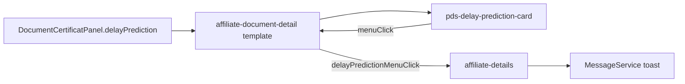

# Prédiction du délai card

## Design source

[Figma iSHARE-Audit · node 704:11968](https://www.figma.com/design/9HlAudLC1oesvT8IkrmR6I/iSHARE-Audit?node-id=704-11968)

Card layout (horizontal, not legacy full-height blue meatball):

- Title: **Prédiction du delai** (`text-heading-sm` / Open Sans Bold 16)
- Metric: days remaining — Agenda Bold ~26px, color Figma `primary/color` `#487395`
- Label: **Jours restants** (`text-body-sm`)
- Vertical `p-divider`
- Metric: predicted date — same Agenda Bold / primary color
- Label: **Clôture prédite**
- Vertical `p-divider`
- Outlined secondary icon-only `pButton` 40×40, `bi bi-three-dots-vertical`

Chrome: white bg, 1px `#d1d1d1` border, `radius` 8px, existing `--pds-shadow-md`.

## Scope decisions (confirmed)

- Kebab → **coming soon toast** (reuse `showDrawerFeatureComingSoonToast` / same copy)
- Placement → **every enabled panel** that renders the Détails block (non-`disabled` accordion content)
- No Code Connect

## Architecture



## 1. New shared component (`libs/ui`)

Scaffold with `npm run pds:component` (or mirror `affiliate-overview-card`):

| File                                                                   | Role                                             |
| ---------------------------------------------------------------------- | ------------------------------------------------ |
| `libs/ui/src/lib/delay-prediction-card/`                               | TS / HTML / spec / stories / metadata            |
| `libs/styles/src/06-components/_components.delay-prediction-card.scss` | BEM `c-delay-prediction-card`                    |
| `libs/styles/src/01-settings/_settings.delay-prediction-card.scss`     | Component tokens (padding, metric color, border) |
| Export from `libs/ui/src/index.ts`                                     |                                                  |

**API**

- Inputs: `daysRemaining: number`, `predictedCloseDate: string` (already-formatted `dd/MM/yyyy`)
- Output: `menuClick`
- Aria: titled region; button `aria-label="Plus d'actions — prédiction du délai"`

**PrimeNG:** `pButton` (outlined secondary, icon-only) + `p-divider` vertical — no custom kebab SVG (use Bootstrap Icons already in apps).

**Tokens:** Map `#487395` to a semantic component token that references Plectrum primary when available; otherwise add `--pds-color-delay-prediction-metric` in settings (do not hardcode hex in the component SCSS). Reuse `--pds-shadow-md`, surface border, spacing tokens.

**Storybook:** Default + long date; document Figma link and states.

## 2. Wire into document detail panels

In [`affiliate-document-detail.component.html`](apps/ishare/src/app/affiliate-details/affiliate-document-detail/affiliate-document-detail.component.html), after the `__details` block (~line 658) and **before** `__divider` / “Voir plus de détails”:

```html
@if (panel.delayPrediction; as prediction) {
<pds-delay-prediction-card
  class="o-layout--margin-block-start-3"
  [daysRemaining]="prediction.daysRemaining"
  [predictedCloseDate]="prediction.predictedCloseDate"
  (menuClick)="onDelayPredictionMenuClick()"
/>
}
```

Extend [`DocumentCertificatPanel`](apps/ishare/src/app/affiliate-details/affiliate-document-detail/affiliate-document-detail.types.ts):

```ts
delayPrediction?: {
  daysRemaining: number;
  predictedCloseDate: string;
};
```

Show only when `delayPrediction` is set (data-driven). Populate mock for **all enabled panels that already render Détails** (including those with empty `details: []` but still show the heading — attach prediction so the card appears). Skip `disabled` panels (no expand / no Détails body).

## 3. Mock data

In [`affiliate-document-detail.mock.ts`](apps/ishare/src/app/affiliate-details/affiliate-document-detail/affiliate-document-detail.mock.ts), add `delayPrediction` on every enabled Eva (and other) panel that exposes Détails — e.g. Certificat ITT, FDR A/employeur/affilié, Compte financier, Calcul, Incapacité prolongation, Rechute panels, C4 isolé, etc. Use varied but stable demo values (e.g. 9–14 days, dates near existing reception dates).

Helper optional: `function delayPrediction(days, date)` to keep mocks DRY.

## 4. Coming-soon toast wiring

- `AffiliateDocumentDetailComponent`: `delayPredictionMenuClick = output<void>()`; handler emits on menu click
- [`affiliate-details.component.html`](apps/ishare/src/app/affiliate-details/affiliate-details.component.html): bind `(delayPredictionMenuClick)="onDelayPredictionMenuClick()"`
- TS: call existing `showDrawerFeatureComingSoonToast()` (summary `Bientôt disponible`)

## 5. Tests

- Unit: card renders days + date; emits `menuClick`
- Document detail: enabled panel with `delayPrediction` shows card; disabled panel does not; menu click bubbles / parent shows toast (or spy on emit)
- Update any snapshot/text assertions if needed

## Out of scope

- Real prediction logic / API
- Actual kebab menu items
- Code Connect mapping
- Changing legacy blue meatball layout (Figma 704:11968 is SSOT)
