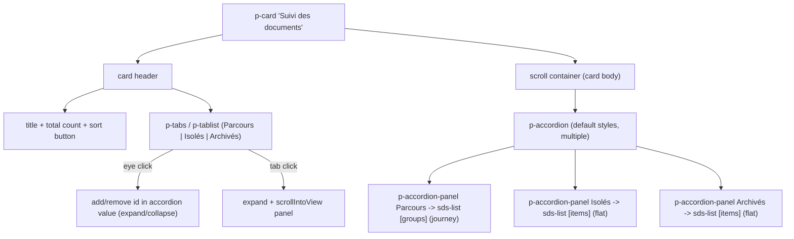

# Affiliate document list — category tabs redesign

## Goal

Show all document types in one consecutive list. Remove the `Vue parcours` and `Documents archivés seulement` toggles and the `+ N hors parcours` chip. Below the "Suivi des documents" title, render a PrimeNG Tabs bar with one tab per category (`Parcours`, `Isolés`, `Archivés`), each showing an eye toggle + a `p-badge` count. The eye toggles that section's visibility (`bi bi-eye` when shown, `bi bi-eye-slash` when hidden); clicking the tab scrolls to (and expands) the section. Each category is a panel of a single default-styled `p-accordion` (familiar chevron toggle), so the chevron and the eye both control expand/collapse. Parcours keeps its inner collapsible journey groups.

## New structure

## 1. Mock data — add the Archivés bucket

In [apps/ishare/src/app/affiliate-details/affiliate-details.component.ts](apps/ishare/src/app/affiliate-details/affiliate-details.component.ts):

- Add `EVA_MARTINEZ_ARCHIVED_DOCUMENTS: ListDocumentItem[]` with 1 doc, `status.label = 'Clôturé'` (so it counts as closed for the existing overview info tag), run through `withDerivedTags`.
- Register it in `DOCUMENT_SECTOR_BY_ID`, `DOCUMENT_RECEPTION_DATE_BY_ID`, and include it in `allEvaMartinezDocuments()`.
- Add a matching detail entry in [affiliate-document-detail.mock.ts](apps/ishare/src/app/affiliate-details/affiliate-document-detail/affiliate-document-detail.mock.ts) (reuse `placeholderMoreDetails` for panels) so the archived row is selectable in the detail card.

## 2. Component logic — categories instead of toggles

In [affiliate-details.component.ts](apps/ishare/src/app/affiliate-details/affiliate-details.component.ts):

- Remove `journeyView`, `archivedOnly` signals and everything keyed off them: `isFlatListMode`, `shouldUseFlatListPresentation`, `showHorsParcoursChip`, `horsParcoursChipLabel`, `journeyViewTooltip`, `onJourneyViewChange`, `syncSelectionToJourneyView`, `disableJourneyView`, and the journey/archived-specific effects (auto-expand-all-on-archived, journey default-expansion gating).
- Introduce a category model and signals:
  - `type DocCategoryId = 'parcours' | 'isoles' | 'archives'`.
  - `openCategories = signal<DocCategoryId[]>(['parcours','isoles','archives'])` — bound to the accordion `[value]` (`[multiple]="true"`); a category is "visible" when its id is in this array. The eye toggle and the accordion chevron both edit this one source of truth.
  - `activeCategory = signal<DocCategoryId>('parcours')` (drives the Tabs `[value]` + scroll-spy underline).
  - `parcoursGroups()` = current `listGroups()` logic (journey groups for Eva, filtered+sorted), independent of the removed `journeyView` guard.
  - `isolesItems()` = filtered+sorted standalone docs; `archivesItems()` = filtered+sorted archived docs.
  - `categories()` = ordered list of `{ id, label, icon, count, kind: 'journey'|'flat', groups?, items? }`, omitting empty categories.
  - `navigableDocuments()` = parcours docs (group order) ++ isolés ++ archivés, in display order, for prev/next.
  - `documentCount()` = sum of category counts (total badge).
- Keep `applyDocumentFilters` (drop the `archivedOnly` branch), `sortDocuments`, `sortGroups`, search/sector/sort.
- New methods: `toggleCategoryVisibility(id)` (add/remove id in `openCategories`), `scrollToCategory(id)` (ensure id in `openCategories`, set `activeCategory`, `scrollIntoView` the panel), `onAccordionValueChange(ids)`, `onCategoryTabChange(id)`.
- Deep links: `onStatusActionClick` + `onCrossReferenceNavigate` replace `journeyView.set(true)` with `ensure 'parcours' in openCategories` + expand target journey group + `scrollToCategory('parcours')`.

## 3. Template

In [affiliate-details.component.html](apps/ishare/src/app/affiliate-details/affiliate-details.component.html):

- Toolbar: delete the two `sds-form-field` blocks for `journey-view` and `archived-only` (keep search / sector / sort).
- Card header: keep title + total count + sort button; remove the hors-parcours chip `button`. Add a second row with `p-tabs [value]="activeCategory()" (valueChange)="onCategoryTabChange($event)"` + `p-tablist`, one `p-tab [value]="cat.id"` per category. Inside each tab: an eye toggle `button` (`bi bi-eye` when `cat.id` is in `openCategories()`, else `bi bi-eye-slash`; `stopPropagation`; `data-telemetry-id="category-toggle-{id}"`), the label, and a `p-badge [value]="cat.count"`.
- Card body: a single default-styled `p-accordion [value]="openCategories()" [multiple]="true" (valueChange)="onAccordionValueChange($event)"` (no `c-audit-accordion`/`c-list__accordion` class so it keeps stock PrimeNG visuals). One `p-accordion-panel [value]="cat.id"` per visible category with `p-accordion-header` (label + count) and `p-accordion-content` containing an `sds-list` (`[groups]` for Parcours, `[items]` for Isolés/Archivés), reusing existing `(itemClick)`, `(tagTargetClick)`, `[selectedItemId]`, `[expandedGroupIds]`. Add a template ref/id per panel for `scrollToCategory`.
- Keep the empty-state when `categories()` is empty.

## 4. Styles

In [libs/styles/src/06-components/\_components.affiliate-details.scss](libs/styles/src/06-components/_components.affiliate-details.scss):

- Remove `.c-affiliate-details__hors-parcours-chip`.
- Add BEM layout classes only: `__category-tabs`, `__category-tab`, `__category-eye` (and a `__category-accordion` wrapper for spacing/min-width if needed). Do NOT restyle the accordion chrome — omit `c-audit-accordion`/`c-list__accordion` so the accordion uses default PrimeNG Aura tokens. The custom accordion looks are class-scoped in [\_settings.accordion.scss](libs/styles/src/01-settings/_settings.accordion.scss) and [\_components.audit-accordion.scss](libs/styles/src/06-components/_components.audit-accordion.scss), so a bare `p-accordion` is already "regular". No new token bridge needed. `p-badge` keeps its default styling. No Tailwind in template.

## 5. Telemetry + docs

- Remove `data-telemetry-id`/`sdsTelemetryLabel` for `journey-view`, `archived-only`, `hors-parcours-chip`; add `category-tab-{id}` + `category-toggle-{id}`.
- Update the French label map + spec in [libs/ui/src/lib/testing-telemetry/analytics/telemetry-labels.ts](libs/ui/src/lib/testing-telemetry/analytics/telemetry-labels.ts) (drop removed ids, add new ones).
- Update [docs/user-testing/ishare-moderated-test-protocol.md](docs/user-testing/ishare-moderated-test-protocol.md) and the capture workflow doc wherever the journey/archived toggle flow is described.

## 6. Tests

- Rewrite the journey/archived/hors-parcours blocks in [affiliate-details.component.spec.ts](apps/ishare/src/app/affiliate-details/affiliate-details.component.spec.ts): remove toggle/chip tests; add tests for category counts (Parcours 4 / Isolés 2 / Archivés 1), eye-toggle removes the id from `openCategories` (collapses the accordion panel) and flips to `bi bi-eye-slash`, tab click sets `activeCategory` + scrolls, archived doc selectable, prev/next spans all categories, toolbar no longer renders `#journey-view` / `#archived-only`.
- Confirm [list.component.spec.ts](libs/ui/src/lib/list/list.component.spec.ts) still passes (no API change to `sds-list`).
- Run `ng test ishare`, `ng test ui`, and `ng build ishare`.

## Decisions

- `sds-list` is reused unchanged; three instances (1 journey + 2 flat) live inside three accordion panels — no shared-component change, avoids mixed-section complexity.
- Category tab bar + accordion are built inline with PrimeNG Tabs / Accordion / Badge in the app (orchestration is app-specific); no new `libs/ui` component.
- The accordion uses default PrimeNG styling (chevron toggle); the eye in the tab and the chevron edit the same `openCategories` state, so they never diverge.
- Tab counts (`p-badge`) reflect filtered (visible) docs; empty categories hide their tab + panel.
