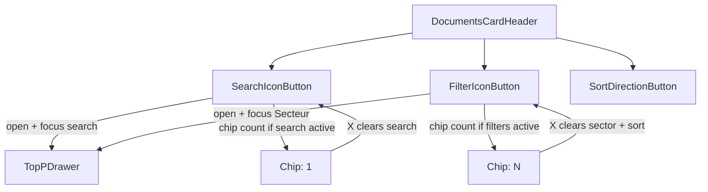

# Documents filter drawer refactor

## Current state

- Filter UI lives in a sticky [`pds-toolbar`](apps/ishare/src/app/affiliate-details/affiliate-details.component.html) at page level (lines 4–96).
- Filter state is local to [`AffiliateDetailsComponent`](apps/ishare/src/app/affiliate-details/affiliate-details.component.ts): `documentSearch`, `selectedSector`, `selectedSort` — no separate service.
- Filtering pipeline (`applyDocumentFilters` → `visibleDocuments`) stays unchanged.
- Drawer precedent: [`document-more-details-drawer`](apps/ishare/src/app/affiliate-details/affiliate-document-detail/document-more-details-drawer/) uses headless `p-drawer` + `PDS_DRAWER_APPEND_TO` + shared drawer tokens.
- No top-position drawer exists yet; PrimeNG supports `position="top"` with `height: 'auto'`.

## Target UX



**Card header layout** (right side, before existing sort-direction button):

| Control        | Icon                           | Opens drawer                                     | Chip                                                                             |
| -------------- | ------------------------------ | ------------------------------------------------ | -------------------------------------------------------------------------------- |
| Search         | `bi-search`                    | Yes, autofocus `#document-search`                | `1` when `documentSearch().trim()` is non-empty; X calls `clearDocumentSearch()` |
| Filter         | `bi-funnel` (or `bi-filter`)   | Yes, focus `#document-sector` autocomplete input | Count of active filters; X resets sector + sort to defaults                      |
| Sort direction | existing `startDateSortIcon()` | No                                               | unchanged                                                                        |

**Active filter count logic** (filter button chip):

- `+1` if `selectedSector()` is set and `value !== 'tous'`
- `+1` if `selectedSort()?.value !== 'date-reception'` (default is `sortOptions[1]`)

**Drawer contents** — single shared drawer, horizontal form row:

- Rechercher (iconfield + input-clear)
- Secteur (p-autocomplete)
- Trier par (p-autocomplete)

Reuse existing bindings/handlers: `onSectorChange`, `onSortChange`, `filterSectors`, `filterSortOptions`, telemetry IDs.

## Implementation

### 1. New drawer component (app-scoped)

Create [`apps/ishare/src/app/affiliate-details/document-filters-drawer/`](apps/ishare/src/app/affiliate-details/document-filters-drawer/) following the `document-more-details-drawer` pattern:

- `p-drawer` with `position="top"`, `[appendTo]="PDS_DRAWER_APPEND_TO"`, `[modal]="true"`, `[closable]="false"`, `[dismissible]="true"`
- Panel style: `{ width: '100%', maxWidth: '100%', height: 'auto' }` (top drawer — not the right-drawer width tokens)
- `visible` as `model<boolean>()`
- `focusTarget` as `input<'search' | 'sector'>('search')` — set by parent before opening
- Filter fields passed via inputs + change outputs (or `model` for search/sector/sort) so **filter state remains in parent** and existing computeds/tests keep working
- **Focus on open**: mirror [`top-nav`](libs/ui/src/lib/top-nav/top-nav.component.ts) pattern — on `visible` becoming true, `setTimeout(0)` then:
  - `search` → `document.getElementById('document-search')?.focus()`
  - `sector` → focus `#document-sector` input (PrimeNG autocomplete inputId)
- Optional close button in drawer header (text `bi-x-lg` button, same as affiliate-detail-drawer)

Move the three form-field blocks verbatim from the toolbar template into this component's drawer body, wrapped in:

```html
<div
  class="c-document-filters-drawer__form o-flex o-flex--row-wrap o-flex--align-items-flex-end o-layout--gap-3"
></div>
```

Use `c-form-field--horizontal` (or existing horizontal form-field modifier if present) for labels beside controls per your horizontal layout requirement.

### 2. Update affiliate-details template

In [`affiliate-details.component.html`](apps/ishare/src/app/affiliate-details/affiliate-details.component.html):

- **Delete** the entire `pds-toolbar.c-affiliate-documents-toolbar` block (lines 4–96).
- **Extend** the card header row (lines 108–141) with a button group on the right:

```html
<div class="o-flex o-flex--align-items-center o-layout--gap-1">
  <!-- search trigger + optional p-chip count -->
  <!-- filter trigger + optional p-chip count -->
  <!-- existing sort-direction button -->
</div>
```

- Icon-only triggers: `pButton` + `text` + `severity="secondary"` + `rounded` (match [`top-nav`](libs/ui/src/lib/top-nav/top-nav.component.html) action buttons).
- Chip: PrimeNG `p-chip` with `[label]="'1'"` / filter count, `[removable]="true"`, `(onRemove)` with `$event` stopped so it does not reopen the drawer.
- Add `<app-document-filters-drawer>` at bottom of template (alongside other drawers).

### 3. Update affiliate-details component TS

In [`affiliate-details.component.ts`](apps/ishare/src/app/affiliate-details/affiliate-details.component.ts):

- Remove `ToolbarComponent` import; remove form modules only used by toolbar if fully moved to drawer child.
- Add drawer state:
  - `documentFiltersDrawerVisible = signal(false)`
  - `documentFiltersFocusTarget = signal<'search' | 'sector'>('search')`
- Add methods:
  - `openDocumentFiltersDrawer(target: 'search' | 'sector')` — set focus target, open drawer
  - `clearDocumentFilters()` — `selectedSector.set(null)`, `selectedSort.set(defaultSortOption)`
- Add computeds:
  - `hasActiveDocumentSearch = computed(() => !!documentSearch().trim())`
  - `activeDocumentFilterCount = computed(() => …)` per count logic above
  - `hasActiveDocumentFilters = computed(() => count > 0)`

### 4. Styles (ITCSS)

**[`_components.affiliate-details.scss`](libs/styles/src/06-components/_components.affiliate-details.scss)**

- Add `c-affiliate-details__documents-actions` — flex row for search/filter/sort buttons
- Add `c-affiliate-details__documents-filter-trigger` — positions removable `p-chip` adjacent to/on the icon button (chip count badge, not full label)

**[`_components.affiliate-documents.scss`](libs/styles/src/06-components/_components.affiliate-documents.scss)**

- Remove sticky toolbar rules (`c-affiliate-documents-toolbar`, `c-toolbar--sticky` overrides)
- Rename/migrate field sizing to `c-document-filters-drawer__field` for the horizontal drawer form
- Add `c-document-filters-drawer` shell styles (padding, full-width top panel, horizontal field row)

**[`_settings.affiliate-documents.scss`](libs/styles/src/01-settings/_settings.affiliate-documents.scss)**

- Repoint toolbar-specific tokens to drawer form fields (filter field width, control height) — keep same 250px field width for consistency

**[`_settings.drawer.scss`](libs/styles/src/01-settings/_settings.drawer.scss)** (optional)

- Add `--pds-size-drawer-top-max-height` if content needs a cap on small viewports

### 5. Tests

Update [`affiliate-details.component.spec.ts`](apps/ishare/src/app/affiliate-details/affiliate-details.component.spec.ts):

- Remove/replace tests asserting sticky `pds-toolbar` at page level
- Assert search + filter icon buttons in `.c-affiliate-details__documents` card header
- Open drawer (click search/filter), then assert three filter labels exist inside drawer
- Assert chip appears when search/filter applied; chip remove clears state
- Assert `openDocumentFiltersDrawer('sector')` focuses sector control (spy on `focus()`)
- Keep existing filter pipeline tests (sector filter, search filter, info-tag filter) — they interact with component state, not toolbar DOM

Add focused spec for `DocumentFiltersDrawerComponent` (visibility, focus target, form rendering).

### 6. Cleanup

- Update toolbar metadata comment in [`toolbar.component.ts`](libs/ui/src/lib/toolbar/toolbar.component.ts) if it still references affiliate documents toolbar as primary example (optional doc-only).
- Verify no remaining references to `c-affiliate-documents-toolbar` outside styles/tests.

## Files touched (summary)

| File                                   | Change                                                          |
| -------------------------------------- | --------------------------------------------------------------- |
| `affiliate-details.component.html`     | Remove toolbar; add header buttons + drawer                     |
| `affiliate-details.component.ts`       | Drawer open/focus logic, active-filter computeds, clear helpers |
| `document-filters-drawer/*`            | **New** top drawer + horizontal form                            |
| `_components.affiliate-details.scss`   | Header action button + chip layout                              |
| `_components.affiliate-documents.scss` | Toolbar → drawer form styles                                    |
| `_settings.affiliate-documents.scss`   | Token rename if needed                                          |
| `affiliate-details.component.spec.ts`  | DOM + chip + drawer tests                                       |

## Out of scope

- Filter state extraction to a service (not needed; local signals work)
- Moving drawer to `libs/ui` (app-specific, matches `document-more-details-drawer`)
- Changing sort-direction toggle behavior (stays in header)
- Header info-tag filters (`documentInfoFilter`) — unchanged; chip only reflects toolbar filters (search/sector/sort)
