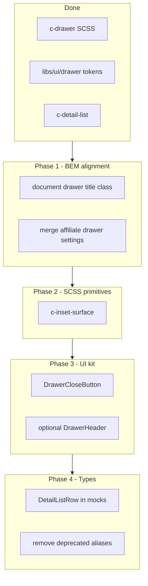

# Drawer & Styles Follow-Up Plan

## Current state

Completed in the prior session:

- Generic [`_components.drawer.scss`](libs/styles/src/06-components/_components.drawer.scss) with `c-drawer` block + `__affiliate-detail-*` elements
- Shared drawer TS module [`libs/ui/src/lib/drawer/`](libs/ui/src/lib/drawer/) (`SDS_DRAWER_APPEND_TO`, `SDS_DRAWER_CONTENT_STYLE`, `DetailListRow`, etc.)
- Semantic border tokens (`--sds-color-panel-border`, `--sds-color-card-border`)
- `c-detail-list`, `c-timeline--content-only`, `appendTo="body"` width fix



---

## Phase 1 — BEM & settings alignment (low risk, do first)

### 1.1 Document drawer title class

**Problem:** [`document-more-details-drawer.component.html`](apps/ishare/src/app/affiliate-details/affiliate-document-detail/document-more-details-drawer/document-more-details-drawer.component.html) still uses `u-text-heading-md` on the header title (line 16). [`AGENTS.md`](libs/styles/AGENTS.md) documents the target: `c-drawer__document-more-details-title`.

**Action:**

- Add to [`_components.drawer.scss`](libs/styles/src/06-components/_components.drawer.scss):

```scss
.c-drawer__document-more-details-title {
  @include text-heading-md;
  color: var(--#{$sds-prefix}-color-text);
}
```

- Replace `u-text-heading-md` in the document drawer template with `c-drawer__document-more-details-title`.

**Note:** Do not reuse `c-drawer__section-title` here — that mixin is `text-heading-sm`; the document drawer intentionally uses `heading-md`.

### 1.2 Merge affiliate drawer settings into drawer settings

**Problem:** [`_settings.affiliate-detail-drawer.scss`](libs/styles/src/01-settings/_settings.affiliate-detail-drawer.scss) is a separate 01-settings file while component SCSS already lives in the unified drawer file.

**Action:**

- Move tokens into [`_settings.drawer.scss`](libs/styles/src/01-settings/_settings.drawer.scss) under a commented `// Affiliate detail variant` section.
- Keep token names unchanged (`--sds-color-affiliate-detail-drawer-*`) to avoid a wide SCSS churn.
- Remove forward from [`_settings.core.scss`](libs/styles/src/01-settings/_settings.core.scss) and delete the standalone file.
- Update the comment in `_components.drawer.scss` to point at the new location.

---

## Phase 2 — Shared inset surface primitive

### 2.1 Extract `c-inset-surface`

**Problem:** [`c-drawer__affiliate-detail-family-tile`](libs/styles/src/06-components/_components.drawer.scss) and `__affiliate-detail-note` duplicate the same visual pattern: `1px solid var(--sds-color-content-border)` + background + radius.

| Element     | Background token                              | Radius token                                |
| ----------- | --------------------------------------------- | ------------------------------------------- |
| family-tile | `--sds-color-affiliate-detail-drawer-tile-bg` | `--sds-radius-affiliate-detail-drawer-tile` |
| note        | `--sds-color-affiliate-detail-drawer-note-bg` | `--sds-radius-affiliate-detail-drawer-note` |

**Action:**

- Add [`_components.inset-surface.scss`](libs/styles/src/06-components/_components.inset-surface.scss) (optional companion [`_settings.inset-surface.scss`](libs/styles/src/01-settings/_settings.inset-surface.scss) only if tokens should be genericized later).
- Base block:

```scss
.c-inset-surface {
  border: 1px solid var(--#{$sds-prefix}-color-content-border);
}
```

- Modifiers on the drawer elements (keep feature tokens on modifiers, not on the block):

```scss
.c-inset-surface--affiliate-detail-tile {
  background: …;
  border-radius: …;
}
.c-inset-surface--affiliate-detail-note {
  background: …;
  border-radius: …;
}
```

- Add both classes in [`affiliate-detail-drawer.component.html`](libs/ui/src/lib/affiliate-detail-drawer/affiliate-detail-drawer.component.html) alongside existing `c-drawer__affiliate-detail-*` classes (tile keeps button-specific rules like hover/cursor in the drawer element).
- Forward from [`_components.core.scss`](libs/styles/src/06-components/_components.core.scss).

---

## Phase 3 — Drawer UI kit (extract duplicated chrome)

### 3.1 `DrawerCloseButtonComponent`

**Problem:** Identical close button markup in two templates:

- [`affiliate-detail-drawer.component.html`](libs/ui/src/lib/affiliate-detail-drawer/affiliate-detail-drawer.component.html) (~lines 78–87)
- [`document-more-details-drawer.component.html`](apps/ishare/src/app/affiliate-details/affiliate-document-detail/document-more-details-drawer/document-more-details-drawer.component.html) (~lines 17–27)

Both use: `pButton`, `text`, `rounded`, `severity="secondary"`, `size="small"`, `icon="bi bi-x-lg"`, `aria-label="Fermer"`.

**Action:**

- Add `libs/ui/src/lib/drawer/drawer-close-button.component.ts` (+ minimal spec).
- Input: optional `ariaLabel` (default `'Fermer'`).
- Output: `close` event (parent calls `visible.set(false)` or `onClose()`).
- Export from [`libs/ui/src/lib/index.ts`](libs/ui/src/lib/index.ts).
- Replace inline buttons in both drawers; keep existing spec selectors (`[aria-label="Fermer"]`) passing.

### 3.2 Optional: `DrawerHeaderComponent` (defer until 3rd consumer)

**Problem:** Header shell (`c-drawer__header` + title slot + close) is duplicated but affiliate drawer has a more complex header (avatar, actions).

**Recommendation:** Stop at `DrawerCloseButton` for now. Revisit a `DrawerHeaderComponent` with `ng-content` slots when a third headless drawer appears or affiliate header simplifies.

---

## Phase 4 — TypeScript consolidation

### 4.1 Use `DetailListRow` in family mocks

**Problem:** [`affiliate-family-mock.ts`](apps/ishare/src/app/affiliate-details/affiliate-family-mock.ts) defines `generalInfo` / `contactInfo` as inline `{ label: string; value: string }[]` (lines 37–39).

**Action:**

- Import `DetailListRow` from `@solidaris/ui`.
- Replace inline shapes on `AffiliateFamilyProfile` interface.
- No runtime change; improves consistency with [`affiliate-detail-drawer.component.ts`](libs/ui/src/lib/affiliate-detail-drawer/affiliate-detail-drawer.component.ts).

### 4.2 Remove deprecated type aliases

**Problem:** [`AffiliateDetailDrawerInfoRow`](libs/ui/src/lib/affiliate-detail-drawer/affiliate-detail-drawer.component.ts) and `AffiliateDetailDrawerPosition` are thin aliases over `DetailListRow` / `DrawerPosition`. Only referenced in component metadata.

**Action:**

- Update [`affiliate-detail-drawer.metadata.ts`](libs/ui/src/lib/affiliate-detail-drawer/affiliate-detail-drawer.metadata.ts) to reference `DetailListRow` and `DrawerPosition` directly.
- Remove exported aliases from component TS and re-export list in `libs/ui` index if needed.
- Grep workspace for any remaining imports of deprecated names.

### 4.3 Optional: split `AffiliateDetailDrawerData` (low priority)

Only worth doing if Storybook stories or mocks become hard to maintain. Split into `AffiliateDetailDrawerHeaderData`, `AffiliateDetailDrawerSectionData`, etc., without changing the public input shape (use intersection type or nested optional groups). **Skip unless mocks grow further.**

---

## Phase 5 — Evaluate `c-detail-list` for document detail panel (investigate, may not merge)

**Problem:** [`c-affiliate-document-detail__detail-label`](libs/styles/src/06-components/_components.affiliate-document-detail.scss) uses a **124px** label column and muted label color; [`c-detail-list`](libs/styles/src/06-components/_components.detail-list.scss) uses **160px** and default text color.

**Action (audit-first):**

1. Compare Figma specs for drawer info rows (160px) vs document metadata rows (124px).
2. If widths must differ: add `c-detail-list--compact` modifier with `--sds-size-detail-list-label-width: calc(124 / 14 * var(--base-unit))` and `c-detail-list__label--muted` (or token on modifier).
3. Migrate document detail template rows only if visual parity is confirmed in Storybook / running app.
4. Deprecate `c-affiliate-document-detail__detail-label` / `__detail-value` once migrated.

**If Figma confirms different layouts:** keep separate classes; document in AGENTS.md why two detail-row patterns exist.

---

## Deferred / out of scope (unless you explicitly expand)

| Item                                                                                   | Rationale                                                                                                                                                                                                                                                               |
| -------------------------------------------------------------------------------------- | ----------------------------------------------------------------------------------------------------------------------------------------------------------------------------------------------------------------------------------------------------------------------- |
| Move `document-more-details-drawer` to `libs/ui`                                       | Coupled to iSHARE `DocumentCertificatPanel` types; only worth it when iCRM or Storybook needs the same drawer                                                                                                                                                           |
| Rename `c-affiliate-documents-toolbar__field` → `c-toolbar__affiliate-documents-field` | Separate toolbar BEM sweep; touches [`affiliate-details.component.html`](apps/ishare/src/app/affiliate-details/affiliate-details.component.html) + [`_components.affiliate-documents.scss`](libs/styles/src/06-components/_components.affiliate-documents.scss) + specs |
| `transactions-cics-modal` drawer tokens                                                | Dialog, not drawer; no `SDS_DRAWER_*` unless redesigned                                                                                                                                                                                                                 |
| `onClose()` one-liner util                                                             | Not worth abstracting                                                                                                                                                                                                                                                   |
| `normalizeAccordionPanelIds` unit tests                                                | Add only when a second accordion consumer appears                                                                                                                                                                                                                       |

---

## Verification

After each phase:

- Run targeted tests:
  - `nx test ui --testPathPattern=affiliate-detail-drawer`
  - `nx test ishare --testPathPattern=affiliate-document-detail`
  - `nx test ishare --testPathPattern=affiliate-details`
- Visual check in running app (`npm run start`): open affiliate detail drawer and document “more details” drawer — confirm width, timeline, header typography (`heading-md` on document title), inset surfaces, close button behavior.
- Storybook: affiliate-detail-drawer stories still render all states after close-button extraction.

---

## Suggested execution order

1. Phase 1 (title + settings merge) — ~30 min, zero behavioral risk
2. Phase 4.1 (mock types) — trivial, pairs well with Phase 1
3. Phase 2 (`c-inset-surface`) — small SCSS refactor
4. Phase 3.1 (`DrawerCloseButton`) — DRY templates
5. Phase 4.2 (drop aliases) — cleanup after types stable
6. Phase 5 — audit only; implement merge only if widths align
