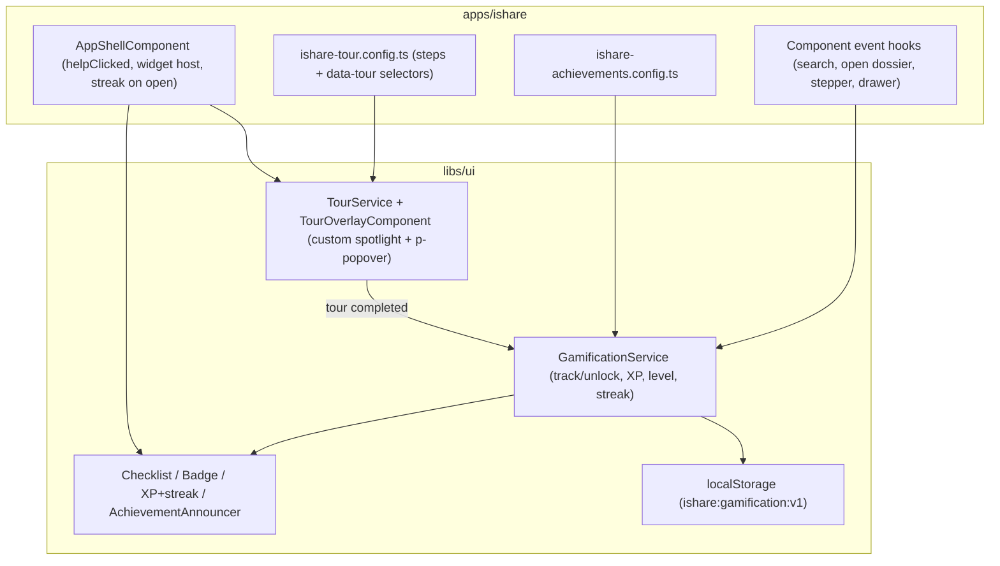

## Decisions (from scoping questions)

- Purpose: demo/prototype polish — looks real, local-only, no backend.
- Mechanics: guided tour (completion = first achievement), achievements/badges, points + levels (XP), onboarding checklist + progress bar, daily streak. Excluded: leaderboard (needs backend + real operator identity).
- Persistence: `localStorage` only.
- Tour: custom-built with PrimeNG/Plectrum primitives (PrimeNG Popover + a dimmed spotlight overlay) — no new dependency, aligns with the PrimeNG-first rule.

## Architecture

Generic + reusable goes to `libs/ui` / `libs/styles` (SSOT). iSHARE-specific config and event wiring stays in `apps/ishare` (per the no-app-logic-in-libs/ui rule).

## What gets built

### 1. Custom tour (libs/ui, no dependency)
- New `libs/ui/src/lib/tour/`:
  - `tour.service.ts`: `start(steps)`, `next()`, `prev()`, `skip()`, `restart()`; signals `isActive`, `currentIndex`, `currentStep`; resolves each step target via `document.querySelector` (selector or `data-tour="..."`), `scrollIntoView`, and exposes the target's bounding rect (recomputed on resize/scroll).
  - `tour-overlay.component.ts`: rendered once at app root. A highlight box positioned over the active target uses the spotlight trick `box-shadow: 0 0 0 9999px <scrim>` to dim everything else (no SVG mask), plus a click-blocking layer. The step card uses PrimeNG **Popover** (`p-popover`) anchored to the target element for positioning, with title, body, "Étape X / N", and Précédent / Suivant / Passer / Terminer controls.
  - `tour-step.ts`: `TourStep` type (`target: string`, `title`, `body`, `placement?`, optional `onEnter`).
  - Export all from [libs/ui/src/lib/index.ts](libs/ui/src/lib/index.ts).
- Styles: new `libs/styles/src/06-components/_components.tour.scss` (`c-tour__spotlight`, `c-tour__scrim`, `c-tour__card`) using semantic Plectrum tokens (radius, shadow, scrim color, spacing) — no hardcoded hex; forwarded from `_components.core.scss`.
- Storybook story demonstrating a 3-step tour over sample targets.

### 2. Gamification engine (libs/ui, localStorage)
- New `libs/ui/src/lib/gamification/`:
  - `gamification.service.ts`: root service backed by `localStorage` (key `ishare:gamification:v1`). Holds signals `unlocked`, `xp`, `level` (computed from XP thresholds), and `streak` (current/longest + lastActiveDate). API: `track(eventId)` (unlocks matching achievements + adds XP, idempotent per achievement), `recordVisit()` (updates daily streak: +1 if consecutive day, reset if gap), `emit$` for unlock notifications, `reset()` (dev/demo). Configured with `Achievement[]`.
  - `achievement.ts`: `Achievement` type (`id`, `title`, `description`, `icon`, `xp`, `triggerEventId`).
- localStorage read/write is guarded (SSR/quota safe) and versioned.

### 3. Gamification UI (libs/ui + libs/styles)
- Presentational standalone components (each with a `.stories.ts`, BEMIT classes, ARIA):
  - `AchievementBadgeComponent` — locked/unlocked, icon, label, tooltip with description.
  - `OnboardingChecklistComponent` — tasks with done state + PrimeNG `p-progressbar`; "Démarrer la visite" CTA.
  - `XpLevelComponent` — level + XP progress bar + daily streak indicator (flame icon + count).
  - `AchievementAnnouncerComponent` — celebratory unlock notification via PrimeNG `MessageService` (custom toast key/template).
- Styles: new `libs/styles/src/06-components/_components.gamification.scss` (`c-achievement`, `c-onboarding-checklist`, `c-xp-bar`, `c-streak`), forwarded from `_components.core.scss`.

### 4. iSHARE wiring (apps/ishare)
- `apps/ishare/src/app/gamification/ishare-tour.config.ts`: steps keyed to existing anchors — top-nav help/avatar, search form (`home`), affiliate overview card (`sds-affiliate-overview-card`), document toolbar + list, stepper, "Voir carte affilié" drawer. Add stable `data-tour="..."` hooks on those elements where CSS selectors would be fragile.
- `apps/ishare/src/app/gamification/ishare-achievements.config.ts`: e.g. `tour-complete` ("Premier pas"), `first-search`, `open-dossier`, `inspect-document`, `open-affiliate-card`, plus XP values.
- Render `<sds-tour-overlay>` and the announcer once in [app-shell.component.html](apps/ishare/src/app/layout/app-shell.component.html).
- Wire `(helpClicked)` on `sds-top-nav` → `TourService.restart()`; auto-start the tour on first visit (localStorage flag). Call `recordVisit()` on shell init (streak).
- Tour completion → `GamificationService.track('tour-complete')` (tour = first achievement).
- Emit events from key interactions: first search ([home.component](apps/ishare/src/app/home/home.component.ts)), opening `affiliate/:id`, stepping the document stepper, opening the carte affilié drawer.
- Host the XP/level + streak widget in the shell near the avatar, with the onboarding checklist in a popover opened from that widget (and surfaced on `home` until complete).
- Provide configs in [app.config.ts](apps/ishare/src/app/app.config.ts).

## Out of scope (v1)
- Leaderboard, multi-operator identity, backend sync. (localStorage is per-browser, so streak/XP are device-local — acceptable for a demo.)

## Validation
- Storybook stories for every new `libs/ui` component (states: locked/unlocked, empty/partial/complete checklist, XP/level + streak, tour active).
- Manual: first-visit auto-tour, help button restart, spotlight tracks targets on scroll/resize, achievements unlock + XP/level + streak persist across reload, checklist progresses, no Tailwind-in-HTML / hardcoded tokens (ITCSS/BEMIT compliance).
