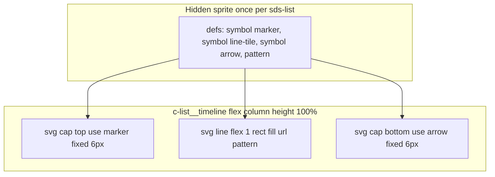

# Stretchable list timeline (SVG `<use>` 9-slice)

## Problem

The journey document row timeline in [`libs/ui/src/lib/list/list.component.html`](libs/ui/src/lib/list/list.component.html) renders one monolithic asset:

```92:94:libs/ui/src/lib/list/list.component.html
<div class="c-list__timeline" aria-hidden="true">
  
</div>
```

[`_components.list.scss`](libs/styles/src/06-components/_components.list.scss) stretches it to the full row height:

```278:283:libs/styles/src/06-components/_components.list.scss
.c-list__timeline-img {
  display: block;
  inline-size: calc(6 / 14 * var(--base-unit));
  block-size: 100%;
  object-fit: fill;
}
```

`object-fit: fill` + `block-size: 100%` scales the entire 131px SVG (circle + zigzag + arrow) uniformly, squishing the caps when rows are shorter than the design height.

## Target behavior



Only the middle segment grows; circle and arrow stay vector-crisp at design size.

## Approach — inline SVG sprite + `<use>` (selected)

### Why this over `` + CSS background

- Caps stay true vectors at any DPI
- Timeline colors can use existing tokens via `var(--sds-color-list-timeline-*)` on symbol strokes/fills
- One semantic graphic per row (3 small SVGs sharing one sprite)
- Zigzag middle uses native SVG `<pattern>` (equivalent fidelity to CSS `background-repeat`, but co-located with caps)

### 1. Create sprite from [`libs/assets/timeline.svg`](libs/assets/timeline.svg)

Extract from Figma node `435:7384` into a single sprite file [`libs/assets/timeline-sprite.svg`](libs/assets/timeline-sprite.svg):

| Symbol ID                     | Content                | viewBox                                           |
| ----------------------------- | ---------------------- | ------------------------------------------------- |
| `sds-list-timeline-marker`    | Top circle             | `0 0 6 6`                                         |
| `sds-list-timeline-line-tile` | One zigzag repeat unit | `0 0 6 4` (adjust slice height for seamless tile) |
| `sds-list-timeline-arrow`     | Bottom chevron         | `0 0 6 6`                                         |

Use `currentColor` or CSS custom properties for fills/strokes so tokens apply:

```xml
<symbol id="sds-list-timeline-marker" viewBox="0 0 6 6">
  <circle ... stroke="var(--sds-color-list-timeline-marker-border)" fill="var(--sds-color-list-timeline-marker)"/>
</symbol>
```

Also define the repeat pattern (can live in the hidden sprite `<defs>` in the template, referencing the line-tile symbol):

```xml
<pattern id="sds-list-timeline-line-pattern" patternUnits="userSpaceOnUse"
         width="6" height="4">
  <use href="#sds-list-timeline-line-tile" width="6" height="4"/>
</pattern>
```

Delete monolithic `timeline.svg` after migration.

**ID collision note:** Define symbols + pattern **once** per `sds-list` instance in a hidden root SVG. Row SVGs reference shared `#sds-list-timeline-*` ids — do not duplicate defs per row.

### 2. Update HTML structure

In [`list.component.html`](libs/ui/src/lib/list/list.component.html):

**A. Hidden sprite** (once, at list root — e.g. first child inside host):

```html
<svg class="c-list__timeline-sprite" aria-hidden="true" focusable="false">
  <defs>
    <!-- inline symbol paths from timeline-sprite.svg, or ng-include / build-time inline -->
    <pattern id="sds-list-timeline-line-pattern" ...>
      <use href="#sds-list-timeline-line-tile" width="6" height="4" />
    </pattern>
  </defs>
</svg>
```

**B. Per journey document row** — replace `` with flex column of 3 SVGs:

```html
<div class="c-list__timeline" aria-hidden="true">
  <svg class="c-list__timeline-cap" aria-hidden="true">
    <use href="#sds-list-timeline-marker" width="6" height="6" />
  </svg>
  <svg
    class="c-list__timeline-line"
    aria-hidden="true"
    preserveAspectRatio="none"
  >
    <rect width="6" height="100%" fill="url(#sds-list-timeline-line-pattern)" />
  </svg>
  <svg class="c-list__timeline-cap" aria-hidden="true">
    <use href="#sds-list-timeline-arrow" width="6" height="6" />
  </svg>
</div>
```

In [`list.component.ts`](libs/ui/src/lib/list/list.component.ts):

- **Remove** `timelineSrc` — no img asset paths needed

**Implementation detail:** Prefer copying symbol path data into the hidden sprite in the template (or a tiny `list-timeline-sprite.component.ts` with `templateUrl`) to avoid cross-document `<use href="external.svg#id">` fragment issues. Keep `timeline-sprite.svg` as the SSOT file; sync paths into template defs during implementation.

### 3. Wire SCSS (use existing tokens)

[`_settings.list.scss`](libs/styles/src/01-settings/_settings.list.scss) already defines timeline tokens — wire them:

- `--sds-color-list-timeline-marker` / `-marker-border` / `-line`
- `--sds-size-list-timeline-gutter` (64px)
- `--sds-size-list-timeline-marker`

Add size tokens:

- `--sds-size-list-timeline-width`: `calc(6 / 14 * var(--base-unit))`
- `--sds-size-list-timeline-cap`: cap height (~6px)
- `--sds-size-list-timeline-line-tile`: pattern tile height (4px, match symbol slice)

Update [`_components.list.scss`](libs/styles/src/06-components/_components.list.scss):

| Class                         | Rules                                                                                                            |
| ----------------------------- | ---------------------------------------------------------------------------------------------------------------- |
| `.c-list__timeline-sprite`    | `position: absolute; width: 0; height: 0; overflow: hidden` (or `u-sr-only` equivalent — not visible, defs only) |
| `.c-list__timeline`           | `display: flex; flex-direction: column; align-items: center; height: 100%` (keep absolute positioning)           |
| `.c-list__timeline-cap`       | `flex-shrink: 0; width/height: cap size; display: block`                                                         |
| `.c-list__timeline-line`      | `flex: 1 1 auto; min-height: 0; width: timeline-width; display: block`                                           |
| `.c-list__timeline-line rect` | `height: 100%` (fills flex-grown svg)                                                                            |

Remove `.c-list__timeline-img` and `object-fit: fill`.

Expose timeline color tokens on `.c-list__timeline` so child SVGs inherit `var(--sds-color-*)` from symbols.

### 4. Tests and Storybook

[`list.component.spec.ts`](libs/ui/src/lib/list/list.component.spec.ts):

- Assert hidden sprite defs exist once per list instance
- Assert journey rows render `.c-list__timeline-cap` (×2), `.c-list__timeline-line`, and `<use href="#sds-list-timeline-marker">` etc.
- Assert caps are not `height: 100%` (fixed cap size); line svg has `flex: 1` behavior
- Remove `timeline.svg` src assertion

[`list.stories.ts`](libs/ui/src/lib/list/list.stories.ts): visually verify journey story with short/tall rows.

### 5. Asset pipeline

Keep `timeline-sprite.svg` in `libs/assets/` as design SSOT. Hidden sprite defs inlined in template reference the same geometry. No separate img assets to copy for runtime loading.

## Files to touch

| File                                                  | Change                                     |
| ----------------------------------------------------- | ------------------------------------------ |
| `libs/assets/timeline-sprite.svg`                     | **new** — symbol SSOT                      |
| `libs/assets/timeline.svg`                            | **delete**                                 |
| `libs/ui/src/lib/list/list.component.html`            | hidden sprite + 3-part SVG `<use>` per row |
| `libs/ui/src/lib/list/list.component.ts`              | remove `timelineSrc`                       |
| `libs/styles/src/01-settings/_settings.list.scss`     | cap/tile width tokens                      |
| `libs/styles/src/06-components/_components.list.scss` | flex 9-slice for SVG caps/line             |
| `libs/ui/src/lib/list/list.component.spec.ts`         | SVG structure assertions                   |

## Verification

1. Storybook journey list — marker/arrow crisp on short rows; zigzag line fills gap
2. iSHARE Eva Martinez Parcours — rows of varying height
3. `ng test ui --include=**/list.component.spec.ts`

## Risk / fallback

- If zigzag tile doesn't repeat seamlessly, adjust `viewBox` height on `sds-list-timeline-line-tile` symbol
- If pattern `url(#id)` fails across shadow DOM boundaries, keep all defs + uses in the same component template (ViewEncapsulation.None is already set on list — should be fine)
