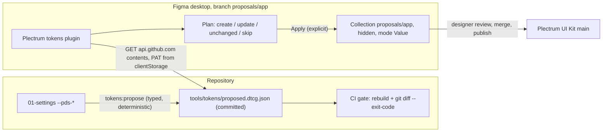

# Plectrum tokens Figma plugin (repository → Figma)

## Decisions this plan builds on

- **Transport**: private Figma plugin using `figma.variables` (Plugin API is not plan-gated). Chosen by you: the plugin **fetches `proposed.dtcg.json` from GitHub** with a designer-owned fine-grained PAT (read-only `Contents`, this repo only) stored in `figma.clientStorage`; the REST scripts and workflows (`apply-to-figma.mjs`, `pull-figma.mjs`, `apply-to-figma.yml`, `library-publish.yml`) **stay parked** as the Enterprise path.
- **Guard parity** with `tools/tokens/apply-to-figma.mjs`: writes only into collection `proposals/{app}`, `hiddenFromPublishing`, one mode `Value`, `scopes: ['ALL_SCOPES']`, `codeSyntax.WEB = var(--pds-…)`, description `Code-owned token --pds-…`, never the main file `YNZ1DlSjDNUXrvkxlSp10D`, explicit selection required (no silent "all"), never deletes or retypes.
- **Main-file guard inside the plugin**: `manifest.enablePrivatePluginApi: true` exposes `figma.fileKey` to private (org-published or development) plugins. Refuse when `figma.fileKey` is `undefined` or equals the main key. There is no Plugin API to read the branch name, so the UI shows `figma.fileKey` + `figma.root.name` and asks the designer to confirm the branch — the key check is the hard stop.
- **`proposed.dtcg.json` becomes a committed generated file** (currently gitignored). GitHub Actions artifacts redirect to blob-storage domains that a plugin allowlist cannot pin, and a committed file is the pattern the repo already uses for `*.generated.*` with a `git diff --exit-code` CI gate. A `ref` setting (default `main`) lets a designer preview a PR branch.
- **v1 value types** (repo side decides, plugin only maps): `color → COLOR`, `dimension` in px `→ FLOAT`, `number`/`fontWeight → FLOAT`, `fontFamily → STRING`. Shadows, gradients, transitions, durations, `%`/viewport units, keywords (`auto`, `currentcolor`) stay `$type: "other"` with a `reason` and are listed as skipped. Today ~170 of ~200 proposal entries are `"other"` because `propose-to-figma.mjs` only recognises hex/rgba; without this step the plugin could write ~30 colours.
- **Plugin UI is not a design-system surface**: it runs in Figma's iframe and uses Figma's `themeColors` CSS variables so it looks native. `libs/*` rules (PrimeNG-first, `--pds-*` only) govern apps and libraries; nothing here is added to `libs/`.

## Flow



## 1. Repository side — make the proposal Figma-ready

`tools/tokens/propose-to-figma.mjs` (keep CLI, output path and `codeOwned` shape; docs and `apply-to-figma.mjs` depend on them):

- **Typing + resolution** instead of `startsWith('#') ? 'color' : 'other'`:
  - `color`: hex3/6/8, `rgb()/rgba()`, `transparent` (reuse `normalizeHex` from `format-value.mjs`); `#{$…}` Sass interpolation is not a colour (fixes the `grid/cols` false positive).
  - `dimension`: `px`, `rem` (×14 — `1rem = 14px`, `--pds-base-unit: 1rem`), unitless `0`, and `calc()` that reduces to px after substituting `var(--pds-*)` from the collected 01-settings declarations and `resolveDtcg().resolved` (depth-limited; small `+ - * /` evaluator over px/rem/unitless — no `eval`). Emit DTCG `{ "value": 17, "unit": "px" }`.
  - `number` (line-height `1`, opacity, z-index), `fontWeight` (400/600/700), `fontFamily` (`'Open Sans', sans-serif` → `["Open Sans", "sans-serif"]`).
  - Everything else: `"$type": "other"` plus `$extensions["com.solidaris.pds"].reason` (`unsupported:shadow`, `unresolved:var(--pds-color-card-border)`, `unit:%`…).
- **Determinism** so the CI gate is stable across Windows/Linux: sort `readdirSync` results, collapse `\r\n`/whitespace in values, stable key order.
- Extract `cssToFigmaColor` from `apply-to-figma.mjs` into `tools/tokens/figma-values.mjs` (shared by the parked CLI and the plugin bundle) so the two transports cannot drift.
- Tests: `tools/tokens/propose-to-figma.spec.mjs` with `node --test` (same runner as `tools/stylelint/*.spec.mjs`): typing table, calc resolution, skip reasons, determinism.
- `.gitignore`: remove `/tools/tokens/proposed.dtcg.json`; add `/tools/figma-plugin/dist/`. Commit the regenerated proposal.
- `.github/workflows/ci.yml`: step `Rebuild token proposal (must be committed)` → `npm run tokens:propose && git diff --exit-code -- tools/tokens/proposed.dtcg.json`.

## 2. The plugin — `tools/figma-plugin/`

```
tools/figma-plugin/
  manifest.json      name "Plectrum tokens", editorType ["figma"], documentAccess "dynamic-page",
                     enablePrivatePluginApi true, main dist/code.js, ui dist/ui.html,
                     networkAccess { allowedDomains: ["https://api.github.com"], reasoning: "Reads proposed.dtcg.json from the solidaris-plectrum repository" }
  tsconfig.json      strict, lib es2020, typeRoots [@types, @figma]  (main thread: no DOM)
  tsconfig.ui.json   lib es2020 + dom                                  (iframe)
  build.mjs          esbuild: src/main.ts → dist/code.js; src/ui.ts + src/ui.html → dist/ui.html (script inlined)
  README.md          build, import from manifest, PAT setup, publish to Organization
  src/
    main.ts          showUI({ themeColors: true }); message handler; settings; fetch; guards; apply
    settings.ts      clientStorage keys: githubToken, owner (solidaris-danielbodigil), repo (solidaris-plectrum),
                     path (tools/tokens/proposed.dtcg.json), ref (main)
    github.ts        GET /repos/{owner}/{repo}/contents/{path}?ref= with Accept: application/vnd.github.raw+json,
                     Authorization: Bearer <PAT>, X-GitHub-Api-Version  (main-thread `fetch`, string URL, plain headers)
    plan.ts          pure: (proposal, selection, existing collection + variables) → { create, update, unchanged, skip[reason] }
    values.ts        pure: DTCG token → { resolvedType, value }  (imports cssToFigmaColor from ../../tokens/figma-values.mjs)
    apply.ts         executes a plan through figma.variables; returns a result log
    ui.html / ui.ts  settings panel, app select (scratch | ishare | icrm | custom), fetch, filter + checkbox table
                     (nothing selected by default; "select all visible" is an explicit action), dry-run summary, Apply, result log
    *.spec.ts        node --import tsx --test for plan.ts and values.ts (pure, no Figma globals)
```

Main-thread sequence (`main.ts`):

1. `figma.editorType === 'figma'`, `figma.fileKey` defined and `!== MAIN_FILE_KEY` — otherwise show the refusal and stop (same wording as the CLI).
2. Load settings; UI shows file key, `figma.root.name`, token status (`…last4` only, never the token).
3. `fetch` proposal for `ref` → validate `codeOwned` → send rows to UI with `$type`, value preview, skip reason.
4. On "Plan": `getLocalVariableCollectionsAsync()` → non-remote `proposals/{app}`; `getLocalVariablesAsync()` for that collection → compute plan (existing variable with a different `resolvedType` → skip, never retype).
5. On "Apply": create the collection if missing (`createVariableCollection`, `hiddenFromPublishing = true`, `renameMode(defaultModeId, 'Value')`); per row `createVariable(name, collection, type)` or reuse; `setValueForMode(defaultModeId, value)`; `description`, `scopes = ['ALL_SCOPES']`, `setVariableCodeSyntax('WEB', 'var(--pds-…)')`, `hiddenFromPublishing = true`. All conversions happen in the plan phase so the write loop only calls the API; a mid-way failure is reported and undoable (Edit → Undo, one plugin run = one undo step). `figma.notify` with counts.

Core write, for reference:

```ts
const collection =
  existing ?? figma.variables.createVariableCollection(`proposals/${app}`);
if (!existing) {
  collection.hiddenFromPublishing = true;
  collection.renameMode(collection.defaultModeId, "Value");
}
const variable =
  found ??
  figma.variables.createVariable(row.name, collection, row.resolvedType);
variable.setValueForMode(collection.defaultModeId, row.value); // {r,g,b,a} | number | string
variable.description = `Code-owned token ${row.cssVar}`;
variable.scopes = ["ALL_SCOPES"];
variable.setVariableCodeSyntax("WEB", `var(${row.cssVar})`);
variable.hiddenFromPublishing = true;
```

## 3. Build, test, CI, distribution

- Root `package.json`: devDependencies `@figma/plugin-typings` (1.138) and `esbuild` (pin explicitly rather than relying on Angular's transitive 0.28); scripts `figma-plugin:build`, `figma-plugin:watch`, `figma-plugin:typecheck` (`tsc -p … --noEmit` for both tsconfigs), `figma-plugin:test`.
- `.github/workflows/ci.yml`: job `figma-plugin` → typecheck, test, build, upload `tools/figma-plugin/manifest.json` + `dist/` as artifact `plectrum-figma-plugin` so a publisher or designer needs no local toolchain.
- Distribution (manual, Figma desktop): developers `Plugins → Development → Import plugin from manifest`; the first import registers the plugin `id` — copy it into `manifest.json` and commit so later publishes update the same plugin. Release: `Manage plugins → Publish → Publish to: Organization` (Organization plan, no Figma review, any member can publish). Recorded in the plugin README.
- Optional de-risk before writing the UI: run the exact `figma.variables` sequence above on the `proposals/scratch` branch through the Figma MCP `use_figma` tool to confirm collection/mode/`codeSyntax` behaviour.

## 4. Docs and decision record (prose docs, no CSSOM impact)

- `.ai/decisions/2026-09-10-repo-to-figma-plugin.md` (ADR: Option A on the Organization plan, REST kept for Enterprise) and point `.ai/questions/2026-09-07-repo-to-figma-transport.md` to it (status: decided).
- `tools/tokens/PLUGIN_SETUP.md`: new section "Repo → Figma (Plectrum tokens plugin)" mirroring the existing PrimeUI section — designer-owned PAT (`Contents: Read`, this repo only), settings, guard list; the current "parked" text becomes "Enterprise alternative".
- `tools/tokens/README.md` (propose row: typed output, committed file; plugin row), `apply-to-figma.yml` / `pull-figma.mjs` header comments (plugin is the live path).
- Storybook: `libs/ui/src/docs/token-pipeline-figma.mdx` (status paragraph, diagram edge `proposal → branch` label `plugin` instead of `by hand`, Repository → Figma process) and `token-pipeline-figma.stories.ts` (`OutboundStatus`, `OutboundOptions`, `OutboundInterim`, `OutboundProcess`, `Guardrails`, `Reference`); `libs/ui/src/docs/token-pipeline.mdx` rows that describe `tokens:propose` / `tokens:apply` as parked (lines ~103–111, 196–198, 213–215, 244–247, 278–280).

## Out of scope (follow-ups, noted in the ADR)

- Export direction (branch variables → JSON, the `tokens:pull-figma` replacement).
- Category-based `scopes` (e.g. `radius/* → CORNER_RADIUS`) instead of `ALL_SCOPES`.
- An exclude list for documentation-only tokens (`docs/*`, `doc/demo/*`, `token/explorer/*`) so they stop appearing in the proposal.
