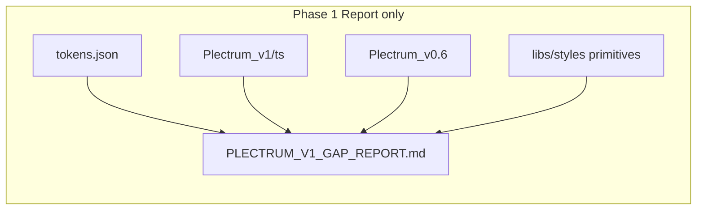

# Plectrum v1 upgrade

## Phasing (per your direction)

| Phase             | Scope                          | Code changes                                                                     |
| ----------------- | ------------------------------ | -------------------------------------------------------------------------------- |
| **1 — Report**    | Audit + deliverable for review | **Docs/scripts only** — no `Plectrum_v1/ts` edits, no `providePlectrum()` switch |
| **2 — Implement** | After you review the report    | Wire v1, prod avatar toggle, then fixes from report                              |

---

## Current state

| Piece         | Today                                                                                                                                                                                                                     |
| ------------- | ------------------------------------------------------------------------------------------------------------------------------------------------------------------------------------------------------------------------- |
| Active preset | [`libs/plectrum/src/lib/index.ts`](libs/plectrum/src/lib/index.ts) imports **`Plectrum_v0.6`**                                                                                                                            |
| v1 preset     | [`libs/plectrum/src/Plectrum_v1/ts/`](libs/plectrum/src/Plectrum_v1/ts/) — 82 component files + `index.ts`, **no root barrel**                                                                                            |
| Figma export  | [`libs/plectrum/src/tokens.json`](libs/plectrum/src/tokens.json) — DTCG format, ~33k lines, 7 token sets                                                                                                                  |
| SDS tokens    | [`libs/styles/src/01-settings/_settings.colors-primitive.scss`](libs/styles/src/01-settings/_settings.colors-primitive.scss) — **hardcoded**, independent of preset                                                       |
| Avatar menu   | [`sds-top-nav`](libs/ui/src/lib/top-nav/top-nav.component.html) — `p-menu` on avatar trigger; today menu items only when `testingTelemetryEnabled` via [`app-shell`](apps/ishare/src/app/layout/app-shell.component.html) |



**Important:** `tokens.json` is **lookup reference only** — do not mirror into preset or SCSS in either phase unless explicitly listed in Phase 2 fixes.

---

## Preliminary findings (to be expanded in formal report)

These are **hypotheses for Phase 1 audit** — not fixes:

| Issue                            | v1 today                                                                             | Reference                                                        |
| -------------------------------- | ------------------------------------------------------------------------------------ | ---------------------------------------------------------------- |
| `{extremes.white}`               | Referenced in [`base.ts`](libs/plectrum/src/Plectrum_v1/ts/base.ts), **not defined** | `tokens.json` / hardcode `#ffffff`                               |
| `extend.ts` regression           | v1: `basic.solidaris`, `plectrum.*`, `functional.link` only                          | v0.6 had `emutnav`, `surface.75`, `transparant.*`, `focus.color` |
| Dark color scheme                | v1 **light-only**                                                                    | v0.6 has `dark`; `darkModeSelector: '.dark'` still configured    |
| Drawer shadow                    | v1 hardcoded in [`drawer.ts`](libs/plectrum/src/Plectrum_v1/ts/drawer.ts)            | Figma `Component Color Scheme/Light → drawer`                    |
| Accordion / primary / primitives | Intentional visual diffs vs v0.6                                                     | Visual review matrix in Phase 2                                  |

---

## Phase 1 — Gap report (do this first)

### Deliverables

1. **[`libs/plectrum/PLECTRUM_V1_GAP_REPORT.md`](libs/plectrum/PLECTRUM_V1_GAP_REPORT.md)** (primary deliverable)
   - Executive summary: safe to switch default? blockers count by severity
   - **Unresolved `{token.path}` refs** in all `Plectrum_v1/ts/*.ts` (automated grep + manual classification)
   - **v1 vs v0.6** component-level diff table (drawer, accordion, card, tag, button, tabs, …)
   - **v1 / v0.6 vs `tokens.json`** for key semantic roles (panel border `#e7e7e7`, primary, surface scale, overlay shadow)
   - **SDS primitives vs Figma** drift on tokens apps actually use (`--sds-color-panel-border`, emutnav, etc.)
   - **Recommended fix order** for Phase 2 (no implementation)

2. **[`libs/plectrum/TOKENS_REFERENCE.md`](libs/plectrum/TOKENS_REFERENCE.md)**
   - Purpose of `tokens.json`, token set names, how to look up a value when debugging
   - Map: Figma set → code location (`base.ts`, `extend.ts`, SDS `01-settings`)

3. **Optional:** [`libs/plectrum/scripts/audit-preset-refs.mjs`](libs/plectrum/scripts/audit-preset-refs.mjs) — read-only script; output feeds the gap report

### Phase 1 constraints

- **No** edits to `Plectrum_v1/ts/*`, `providePlectrum()`, or app wiring
- **No** mirroring `tokens.json` into codebase

---

## Phase 2 — Implementation (after report review)

### 1 — Barrel + provider (default v1)

- Add [`libs/plectrum/src/Plectrum_v1/index.ts`](libs/plectrum/src/Plectrum_v1/index.ts) re-exporting `./ts`
- Refactor [`providePlectrum()`](libs/plectrum/src/lib/index.ts):

```ts
export type PlectrumPresetVersion = 'v0.6' | 'v1';

export function providePlectrum(
  version: PlectrumPresetVersion = readStoredPresetVersion() ?? 'v1',
): EnvironmentProviders { ... }
```

- Export `PlectrumPresetV06` and `PlectrumPresetV1` from [`libs/plectrum/src/index.ts`](libs/plectrum/src/index.ts)

### 2 — Preset fixes (from report only)

Surgical edits in `Plectrum_v1/ts/` **only for items you approve** from `PLECTRUM_V1_GAP_REPORT.md` (e.g. `extremes.white`, extend merge, dark scheme, drawer shadow).

### 3 — Avatar-menu version toggle (production included)

Target: top-nav avatar menu — DOM path `sds-top-nav → button.c-top-nav__avatar-trigger → p-menu`.

PrimeNG preset is bootstrap-bound → **localStorage + full reload**:

| Key                         | Values         | Default |
| --------------------------- | -------------- | ------- |
| `solidaris-plectrum-preset` | `v1` \| `v0.6` | `v1`    |

**Production visibility (your update):** toggle is **not** gated behind `testingTelemetryEnabled`. It ships in all environments for now.

Recommended wiring (keeps testing menu separate):

- New **`PlectrumPresetMenuService`** (or `libs/plectrum` helper + thin app wrapper) — owns storage read/write + menu item model
- [`app-shell`](apps/ishare/src/app/layout/app-shell.component.html): always pass avatar menu when preset toggle is enabled — e.g. `[showAvatarMenu]="true"` and merge preset menu item(s) with testing items when telemetry is on
- Menu item example:

```ts
{
  label: `Plectrum theme : ${current === 'v1' ? 'v1 (active)' : 'v0.6 (active)'}`,
  icon: 'bi bi-palette',
  id: 'plectrum-preset-toggle',
  command: () => { flipStorage(); location.reload(); },
}
```

- **Storybook** [`libs/ui/.storybook/preview.ts`](libs/ui/.storybook/preview.ts) — same storage key + toolbar or decorator entry
- **iCRM** — same pattern if it uses `sds-top-nav` with avatar menu

### 4 — Verification (Phase 2)

- `npx sass libs/styles/src/main.scss`
- Build iSHARE + Storybook (v1 default)
- Manual matrix via avatar toggle (prod + dev): top nav, overview card, drawers, accordions, category tabs, list
- Tests: preset menu service + existing specs

---

## Out of scope

- Mirroring full `tokens.json` into preset or `libs/styles`
- Regenerating SDS primitives from Figma (unless explicitly approved post-report)
- Deleting `Plectrum_v0.6`
- Phase 2 work before report delivery and your review
