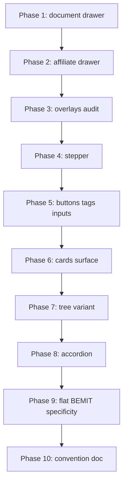

# PrimeNG default styles cleanup

## Problem

Feature work has added SCSS layers that override PrimeNG when defaults would suffice. Examples:

- `c-document-more-details-drawer` / `c-affiliate-detail-drawer` — custom `.p-drawer` chrome copied across features
- Layout duplicated in component SCSS instead of `o-flex` / `o-layout` in templates
- Figma tokens driving one-off `--p-*` bridges instead of PrimeNG + Plectrum theme
- Specificity hacks (doubled BEM classes) fighting PrimeNG injection order

---

## SSOT & principles

| Principle               | Rule                                                                                                                                                                                   |
| ----------------------- | -------------------------------------------------------------------------------------------------------------------------------------------------------------------------------------- |
| **SSOT**                | **PrimeNG defaults + Plectrum theme** — not Figma, not per-feature token files                                                                                                         |
| **Minimal CSS**         | No new component SCSS unless layout/objects cannot express it                                                                                                                          |
| **Layout in templates** | Use `o-flex`, `o-layout` ([05-objects](libs/styles/src/05-objects/)) in HTML — avoid `__header`, `__body` flex/gap/padding SCSS when a utility mix exists                              |
| **Flat BEMIT**          | Shallow blocks/modifiers only; avoid long descendant chains                                                                                                                            |
| **Specificity**         | Prefer ITCSS layer cascade (settings → objects → components → trumps); if PrimeNG must be beaten, use `:is()`, `:where()`, or `@layer` — **not** doubled selectors like `.c-foo.c-foo` |
| **Custom classes**      | Add a `c-*` class only when it carries semantic scope (variant, audit pattern, tree variant) — not for flex/padding/overflow                                                           |

Reference utilities:

- [\_objects.flex-grid.scss](libs/styles/src/05-objects/_objects.flex-grid.scss) — `o-flex`, `o-flex--y`, `o-flex--align-items-center`, …
- [\_objects.layout.scss](libs/styles/src/05-objects/layout/_objects.layout.scss) — `o-layout--gap-*`, `o-layout--padding-*`, `o-layout--full-height`, `o-layout--min-w-0`, …

---

## Component policy

| PrimeNG component               | Policy                                                                                            |
| ------------------------------- | ------------------------------------------------------------------------------------------------- |
| **Button**                      | Default PrimeNG + Plectrum                                                                        |
| **Stepper**                     | Default PrimeNG + Plectrum                                                                        |
| **Tag**                         | Default PrimeNG + Plectrum                                                                        |
| **Inputs**                      | Default PrimeNG + Plectrum                                                                        |
| **Drawer**                      | Default PrimeNG — no `styleClass` on `p-drawer`, no `.p-drawer` overrides                         |
| **Modal / Dialog**              | Default PrimeNG                                                                                   |
| **Popover / Menu**              | Default PrimeNG — anchor via component API (`[popup]`, `appendTo="body"`), no custom overlay SCSS |
| **Form field** (`c-form-field`) | **Custom SDS** — vertical/horizontal labels, required, validation (wrapper only)                  |
| **Card** (`p-card`)             | **Allowed surface** — reusable panel chrome on named wrappers                                     |
| **Tree** (`c-list`)             | **Named variant** — formalize; do not revert to bare PrimeNG                                      |
| **Accordion**                   | **Custom bordered** — `c-audit-accordion` only for border chrome                                  |

### Keep (global parity — not design chrome)

- `_settings.button.scss`, `_settings.tag.scss`, `_settings.togglebutton.scss` — line-height parity
- `_components.overlay-list.scss`, `_components.autocomplete.scss` — scale parity
- `_components.form-field.scss` — wrapper alignment for toggleswitch

### Keep (approved custom layers)

- `c-form-field`, `c-audit-accordion`, `c-list` tree variant, `p-card` surface wrappers

---

## Phase 1 — `document-more-details-drawer` (highest priority)

**Current debt:** dedicated [\_components.document-more-details-drawer.scss](libs/styles/src/06-components/_components.document-more-details-drawer.scss) + [\_settings.document-more-details-drawer.scss](libs/styles/src/01-settings/_settings.document-more-details-drawer.scss) for layout and PrimeNG bridges Figma drove — **not required by policy**.

### Template ([document-more-details-drawer.component.html](apps/ishare/src/app/affiliate-details/affiliate-document-detail/document-more-details-drawer/document-more-details-drawer.component.html))

- Remove `styleClass="c-document-more-details-drawer"` from `<p-drawer>` — default drawer chrome.
- Replace layout BEM (`__panel`, `__header`, `__body`, `__event-header`, …) with `o-flex` / `o-layout` mixes where they only express flex, gap, padding, overflow, full-height.
- Keep **only** classes with semantic meaning:
  - `c-audit-accordion` on nested accordions
  - Timeline marker modifiers (`--info` / `--warn` / `--success`) **if** no existing token/utility covers them — otherwise inline severity classes or PrimeNG timeline `#marker` defaults
- Default `p-button`, `p-tag`, `p-table`, `p-timeline` — no wrapper classes for theming.

### SCSS — prefer deletion

| Action                  | Target                                                                               |
| ----------------------- | ------------------------------------------------------------------------------------ |
| **Delete**              | `.p-drawer`, `--p-button-*`, `--p-timeline-*`, `--p-tag-*`, `--p-datatable-*` blocks |
| **Delete**              | Layout-only rules replaceable by `o-flex` / `o-layout`                               |
| **Delete entire files** | Both drawer settings + components SCSS if nothing remains                            |
| **Keep**                | Marker color modifiers only if still needed after PrimeNG defaults                   |

### Tests

- [affiliate-document-detail.component.spec.ts](apps/ishare/src/app/affiliate-details/affiliate-document-detail/affiliate-document-detail.component.spec.ts)
- `npx nx test ishare --testPathPattern=affiliate-document-detail`

---

## Phase 2 — `c-affiliate-detail-drawer`

Same treatment as Phase 1 on [\_components.affiliate-detail-drawer.scss](libs/styles/src/06-components/_components.affiliate-detail-drawer.scss):

- Default `p-drawer` — remove `styleClass` and `.p-drawer` rules
- `o-flex` / `o-layout` for header/content/toolbar layout
- Remove `--p-button-*`, `--p-tag-*`
- Remove `__accordion` chrome-free reset → default accordion or `c-audit-accordion`
- **Keep** `__family-tile .p-card` — card-as-surface

---

## Phase 3 — Overlays (drawer, modal, popover, menu, dialog)

Audit all overlay usage in apps + `libs/ui`:

| Check                       | Pass criteria                                                            |
| --------------------------- | ------------------------------------------------------------------------ |
| `p-drawer`                  | No feature `styleClass`; no feature SCSS on `.p-drawer`                  |
| `p-dialog` / dynamic dialog | Default chrome; no custom mask/panel SCSS                                |
| `p-popover`                 | Removed from list (now `p-menu`); any remaining popovers default only    |
| `p-menu [popup]`            | `appendTo="body"` only; no `.p-menu-overlay` custom SCSS                 |
| Mask                        | Theme `--p-mask-background` only (Plectrum) — no per-feature mask styles |

Known SCSS to remove: drawer files in Phase 1–2. No other overlay SCSS in `libs/styles` today — enforce in convention doc for new work.

---

## Phase 4 — Stepper → default PrimeNG

Delete [\_settings.stepper.scss](libs/styles/src/01-settings/_settings.stepper.scss) token bridge (all `--p-stepper-*` on `.c-affiliate-document-detail__stepper`).

- Compare with [primeng.org/stepper](https://primeng.org/stepper)
- Template-only adjustments if needed — no SCSS bridges

---

## Phase 5 — Buttons, tags, inputs → default PrimeNG

Remove scoped bridges:

- [\_settings.top-nav.scss](libs/styles/src/01-settings/_settings.top-nav.scss) — `--p-button-*`
- [\_settings.affiliate-overview.scss](libs/styles/src/01-settings/_settings.affiliate-overview.scss) — `--p-button-*`
- [\_settings.copyable-text.scss](libs/styles/src/01-settings/_settings.copyable-text.scss) — `--p-button-*`
- Any remaining `--p-tag-*` outside `c-audit-accordion` flows

---

## Phase 6 — Cards as surface (keep)

`p-card` remains an approved composition primitive.

**Keep:** affiliate-details panels, overview cards, drawer family tiles, iconography cards.

**Fix specificity anti-pattern** in [\_components.affiliate-details.scss](libs/styles/src/06-components/_components.affiliate-details.scss):

```scss
// Anti-pattern today — doubled class for specificity
.c-affiliate-details__documents.c-affiliate-details__documents .p-card-body { … }
```

Replace with:

- Owned scroll wrapper + `o-scroll-shadow` on our element, **or**
- `@layer components { … }` / `:where(.c-affiliate-details__documents) .p-card-body` per ITCSS policy

Do not remove card surface `--p-card-*` tokens.

---

## Phase 7 — Tree variant (formalize, do not strip)

[\_components.list.scss](libs/styles/src/06-components/_components.list.scss) — intentional iSHARE document list tree.

1. Single flat scope: e.g. `.c-list__tree` or `.c-list--journey` (one block, no deep nesting)
2. Document: “PrimeNG tree variant — not default tree”
3. Prefer `:where(.c-list__tree) .p-tree-node-content` over chained BEM descendants where PrimeNG internals need targeting

---

## Phase 8 — Accordion bordered styles (keep + audit)

**Keep:** `c-audit-accordion` — borders, radii, padding ([\_settings.accordion.scss](libs/styles/src/01-settings/_settings.accordion.scss), [\_components.audit-accordion.scss](libs/styles/src/06-components/_components.audit-accordion.scss))

**Audit chrome-free** (`.c-sub-nav-shell__accordion`, `.c-list__accordion`, drawer accordions):

- Default PrimeNG accordion, **or**
- `c-audit-accordion` where borders are required

---

## Phase 9 — Flat BEMIT & specificity pass

Repo-wide cleanup after feature phases:

| Anti-pattern                            | Replacement                                        |
| --------------------------------------- | -------------------------------------------------- |
| `.c-block.c-block .p-*` doubled classes | ITCSS order or `@layer components`                 |
| Deep chains `.c-a .c-b .c-c .p-*`       | Flat block + `:where()` / `:is()` on PrimeNG child |
| Layout in `__element` SCSS              | `o-flex` / `o-layout` in template                  |
| Feature SCSS file per drawer/page       | Delete when utilities + default PrimeNG suffice    |
| Figma-driven `--p-*` one-offs           | Remove; Plectrum theme is SSOT                     |

Examples to fix:

- [\_components.affiliate-details.scss](libs/styles/src/06-components/_components.affiliate-details.scss) — doubled `.p-card-body` selector
- Drawer `__header` / `__body` padding — move to `o-layout--padding-*` / `o-layout--gap-*`

---

## Phase 10 — Convention doc

Add to `libs/styles/README.md` or `AGENTS.md`:

```text
Solidaris styling policy

SSOT (in order):
  1. PrimeNG component defaults
  2. Plectrum theme (providePlectrum)
  3. libs/styles ITCSS (objects, then scoped components)
  Figma is reference only — not SSOT for PrimeNG chrome.

DEFAULT PrimeNG (no scoped --p-* / .p-* overrides):
  button, stepper, tag, inputs
  drawer, modal/dialog, popover, menu

Layout — prefer templates over SCSS:
  o-flex, o-layout (05-objects) for flex, gap, padding, overflow, min-size
  Do not add c-* classes for layout-only concerns.

Custom classes — only when needed:
  c-form-field (label layout)
  c-audit-accordion (bordered accordion)
  c-list tree variant
  p-card surface wrappers (named panel chrome)

BEMIT:
  Keep blocks flat; shallow modifiers only.
  No doubled-class specificity (.c-foo.c-foo).

Specificity over PrimeNG:
  1. ITCSS layer order (unlayered components after @layer primeng)
  2. :is() / :where() on scoped wrapper
  3. @layer components { … }
  Never: deep descendant chains or repeated class names for weight.

Overlays:
  No styleClass on p-drawer / p-dialog roots.
  appendTo="body" when stacking requires it — not custom mask CSS.

Global parity (allowed without approval):
  line-height on .p-button, .p-tag, .p-togglebutton; overlay list font scale.
```

---

## Execution order



Phase 1 is the proof case: default `p-drawer`, `o-flex`/`o-layout` template, delete feature SCSS, keep `c-audit-accordion` only.

---

## Phase 1 file checklist

- [document-more-details-drawer.component.html](apps/ishare/src/app/affiliate-details/affiliate-document-detail/document-more-details-drawer/document-more-details-drawer.component.html)
- [document-more-details-drawer.component.scss](apps/ishare/src/app/affiliate-details/affiliate-document-detail/document-more-details-drawer/document-more-details-drawer.component.scss) — likely empty / delete
- [\_components.document-more-details-drawer.scss](libs/styles/src/06-components/_components.document-more-details-drawer.scss) — delete if empty
- [\_settings.document-more-details-drawer.scss](libs/styles/src/01-settings/_settings.document-more-details-drawer.scss) — delete if empty
- [\_components.core.scss](libs/styles/src/06-components/_components.core.scss)
- [\_settings.core.scss](libs/styles/src/01-settings/_settings.core.scss)
- [affiliate-document-detail.component.spec.ts](apps/ishare/src/app/affiliate-details/affiliate-document-detail/affiliate-document-detail.component.spec.ts)
