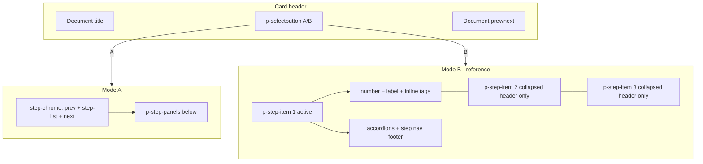

# Stepper layout toggle (A horizontal / B vertical)

## Goal

Add `p-selectbutton` with options **A** and **B** beside the document title in the detail card header ([`affiliate-details.component.html`](apps/ishare/src/app/affiliate-details/affiliate-details.component.html)).

| Mode | Label | Layout |
|------|-------|--------|
| **A** | Horizontal | Current implementation — fixed chrome row (prev / scrollable step list / next), status **below** step title, shared scrollable `p-step-panels` area |
| **B** | Vertical | Reference mockup — stacked `p-step-item` rows, status **inline** with title, inactive steps collapsed, active step expands accordion + step nav **inside** its panel |

Both modes share: same `steps()` data, `activeStep`, `certPanelsAccordion` content, tag click handlers, and accordion state.

## Visual reference — Mode B (vertical)

```
● 1  Certificat  [Accepté]
│    ┌─────────────────────────────┐
│    │  (accordion panels)         │
│    │                             │
│    │     [Précédent] [Suivant]   │
│    └─────────────────────────────┘
│
○ 2  Feuilles de renseignement  [Clôturé]
│
○ 3  Calcul  [En attente] [⚠ 1]
```

Key differences from horizontal step headers:

| Element | Horizontal (A) | Vertical (B) |
|---------|----------------|--------------|
| Status tags | Below title (`__step-meta` row under head) | **Inline** on same row as number + label |
| Step separators | Horizontal lines between steps in steplist | Vertical connector via PrimeNG `p-stepitem` separator |
| Prev/next nav | Flanking step list in `__step-chrome` | **Inside active step panel** footer, right-aligned |
| Inactive steps | All visible in horizontal list | **Collapsed** — header row only |
| Panel content | Single shared area below all steps | Per-step `p-step-panel`, only active step expanded |

Nav button labels in vertical footer (match existing aria/tooltip copy):
- **Précédent** / **Étape précédente** (outlined secondary, icon left)
- **Suivant** / **Étape suivante** (primary, icon right)



## 1. State + header UI (parent)

**[`affiliate-details.component.ts`](apps/ishare/src/app/affiliate-details/affiliate-details.component.ts)**
- Import `SelectButton` from `primeng/selectbutton`.
- Add `DocumentStepperView = 'horizontal' | 'vertical'` in [`affiliate-document-detail.types.ts`](apps/ishare/src/app/affiliate-details/affiliate-document-detail/affiliate-document-detail.types.ts).
- Add `stepperView = signal<DocumentStepperView>('horizontal')`.
- Add `stepperViewOptions = [{ label: 'A', value: 'horizontal' }, { label: 'B', value: 'vertical' }]`.
- Computed `showStepperViewToggle()` — true when selected document has `layout !== 'standalone'`.
- Reset `stepperView` to `'horizontal'` on `selectedDocumentId` change.
- Pass `[stepperView]="stepperView()"` to `app-affiliate-document-detail`.

**[`affiliate-details.component.html`](apps/ishare/src/app/affiliate-details/affiliate-details.component.html)** (~L344–386)
- Insert `p-selectbutton` between title `h2` and document skip-nav buttons.
- `size="small"`, `[allowEmpty]="false"`, `ariaLabel="Mode d'affichage du parcours"`.
- Hidden when `pageLoading()` or `!showStepperViewToggle()`.

Pattern: [`affiliate-detail-drawer.component.html`](libs/ui/src/lib/affiliate-detail-drawer/affiliate-detail-drawer.component.html).

## 2. Document detail — templates + dual markup

**[`affiliate-document-detail.component.ts`](apps/ishare/src/app/affiliate-details/affiliate-document-detail/affiliate-document-detail.component.ts)**
- `stepperView = input<DocumentStepperView>('horizontal')`.

**Shared `ng-template`s** in [`affiliate-document-detail.component.html`](apps/ishare/src/app/affiliate-details/affiliate-document-detail/affiliate-document-detail.component.html):

### `#documentStepHeader`
Params: `step`, `activateCallback`, `value`, `layout` (`'horizontal' | 'vertical'`), `showSeparator` (horizontal only).

- **Horizontal**: current structure — `__step-head-row` (button + separator) then `__step-meta` below.
- **Vertical**: single `__step-header-vertical` row — `p-step-header` (number + label) + inline `__step-meta` (status `p-tag` + count buttons on same row). No horizontal separator.

### `#documentStepPanelFooter`
Params: `activateCallback` (optional for vertical panel context).

- Row: `__step-panel-footer` with Précédent + Suivant buttons (visible labels, existing disabled logic).
- Used **only in vertical** active step panel (horizontal keeps nav in `__step-chrome`).

### Existing templates unchanged
- `#certPanelsAccordion`
- `#stepScrollTop` (horizontal shared scroll area; vertical may attach per active panel or body scroll)

---

### Mode A — horizontal (keep current)

Existing `p-step-list` + `__step-chrome` + `p-step-panels` structure; replace inline header with `*ngTemplateOutlet="documentStepHeader; context: { layout: 'horizontal', showSeparator: !last, ... }"`.

---

### Mode B — vertical (reference layout)

```html
<p-stepper
  class="c-affiliate-document-detail__stepper c-affiliate-document-detail__stepper--vertical ..."
  [(value)]="activeStep"
>
  @for (step of steps(); track step.value) {
    <p-step-item [value]="step.value">
      <p-step [pdsTelemetryLabel]="step.label">
        <ng-template #content let-activateCallback="activateCallback" let-value="value">
          <ng-container *ngTemplateOutlet="documentStepHeader; context: {
            step, activateCallback, value, layout: 'vertical', showSeparator: false
          }" />
        </ng-template>
      </p-step>
      <p-step-panel>
        <ng-template #content let-activateCallback="activateCallback">
          <div class="c-affiliate-document-detail__step-panel-body o-flex o-flex--y o-layout--gap-3">
            <ng-container *ngTemplateOutlet="certPanelsAccordion; context: { panels: step.panels }" />
            <ng-container *ngTemplateOutlet="documentStepPanelFooter" />
          </div>
        </ng-template>
      </p-step-panel>
    </p-step-item>
  }
</p-stepper>
```

- No `__step-chrome` row in vertical mode.
- PrimeNG handles collapse/expand of inactive `p-step-item` panels.
- Reuse `goToPreviousStep()` / `goToNextStep()` from footer buttons.

**Standalone layout**: unchanged; toggle hidden.

**Loading skeleton**: horizontal skeleton only (toggle hidden while loading).

## 3. Styles

**[`_components.affiliate-document-detail.scss`](libs/styles/src/06-components/_components.affiliate-document-detail.scss)**

**Horizontal** — scope under `:not(.c-affiliate-document-detail__stepper--vertical)`:
- Step-list scroll shadow wrapper, head-row separator, steplist nowrap overrides (existing rules).

**Vertical** — `.c-affiliate-document-detail__stepper--vertical`:
- Rely on PrimeNG `.p-stepper:has(.p-stepitem)` column layout + vertical `.p-stepper-separator`.
- `__step-header-vertical`: flex row, nowrap, align center; meta inline after title.
- `__step-panel-body`: panel content indented to align with label (tune via `margin-inline-start` using step number size token if PrimeNG indent is insufficient).
- `__step-panel-footer`: flex row, justify end, gap; shrink-0 at bottom of active panel.
- Inactive step headers: muted title color via existing PrimeNG `.p-step` / `.p-step-active` tokens.
- Ensure vertical separator line passes behind expanded panel (PrimeNG default; verify no `overflow: hidden` breaks it).

**Header toggle**: `.c-affiliate-document-detail__stepper-layout-switch` — minimal spacing in card header row.

## 4. Tests

**[`affiliate-document-detail.component.spec.ts`](apps/ishare/src/app/affiliate-details/affiliate-document-detail/affiliate-document-detail.component.spec.ts)**
- Default: `p-step-list` present, `__step-chrome` nav present, `__step-meta` below title.
- `stepperView: 'vertical'`: `p-step-item` present, no `__step-chrome`; status tag inline in step header; footer nav inside active `p-steppanel`; accordions render.
- Tag click / step navigation behavior unchanged in both modes.

## 5. Out of scope

- Persisting toggle across sessions.
- Vertical loading skeleton.
- Moving toggle into `libs/ui`.
