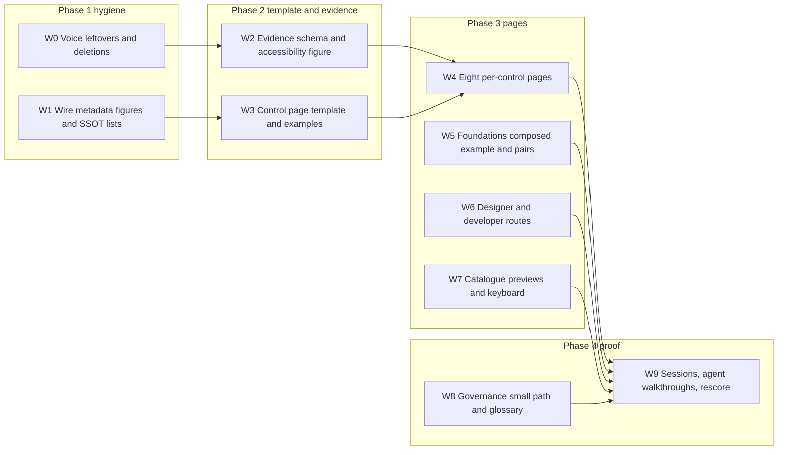

# Storybook 10/10 programme

Coordinator: **Claude Fable 5.1** (this session, `claude-fable-5-1-thinking-high`). It owns sequencing, voice review, merges, and the final rescore. Subagents get a model by difficulty tier; the coordinator picks the tier per task using the rule below and never hands voice-sensitive copy to the fast tier.

## Model assignment rule

- **Tier A — judgment, voice, cross-file design** (copy rewrites in the Contribute voice, page templates, schema changes, IA decisions): `claude-fable-5-1-thinking-high`; use `claude-opus-5-thinking-medium` when two Tier A tasks run in parallel.
- **Tier B — build from a written spec** (new figure components, stories, scripts, specs, MDX pages whose copy the coordinator already wrote): `claude-sonnet-5-thinking-high`; `gpt-5.6-sol-medium` as the parallel second.
- **Tier C — mechanical, repetitive, verifiable by a check** (delete lines, rename, run `docs:check`, grep-and-replace across many files, regenerate `index.json`): `composer-2.5`; `composer-2.5-fast` for single-file edits.
- **Browser verification and agent-run walkthroughs**: `browser-use` subagent, `inherit`.
- **Read-only gates**: `Architect` and `Token Auditor` roles from `.cursor/agents/` on Tier B.
- Existing roles map: UX Researcher (Figma reads), UX Engineer (SCSS, stories), Frontend Dev (Angular figures), Tester (specs, a11y, Storybook tests).

## Status of the two existing plans

- [.cursor/plans/plectrum-ux-audit-and-plan.md](.cursor/plans/done/plectrum-ux-audit-and-plan.md): T01–T05 and T07/T08 largely done (rescore 7/10). Remaining: T06 per-control pages, T07 composed foundations example and approved pairs, T08 recorded evidence and FR/NL glossary, T10 sessions and drift checks. T09 (patterns) is out of scope by your decision.
- [.cursor/plans/storybook_docs_audit_15622331.plan.md](.cursor/plans/done/storybook_docs_audit_15622331.plan.md): still relevant for its **section 2 (wire Patterns/Examples/Variants, generate lists)** and most of **section 1 leftovers**. Three items are superseded and the file must be corrected before archiving: the MDX order rule (you chose primary canvas → Usage → Variants → Anatomy, now in `.ai/rules/03-storybook.md`), the "no Glossary on Introduction" line (Overview now has "Words we use" by your request), and the Introduction Hero/FirstHour rows (replaced by the Audience figure). Done already: `solidaris-nx`, versions from `package.json`, Figma map page. Action: annotate those, fold the rest into this plan, move the file to `.cursor/plans/Done/`.

## Work packages

### W0 — Voice leftovers and deletions (Tier A copy, Tier C deletes)
From the docs audit plan, still present in source:
- Delete "20 of 39 use cases" in [libs/ui/src/docs/writing-stories-figures.stories.ts](libs/ui/src/docs/writing-stories-figures.stories.ts) L48; delete the "temporary home / migration-ledger" sentence in [libs/ui/src/docs/story-authoring.mdx](libs/ui/src/docs/story-authoring.mdx) L79; delete the dated "Audit outcome" section in [libs/ui/src/docs/get-started-contribute.mdx](libs/ui/src/docs/get-started-contribute.mdx) L92.
- Rewrite `AppLayer` in [libs/ui/src/docs/get-started-contribute.stories.ts](libs/ui/src/docs/get-started-contribute.stories.ts) L145–149 (drop "drift stays contained by tooling", "rule 09 §9"); drop "rule 09 §13" in [libs/ui/src/docs/primeng-customizations.mdx](libs/ui/src/docs/primeng-customizations.mdx) L43.
- Remove restated values: [libs/ui/src/foundations/radius.mdx](libs/ui/src/foundations/radius.mdx) L10 (6px/8px history); keep one breakpoint sentence in [libs/ui/src/foundations/layout.mdx](libs/ui/src/foundations/layout.mdx) (L20 stays, L188 goes).
- Voice pass on: ai-strategy, css-architecture, token-pipeline trio, token-sync-status, whats-new, releases, typography-primitives, focus, scroll-shadow, elevation vs shadows one-liner; metadata leads for form-field, list, accordion, copyable-text, delay-prediction-card. Do not touch DevLoop / ProposeEarly / AlreadyBuilt / BeforeYouInvent.

### W1 — Wire metadata figures and generated lists (Tier B build, Tier C rollout)
- Export `Patterns` / `Examples` / missing `Variants` via `contractStory(...)` in every `libs/ui/src/lib/**/*.stories.ts`; embed in MDX after Usage (Patterns) and after the last canvas (Examples) only when the block has content. [libs/ui/src/storybook/docs-contract.component.html](libs/ui/src/storybook/docs-contract.component.html) already renders both cases.
- Hide empty contract sections; companion/nested `p-tag`s become docs links using the resolver in `docs-component-index.component.ts`; anatomy legend shows part name then role ([libs/ui/src/storybook/docs-anatomy.component.ts](libs/ui/src/storybook/docs-anatomy.component.ts) L109).
- Extend [tools/scripts/check-docs-ssot.mjs](tools/scripts/check-docs-ssot.mjs): metadata with `commonPatterns` / `examples` / `variants` must embed the figure.
- Generated lists: layout class walls from CSSOM (pattern of `borders-playground.ts`) or Exception B spec; icon `SIZE_OPTIONS` vs `--pds-icon-size-*`; one shared `!dev` "Endorsed composition" figure reused by the five galleries; gallery Figma rows from `PRIMENG_KIT` instead of pasted URLs; Contribute CI table read from `.github/workflows/ci.yml` or replaced by a link; CSS architecture `c-` block list from `index.json`. PrimeNG customizations generation stays deferred.

### W2 — Evidence schema and accessibility figure (Tier A schema, Tier B figure)
- Add `accessibility.evidence` to `.ai/contracts/schema/component.metadata.ts`: `automated`, `manualKeyboard`, `manualScreenReader` (each `passed | failed | not-assessed`, plus `by: 'person' | 'agent'`), `date`, `version`, `limitations[]`. Regenerate `index.json` via the scaffolder path, never by hand.
- Status/Accessibility figure renders those fields with the wording from [libs/ui/src/foundations/accessibility.mdx](libs/ui/src/foundations/accessibility.mdx). "Not assessed" is the default.
- Fill Button, Form Field, Drawer, Empty State: automated from the a11y addon, keyboard from agent-run `browser-use` walkthroughs marked `by: 'agent'`, screen reader stays not-assessed.
- Add two open-able examples: 200% zoom (viewport story) and a long French label story on Form Field.

### W3 — Control page template and paste-ready examples (Tier A)
- Template per control: Status → Default canvas + Controls → When to use / alternatives / default → Variants with the reason each exists → Content → Behavior → Accessibility (responsibility plus evidence) → Use in an application → Related. Encode it in `.ai/rules/03-storybook.md` and `check-docs-ssot.mjs`.
- Snippets live in one `libs/ui/src/primeng/primeng.examples.ts` (same contract as [libs/ui/src/lib/form-field/form-field.example.ts](libs/ui/src/lib/form-field/form-field.example.ts)); the consumer smoke app in `tools/packaging/consumer-app/` mounts each; [tools/scripts/check-docs-release.mjs](tools/scripts/check-docs-release.mjs) gains a drift check per snippet. Run `npm run pack:smoke`.

### W4 — Eight per-control pages (Tier B build, coordinator writes the copy)
- New flat pages `PrimeNG/Button`, `ToggleButton`, `SelectButton`, `InputText`, `Select`, `AutoComplete`, `Dialog`, `Message and Toast`; family galleries stay as theme proof and link down. Add to `storySort` in [libs/ui/.storybook/preview.ts](libs/ui/.storybook/preview.ts).
- Point `storybook` paths in [libs/ui/src/primeng/plectrum-figma.ts](libs/ui/src/primeng/plectrum-figma.ts) at the new pages so Find a component and the UI kit table follow without edits.
- PrimeNG MCP for props and a11y notes; Figma MCP for the exact node per control; no reimplementation.

### W5 — Foundations composed example and approved pairs (Tier A decision, Tier B figure)
- One `pds-docs-page-example` figure: page title, section, card, body, label with `o-layout` gaps and `md` padding, rendered wide and at `xs`; every value shows class or token next to its Figma variable (`figmaRef` already flows through `tools/tokens/sd.config.mjs`). Embed on Typography roles, Spacing, Layout, Semantic colors.
- Colour explorer defaults to reusable roles; feature tokens behind the filter.
- Approved pairs: propose a provisional AA-passing set as the default, labelled provisional, and update [.ai/questions/2026-09-11-approved-color-pairs.md](.ai/questions/2026-09-11-approved-color-pairs.md) with the proposal for design sign-off.
- Empty State: provisional mapping of the seven illustrations to no-results vs blocked-task, on the Empty State page, flagged as a design decision in `.ai/questions/`.

### W6 — Designer and developer routes to done (Tier B)
- Design with Plectrum: steps link the Form Field custom-components node and InputText `23:835`; add three state figures (required, invalid, narrow) reusing Form Field stories; add library activation and who grants access; confirm Agenda/Open Sans in the Figma files via Figma MCP.
- Build with Plectrum: fonts and Bootstrap Icons asset source, supported browsers, release date beside 1.0.0 (from `release-state.ts`), link to the v1 rename notes in What's new. Extend `check-docs-release.mjs` for the new facts.

### W7 — Catalogue previews and keyboard (Tier B, Token Auditor read-only gate)
- Preview per row: PNG export of the Figma node via the Figma images API in a `tools/scripts/catalogue-thumbnails.mjs` (token handling as in `tools/tokens/pull-figma.mjs`), keyed by `PRIMENG_KIT` node ids and `component.figmaUrl`; stored under `libs/assets/catalogue/`; regenerated by script, never hand-edited.
- Keyboard operability of filters and table verified by `browser-use`; a `catalogue.spec.ts` case for tab order.

### W8 — Governance small path and glossary (Tier A)
- Move "A small correction" to the top of Contribute; add the named ask route and a provisional response expectation (two working days) with an `.ai/questions/` entry for the team to confirm.
- FR/NL glossary and copy conventions as a short section on Forms and Actions (not a Foundations page, per your earlier decision), fed from `libs/ui/src/lib/i18n`.

### W9 — Proof and rescore (browser-use, coordinator)
- Session kit in `.ai/research/2026-09-storybook-tasks.md`: seven tasks from the audit, script, consent line, recording template (completion, help needed, confidence).
- Agent dry-run of all seven tasks in `browser-use`, recorded as agent-run in the same template.
- Gates: `docs:check`, `contracts:check`, `npx ng test ui`, `npm run test-storybook`, `npm run pack:smoke`. Update the rescore canvas with the new scores and the evidence lines.

## Verification
- Every gate above green in CI and locally.
- Browser check of each new page and figure at `lg` and `xs`.
- Old story ids still resolve (`index.json` diff before/after).
- Rescore shows each dimension except patterns at 10 with the evidence cited, or names what still blocks it.