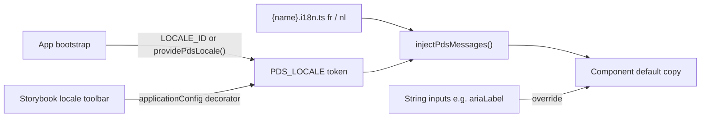

# Storybook staff-bar plan

Source: the staff audit canvas plus the Button discussion. Decisions taken with you: **genericise** List / Affiliate Overview Card / Affiliate Detail Drawer (keep Core), and **build** FR/NL i18n rather than defer it.

## Corrections to the audit before it becomes work

- Inline `statusStory({ status, owner })` on Accordion, Drawer, Detail List, Skeleton Slot, Timeline is **allowed** by [.ai/rules/03-storybook.md](.ai/rules/03-storybook.md) §3 for CSS-only blocks. Not a gap; dropped.
- Storybook 10 already ships a viewport toolbar. The gap is Plectrum **presets** from `$breakpoints`, not the toolbar.
- `pds-doc-demo-box` is not exported from [libs/ui/src/lib/index.ts](libs/ui/src/lib/index.ts) and has zero usages: it is dead code, not an undocumented API.
- Patterns/iCRM: nothing to document yet; dropped.
- The scaffolder stub in [tools/generators/sds-component/index.ts](tools/generators/sds-component/index.ts) violates rule 03 today (`title: '${category}/…'`, `tags: ['autodocs']`, prose in `docs.description.component`, no MDX, no `Status`, barrel append to `src/index.ts`). This is the root cause of the docs-template gap.

## Phase 1 — Catalogue truth

### PrimeNG theme gallery (theme proof, not API docs)

New folder `libs/ui/src/primeng/` with five family pages, one CSF + attached MDX each, titled `PrimeNG/…`:

- **Actions**: `pButton` severities / outlined / text / link / sizes / icon / loading / disabled, ToggleButton, SelectButton
- **Forms**: InputText + IconField/InputIcon + InputGroup, Select, AutoComplete, DatePicker; default / filled / invalid / disabled; endorsed wrapper `pds-form-field`
- **Data**: Table (sortable headers), Tree stock vs `pds-list`, Skeleton, Timeline stock
- **Overlays**: Dialog, Drawer stock, Popover, Toast, Tooltip, Menu, all `appendTo="body"`
- **Content and navigation**: Card, Tag, Badge, Message, Divider, Breadcrumb, Tabs, Stepper, ScrollTop

Scope is driven by actual usage (`pButton` 36, `p-skeleton` 26, `p-card` 18, `pInputText` 16, `p-tag` 11 …). Each MDX: `Status` badge (core / design-system), one line "What Plectrum changes" linking the row on [libs/ui/src/docs/primeng-customizations.mdx](libs/ui/src/docs/primeng-customizations.mdx), an **Endorsed composition** block (Bootstrap Icons not PrimeIcons, `appendTo="body"`, sizes), canvases with render-contract `play`, Chromatic snapshots on, Figma node from the Plectrum UI Kit (Main), and `API: primeng.org/{component}` instead of prose. Follow the Accordion precedent for `## API` (story knobs, not a wrapper API). The preset toggle turns every page into a v0.6 / v1 diff tool.

Wire-up: add `'PrimeNG'` after `'Foundations'` in `storySort` in [libs/ui/.storybook/preview.ts](libs/ui/.storybook/preview.ts); add a row to the "How this Storybook is organized" table in [libs/ui/src/docs/introduction.mdx](libs/ui/src/docs/introduction.mdx); point "Build screens" in [libs/ui/src/docs/get-started-consume.mdx](libs/ui/src/docs/get-started-consume.mdx) at it; fill the `—` Story cells on the customizations page.

### Genericise the three Core components (keep Core)

- **List** (`pds-list` stays): rename `ListDocument*` → `ListEntry*` in [libs/ui/src/lib/list/list.types.ts](libs/ui/src/lib/list/list.types.ts), `c-list__item--document` → `c-list__item--entry` in `_components.list.scss`; move the French keyword-to-icon inference in `list-document-icon.ts` to `apps/ishare` (the `icon` field stays the API — app logic leaves `libs/ui`); metadata description domain-neutral; primary Figma link = Custom-components `pds-list / c-list`, iSHARE-Audit becomes "reference usage".
- **Affiliate Overview Card** → **`pds-profile-card`**: `ProfileCardComponent`, `c-profile-card`, `ProfileCard*` types, `_settings.profile-card.scss` + `_components.profile-card.scss`, stories `Custom components/Profile Card`.
- **Affiliate Detail Drawer** → **`pds-profile-drawer`**: `ProfileDrawerData` with `generalRows`, `contactRows`, `relatedMembers`, `notes`; `c-drawer__affiliate-detail-*` → `c-drawer__profile-*`; section titles come from i18n messages (Phase 4) with a small `labels` partial-override input. Stories `Shell/Profile Drawer`.
- Update iSHARE call sites: `affiliate-details` (ts/html/spec), `affiliate-document-detail` (ts/spec), `affiliate-family-mock.ts`, `affiliate-header.service.ts`, `app-shell` (ts/html), `app.routes.ts`. Update Contribute "Audit outcome" rows, customizations rows, rule 09 §9 example, `generate-index`. Add a changeset (breaking rename of `@solidaris/ui`).
- Names above are proposals; review them in the PR. If the Plectrum kit has no node for a card/drawer, file `.ai/questions/` for design rather than keep linking iSHARE-Audit as the design source.

### Dead code

Delete `libs/ui/src/lib/doc-demo-box/` (+ metadata), `_components.doc-demo-box.scss`, `_settings.doc-demo-box.scss` and their `@forward` lines; regenerate the index. Delete `c-accordion--chromeless` from `_settings.accordion.scss` plus its row on the customizations page and the rule 09 mention; it has been "wiring pending" across two audits. Re-add when a screen needs it.

## Phase 2 — Docs template and scaffolder

- **Scaffolder** [tools/generators/sds-component/index.ts](tools/generators/sds-component/index.ts): title by owner (`Custom components/{Name}` for design-system, `Patterns/{App}/{Name}` otherwise); drop `autodocs` and `docs.description`; emit `Status = statusStory(XMetadata.governance)`, a `Default` with a real `play` stub, and `{name}.mdx` with the Copyable Text template: Status badge, summary, **When to use**, **When not to use**, **Anatomy** (`DocsTable`), **Accessibility**, Figma link, `Default` canvas + `Controls`, one heading per state, `## API` + `ArgTypes` last. Emit `libs/ui/src/lib/{name}/index.ts` and append component + metadata exports to [libs/ui/src/lib/index.ts](libs/ui/src/lib/index.ts), not `src/index.ts`.
- **Rules**: in [.ai/rules/03-storybook.md](.ai/rules/03-storybook.md) §3 add the four template sections to "Each MDX page must include"; fix the contradiction with [libs/ui/src/docs/story-authoring.mdx](libs/ui/src/docs/story-authoring.mdx) by keeping component stories visible in the sidebar (Interactions / A11y panels need them) and reserving `!dev` for docs figures; make the Writing-stories figure say "Default or primary state" like the rule. Update [.ai/contracts/protocols/component-creation.md](.ai/contracts/protocols/component-creation.md) checklist to match.
- **Backfill** every Custom components / Shell / Patterns page to the template. Concretely missing today: Form Field (Figma URL, When to use, Accessibility: label association, `aria-describedby` for hint/error, required), Empty State (When / When not), Accordion, List, Icon, Avatar, Input Clear, Toolbar, shells. Replace the Markdown pipe table in [libs/ui/src/lib/affiliate-overview-card/affiliate-overview-card.mdx](libs/ui/src/lib/affiliate-overview-card/affiliate-overview-card.mdx) with `DocsTable`.
- Add `Patterns/iSHARE/Page shells` (MDX) for the four app-only bridges (`_settings.affiliate-{search,details,document-detail,documents}.scss`) and `Docs/Testing telemetry` for the exported `testing-telemetry` API (`TESTING_TELEMETRY_ENABLED`, `PdsTelemetryLabelDirective`, CSV export).

## Phase 3 — Quality gates

- **a11y**: run `npm run test-storybook`, fix every WCAG 2.1 AA violation, then flip `a11y.test: 'todo'` → `'error'` in [libs/ui/.storybook/preview.ts](libs/ui/.storybook/preview.ts); update the Testing table on Contribute and the note in story-authoring.
- **Chromatic**: you create the project and set `CHROMATIC_PROJECT_TOKEN` + repo variable `CHROMATIC_ENABLED=true` (user action). Then in [.github/workflows/ci.yml](.github/workflows/ci.yml) set `exitZeroOnChanges: false` so unaccepted visual changes fail the check. Gallery and component canvases keep snapshots on; `Status` / figures stay disabled.
- **Play depth**: Toolbar `Sticky` (scroll the container, assert host `c-toolbar--sticky` + computed `position: sticky`); Form Field (toggle `invalid`, assert `aria-invalid` / `aria-describedby` linkage); Empty State (click "Autre illustration", assert the pinned id changes); List (click a group toggler, assert `expandedGroupIdsChange`); TopNav (open avatar menu, assert `aria-expanded`).
- **CI**: remove the `Run Storybook` step (`npm run storybook --ci`) from the `build` job; the dev server is not a gate and `--ci` is consumed by npm, not Storybook. `storybook-tests` already builds the static Storybook.

## Phase 4 — i18n (FR / NL)

- **Foundation** `libs/ui/src/lib/i18n/`: `type PdsLocale = 'fr' | 'nl'`; `PDS_LOCALE` injection token whose root factory derives from Angular `LOCALE_ID` (`nl*` → `nl`, else `fr`) so apps that already set `LOCALE_ID` need nothing; `providePdsLocale(locale)`; `injectPdsMessages(dictionary)`; `PdsMessages<T>` supports plural entries as `(n: number) => string`. Export from the barrel.
- **Migrate baked-in copy** into colocated `{name}.i18n.ts` (inputs keep precedence): Copyable Text `Copier {label}`; TopNav `Menu utilisateur`, `Breadcrumb`; List `Développer ou réduire le groupe`, `Date de début`; Profile Card `Actions à réaliser` prefix / constant / `1 action … / n actions …` plural / `Afficher le menu (pour {label})`; Profile Drawer `Détails`, `Documents`, `Plus d'actions`, `Fermer`, `Informations générales`, `Coordonnées`, `Famille`, `Notes`, `Appeler …`, `Envoyer un e-mail …`; Delay Prediction Card aria-labels, empty text, `Clôture prédite`; Transactions CICS Modal message, placeholder, search aria-label, empty row. `pdsTelemetryLabel` values and `telemetry-labels.ts` stay static (analytics identity, not UI copy). Draft NL-BE copy and open `.ai/questions/nl-copy-review.md` for native review.
- **Storybook**: `globalTypes.locale` toolbar (FR / NL) + `initialGlobals.locale: 'fr'` in preview.ts, provided through the existing `applicationConfig` decorator next to `providePlectrum(version)`. One `Dutch` story per migrated component using story-level `globals: { locale: 'nl' }` with a `play` asserting an NL string; one unit spec case per component with `{ provide: PDS_LOCALE, useValue: 'nl' }`.
- **Apps and docs**: fix `<html lang="en">` in `apps/ishare` and `apps/icrm` `index.html`; add a "Language" section to [libs/ui/src/docs/get-started-contribute.mdx](libs/ui/src/docs/get-started-contribute.mdx); add the rule "user-facing copy in `libs/ui` goes through `PDS_LOCALE` messages" to [.ai/rules/01-architecture.md](.ai/rules/01-architecture.md) and the creation checklist.

## Phase 5 — Designer and product surfaces

- **Figma embed**: install `@storybook/addon-designs@^11` (supports Storybook 10, verified). Add optional `figmaUrl` to `component` in [.ai/contracts/schema/component.metadata.ts](.ai/contracts/schema/component.metadata.ts); scaffolder and existing metadata fill it; CSF metas set `parameters.design = { type: 'figma', url: XMetadata.component.figmaUrl }` and MDX pages link the same field, so the URL has one source.
- **Viewport presets**: `parameters.viewport.options` in preview.ts from `$breakpoints` in [libs/styles/src/01-settings/\_settings.breakpoints.scss](libs/styles/src/01-settings/_settings.breakpoints.scss) (xs 576 · sm 768 · md 992 · lg 1200 · xl 1400 px), cited in a comment like the manager theme literals. Verify the SB 10 `viewport` parameter shape when implementing.
- **Version chrome**: rename the preset toolbar to `Preset` with items `Preset v1 (default)` / `Preset v0.6 (legacy)`; hero eyebrow reads `@solidaris/* v{version} · PrimeNG v21 · Angular 21` via [libs/ui/src/storybook/docs-stack.ts](libs/ui/src/storybook/docs-stack.ts). Hide the stock "Level up" onboarding widget if the SB 10 manager exposes a setting (verify; otherwise leave and note).
- **Troubleshooting** `Docs/Troubleshooting`: `--p-*` empty before `providePlectrum()` boots, packed Storybook mode, Windows watcher, `tokens:build` / `generate-index` diff failures, overlay clipping without `appendTo="body"`, `*-stories.mdx` naming pitfall, a11y `error` failures.
- **What's new** `Docs/What's new`: `tools/scripts/changelog-to-ts.mjs` emits `libs/ui/src/storybook/changelog.generated.ts` from `libs/*/CHANGELOG.md` (none exist yet — no version PR merged) and pending `.changeset/*.md` as "Unreleased"; run it in the `storybook` / `build-storybook` npm scripts and gate the generated file in CI like `tokens.generated.ts`.
- **Living status index** `Docs/Component status`: MDX imports [.ai/contracts/index.json](.ai/contracts/index.json) (already generated and CI-gated) into a `DocsTable` — name, status, owner, category, PrimeNG base, modified. Replace the hand-maintained "Audit outcome" table on Contribute with a link plus a short decisions list. CSS-only blocks stay documented on their own pages.

## Verification (per phase)

- `npm run storybook` then `npm run test-storybook` (render + play + a11y); `npm run build-storybook`
- `ng test ui --no-watch`, `npm run build` (iSHARE compiles after renames), `npm run lint`
- `npm run tokens:lint`, `npm run tokens:check-prefix`, `npm run generate-index && git diff --exit-code .ai/contracts/index.json`
- `npm run pack:smoke` after the rename phase (published API changed)
- Visual: Chromatic run once the token is in place; PR review of gallery snapshots against the Plectrum UI Kit

## Needs you

- Chromatic project + `CHROMATIC_PROJECT_TOKEN` + `CHROMATIC_ENABLED=true`
- Confirm generic names (`pds-profile-card`, `pds-profile-drawer`, `ListEntry*`) at PR review
- Native NL review of the drafted copy
- Design: Plectrum kit nodes for the card and drawer if none exist
