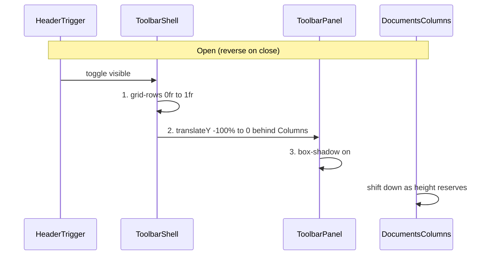

# Collapsible documents toolbar with staged CSS motion

## Current state

- [`affiliate-details.component.html`](apps/ishare/src/app/affiliate-details/affiliate-details.component.html) renders `pds-toolbar.c-affiliate-documents-toolbar` **always visible** at page level (lines 4–96).
- Card header only has title + sort button — no search/filter trigger.
- Shadow/elevation comes from `--p-card-shadow` on the toolbar’s inner `p-card` ([`_settings.affiliate-documents.scss`](libs/styles/src/01-settings/_settings.affiliate-documents.scss)).
- Prior art for discrete CSS reveals: [`_components.nav-shell.scss`](libs/styles/src/06-components/_components.nav-shell.scss) (`@starting-style`, `transition-behavior: allow-discrete`).

## Target UX



**Close** (user sequence): elevation off → slide down behind columns → collapse height so columns slide up.

**Open** (reverse): reserve height → slide in from above behind columns → add elevation.

**Trigger**: text `pButton` with `bi-search` + `bi-funnel` + label **Rechercher et filtrer** in the card header row (left of sort). Toggles toolbar; chevron-up in toolbar `slot="end"` also closes.

---

## 1. Angular state and template

**[`affiliate-details.component.ts`](apps/ishare/src/app/affiliate-details/affiliate-details.component.ts)**

- Add `documentFiltersToolbarVisible = signal(false)`.
- Add `toggleDocumentFiltersToolbar()` (open if closed; close if open).
- Add `closeDocumentFiltersToolbar()` for the chevron button.
- On open: `setTimeout(0)` focus `#document-search` (reuse existing input id).
- Optional: set `[inert]="!documentFiltersToolbarVisible()"` on shell when closed (a11y).

**[`affiliate-details.component.html`](apps/ishare/src/app/affiliate-details/affiliate-details.component.html)**

Wrap toolbar in an animation shell:

```html
<div
  class="c-affiliate-documents-toolbar-shell"
  [class.is-visible]="documentFiltersToolbarVisible()"
  [attr.aria-hidden]="!documentFiltersToolbarVisible()"
>
  <div class="c-affiliate-documents-toolbar-shell__clip">
    <pds-toolbar
      class="c-affiliate-documents-toolbar__panel ..."
      [sticky]="false"
    >
      <!-- existing start fields -->
      <ng-container slot="end">
        <button
          pButton
          text
          icon="bi bi-chevron-up"
          aria-label="Masquer les filtres"
          data-telemetry-id="documents-filter-toolbar-close"
          (click)="closeDocumentFiltersToolbar()"
        />
      </ng-container>
    </pds-toolbar>
  </div>
</div>
```

- Set `[sticky]="false"` on toolbar during animation (sticky + transform fights the slide-under effect). Sticky is unnecessary when the shell controls layout height.
- Card header row: add trigger button between title block and sort button:

```html
<button
  pButton
  type="button"
  text
  severity="secondary"
  class="c-affiliate-details__documents-filters-trigger"
  data-telemetry-id="documents-filter-toolbar-toggle"
  pdsTelemetryLabel="Rechercher et filtrer"
  [attr.aria-expanded]="documentFiltersToolbarVisible()"
  [disabled]="pageLoading()"
  (click)="toggleDocumentFiltersToolbar()"
>
  <i class="bi bi-search" aria-hidden="true"></i>
  <i class="bi bi-funnel" aria-hidden="true"></i>
  <span>Rechercher et filtrer</span>
</button>
```

- Raise columns above sliding panel: add `c-affiliate-details__columns--above-toolbar` (or always-on class) with `position: relative; z-index: 1`.

---

## 2. Motion tokens (ITCSS 01-settings)

**[`_settings.transitions.scss`](libs/styles/src/01-settings/_settings.transitions.scss)** — add Plectrum-aligned easing (from existing animation guidelines in Storybook):

| Token                              | Value                            | Use                |
| ---------------------------------- | -------------------------------- | ------------------ |
| `--pds-ease-standard`              | `cubic-bezier(0.4, 0, 0.2, 1)`   | height collapse    |
| `--pds-ease-snappy`                | `cubic-bezier(0.2, 0.9, 0.4, 1)` | slide transform    |
| `--pds-duration-toolbar-height`    | `220ms`                          | grid-row expansion |
| `--pds-duration-toolbar-slide`     | `200ms`                          | translateY         |
| `--pds-duration-toolbar-elevation` | `140ms`                          | box-shadow         |

**[`_settings.affiliate-documents.scss`](libs/styles/src/01-settings/_settings.affiliate-documents.scss)** — add `--pds-shadow-affiliate-documents-toolbar-none: 0 0 0 1px var(--pds-color-card-border), 0 0 0 0 transparent` for animated elevation (ring stays, shadow layers fade).

---

## 3. Animation SCSS (ITCSS 06-components)

**[`_components.affiliate-documents.scss`](libs/styles/src/06-components/_components.affiliate-documents.scss)** — new block `c-affiliate-documents-toolbar-shell`:

**Height (phase 1 open / phase 3 close)** — grid `0fr` ↔ `1fr` trick (no JS):

```scss
.c-affiliate-documents-toolbar-shell {
  display: grid;
  grid-template-rows: 0fr;
  z-index: 0;
  overflow: hidden;
  transition: grid-template-rows var(--pds-duration-toolbar-height)
    var(--pds-ease-standard) var(--pds-delay-toolbar-height-close); // delayed on close

  &__clip {
    min-height: 0;
    overflow: hidden;
  }

  &.is-visible {
    grid-template-rows: 1fr;
    transition-delay: 0ms; // open: height first, no delay
  }
}
```

**Panel slide + elevation** — target `.c-affiliate-documents-toolbar__panel .p-card` for `box-shadow` (elevation lives on card token bridge):

```scss
.c-affiliate-documents-toolbar__panel {
  transform: translateY(-100%); // exit: ends at +100% below
  transition:
    box-shadow var(--pds-duration-toolbar-elevation) var(--pds-ease-standard)
      var(--delay-elevation),
    transform var(--pds-duration-toolbar-slide) var(--pds-ease-snappy)
      var(--delay-slide);

  .p-card {
    box-shadow: var(--pds-shadow-affiliate-documents-toolbar-none);
    transition: box-shadow var(--pds-duration-toolbar-elevation)
      var(--pds-ease-standard) var(--delay-elevation);
  }
}

.is-visible .c-affiliate-documents-toolbar__panel {
  transform: translateY(0);
  .p-card {
    box-shadow: var(--pds-shadow-affiliate-documents-toolbar);
  }
}
```

**Staggered delays** (open vs close) via separate custom properties on shell base vs `.is-visible`:

| Phase                         | Open delay                    | Close delay                   |
| ----------------------------- | ----------------------------- | ----------------------------- |
| Height (`grid-template-rows`) | `0ms`                         | `340ms` (after slide)         |
| Slide (`transform`)           | `220ms` (after height starts) | `140ms` (after elevation off) |
| Elevation (`box-shadow`)      | `420ms` (last)                | `0ms` (first)                 |

Close exit transform: `translateY(100%)` when `.is-visible` is removed (panel slides down behind columns).

**Entry** — `@starting-style` on `.is-visible` (placed after open-state rules, per [Chrome entry/exit guidance](https://developer.chrome.com/blog/entry-exit-animations)):

```scss
&.is-visible {
  @starting-style {
    grid-template-rows: 0fr;
    .c-affiliate-documents-toolbar__panel {
      transform: translateY(-100%);
      .p-card {
        box-shadow: var(--pds-shadow-affiliate-documents-toolbar-none);
      }
    }
  }
}
```

**Columns foreground** — in [`_components.affiliate-details.scss`](libs/styles/src/06-components/_components.affiliate-details.scss):

```scss
.c-affiliate-details__columns {
  position: relative;
  z-index: 1;
}
```

**`prefers-reduced-motion`** — instant toggle, no transitions (same pattern as nav-shell).

**Trigger styles** — [`_components.affiliate-details.scss`](libs/styles/src/06-components/_components.affiliate-details.scss): `c-affiliate-details__documents-filters-trigger` — inline-flex, gap, icons + label (no Tailwind in HTML).

Remove obsolete sticky `::after` divider rules if `sticky` is disabled, or keep for future sticky-on-scroll variant.

---

## 4. Tests

**[`affiliate-details.component.spec.ts`](apps/ishare/src/app/affiliate-details/affiliate-details.component.spec.ts)**

- Replace “always visible sticky toolbar” with:
  - toolbar **hidden** by default (`!documentFiltersToolbarVisible()`, no `.is-visible`, shell `grid-template-rows` collapsed).
  - click trigger → `.is-visible` + fields rendered.
  - click chevron close → hidden again.
  - `aria-expanded` on trigger reflects state.
- Keep existing filter-field label/id tests; gate them behind `openDocumentFiltersToolbar()` helper.
- Update “toolbar at page level outside documents column” to assert shell wrapper placement.

No change to filter pipeline logic (`applyDocumentFilters`, etc.).

---

## 5. Out of scope / risks

- **Badge counts on trigger** for active search/filters — not requested; can follow up.
- **Browser support**: `grid-template-rows: 0fr` + `@starting-style` — Chrome 117+, Safari 17.5+; acceptable for internal iSHARE target. Fallback: `prefers-reduced-motion` path shows/hides instantly.
- **View Transitions API** — not needed; height + transform sequencing is local to this shell.
- Do **not** edit [`.cursor/plans/documents_filter_drawer_a74abfa8.plan.md`](.cursor/plans/documents_filter_drawer_a74abfa8.plan.md).
