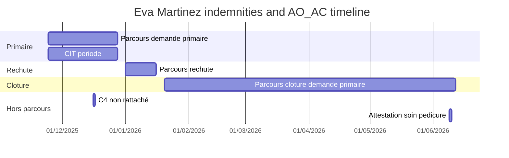

# iSHARE user testing scenarios

## Status: planning / not started

Two scoping decisions are still open (see "Open decisions" at the end). This document captures the research so it can be picked up later.

## App reality check (grounds every scenario)

The app has two real routes under a shared shell. All affiliate data is hard-coded to "Eva Martinez" regardless of `:id`. Many actions are placeholders (toasts / unbound outputs). Key files:

- Routes: [apps/ishare/src/app/app.routes.ts](apps/ishare/src/app/app.routes.ts)
- Affiliate page: [apps/ishare/src/app/affiliate-details/affiliate-details.component.html](apps/ishare/src/app/affiliate-details/affiliate-details.component.html) + `.ts`
- Document detail: [apps/ishare/src/app/affiliate-details/affiliate-document-detail/affiliate-document-detail.component.ts](apps/ishare/src/app/affiliate-details/affiliate-document-detail/affiliate-document-detail.component.ts)
- Drawer (Carte affilié): [libs/ui/src/lib/affiliate-detail-drawer](libs/ui/src/lib/affiliate-detail-drawer)
- Mock data: [apps/ishare/src/app/affiliate-details/affiliate-document-detail/affiliate-document-detail.mock.ts](apps/ishare/src/app/affiliate-details/affiliate-document-detail/affiliate-document-detail.mock.ts) and `EVA_MARTINEZ_*` constants in `affiliate-details.component.ts`
- Domain reference (legacy UI, same logic): [libs/assets/Guide opérateur iShare.pdf](libs/assets/Guide%20op%C3%A9rateur%20iShare.pdf) — operator guide, Jan 2024

## Operator guide reference (document taxonomy & content)

Source: [libs/assets/Guide opérateur iShare.pdf](libs/assets/Guide%20op%C3%A9rateur%20iShare.pdf). Legacy screenshots and labels; **business logic and document types are still valid** in the new app — only UI/UX changed.

### What iShare tracks (any sector)

Each document tab in the list shows:

- **Source** — IGED treatment file (e.g. "Gestion des certificats ITT", "Gestion des cartes de reprise")
- **Date de réception** — when IGED received the scan
- **Statut** — simplified IGED status

Document detail (right panel / second column) shows:

- **Délai de traitement** — estimated average from IBox (not real elapsed time)
- **Step timeline** — expandable rows: date, description, application, source (IGED)
- **IRIS** — link to scanned document image (access-gated, same rules as IRIS)
- **Incapacity period** — start/end dates on demande primaire panels

Status colour mapping (guide → new app severities):

| Guide  | Meaning                  | New app   |
| ------ | ------------------------ | --------- |
| Vert   | Accepté                  | `success` |
| Orange | En cours / En traitement | `warn`    |
| Rouge  | Refus                    | `danger`  |

List behaviour worth mocking: documents **clôturés** stay in "en cours" for **1 month**, then move to **archives** (3-month rule planned). Filters: by **secteur**, sort by **date de réception** or **dernière action**, **action en cours** (pending/processing → received → closed).

### Isolated documents (hors parcours)

Not every document belongs to an indemnities **parcours**. Some are **standalone** — received and processed on their own, without nesting under "Parcours Indemnités - Demande primaire / Rechute / …".

Legacy example (screenshot: `assets/c__Users_Kanar_AppData_Roaming_Cursor_User_workspaceStorage_84baa20712005e25d2ffd2759a32cbf0_images_composer-annotation-cd45f1ab-e289-43b0-9393-884042cbb3a6.png`):

- Left column: flat **Documents en cours** list (no parcours tree) — e.g. **Avantage Pédicure**, Assurance Complémentaire, Paiement pour les AC, and conditional indemnity docs such as **C4** when received but not yet linked to a parcours (Scenario 2).
- Right column: document detail as a **vertical audit timeline** (Reçu → En traitement → Clôturé → Accepté), not a multi-step indemnity stepper.
- Source/application: **Remboursements AO/AC** (not "Gestion des certificats ITT").

| Trait                      | Parcours document                              | Isolated document                                        |
| -------------------------- | ---------------------------------------------- | -------------------------------------------------------- |
| List placement (legacy)    | Grouped under parcours / workflow              | Flat row in **Documents en cours**                       |
| New app — Vue parcours ON  | Child of a `p-treenode` group                  | **Must not** appear inside a parcours group              |
| New app — Vue parcours OFF | Still listed (flattened from groups today)     | Primary discovery path — flat `sds-list`                 |
| Detail layout              | Stepper (Certificat médical → F.D.R. → Calcul) | Single timeline / audit events (like legacy right panel) |
| Typical sectors            | Indemnités                                     | AO/AC, remboursements, autres secteurs                   |

**App gap today:** all mock documents live inside `EVA_MARTINEZ_DOCUMENT_GROUPS` in [affiliate-details.component.ts](apps/ishare/src/app/affiliate-details/affiliate-details.component.ts). There is no `standaloneDocuments` (or equivalent) excluded from journey groups. Scenarios **2** (C4) and **5** (attestation pédicure) both require hors-parcours entries merged into `listItems` / `visibleDocuments` but **omitted from `listGroups`** when Vue parcours is enabled.

**Why documents end up isolated:** IGED may receive a scan (C4, attestation, etc.) before it is **rattaché** to the indemnity workflow. The parcours Calcul step still shows **C4 manquant** while the physical document already exists as a separate list row — a common operator puzzle (Scenario 2).

### Indemnités workflows (the test focus)

Two linked flux de travail drive indemnity scenarios:

1. **Demande Primaire - Régime général**
2. **Demande Incapacité** (opens when incapacity-related docs arrive)

Plus **Rechute - Régime général** (same structure as primaire) and **Rechute - Incapacité** (parallel incapacity flux during relapse). Workflows chain via prev/next navigation between related parcours.

#### Demande primaire — mandatory steps & panels

| Step                         | Panel / document                                | Mandatory?                                   | Mock content to include                                                                                                                                               |
| ---------------------------- | ----------------------------------------------- | -------------------------------------------- | --------------------------------------------------------------------------------------------------------------------------------------------------------------------- |
| 1. Certificat médical        | **CIT** (certificat ITT)                        | Yes — accepted CIT required to start         | Date réception, n° certificat, période incapacité, statut (Accepté / Refusé + raison), audit trail (Reçu → En traitement → Accepté), IRIS + Transactions CICS actions |
| 2. Feuilles de renseignement | **F.D.R. employeur** ou chômage                 | Yes                                          | Date réception, date du risque, statut, worker comment if incomplete                                                                                                  |
|                              | **F.D.R. affilié**                              | Yes                                          | Idem; link to incapacité de travail variant                                                                                                                           |
|                              | **Compte financier**                            | Yes                                          | Idem; liasse variant                                                                                                                                                  |
|                              | C4, déclarations d'accidents, questionnaires TI | Conditional in workflow **or hors parcours** | Missing in flux → **alerte** on Calcul (Scenario 2); received but **non rattaché** → isolated list document `doc-c4` (Scenario 2 resolution)                          |
| 3. Calcul                    | **CALC**                                        | Yes — verification + indemnity amount        | Date réception, statut (En attente / Accepté), worker comment for missing docs, indemnité outcome for Scenario 1                                                      |

Already partially mocked in `doc-demande-primaire`: CIT, three F.D.R. panels, Calcul with C4 warn comment. Gaps: CIT **refus** variant, chômage F.D.R. variant, déclaration accident / questionnaire TI panels, explicit **délai de traitement** and **indemnité** fields.

#### Demande incapacité — document types received during incapacity

Flux starts when any qualifying document is received. **Payments always sort chronologically at the top**; other docs stack below.

| Document type                                            | When it appears                                                    | Mock detail fields                                                                                                                    |
| -------------------------------------------------------- | ------------------------------------------------------------------ | ------------------------------------------------------------------------------------------------------------------------------------- |
| **Paiement**                                             | Each indemnity payment                                             | Date réception, date traitement, amount/period, statut                                                                                |
| **Prolongation**                                         | Extended incapacity                                                | Dates, link to CIT period                                                                                                             |
| **Carte de reprise**                                     | Return-to-work                                                     | Date réception, date clôture CIT, statut                                                                                              |
| **Attestation de VA** (vacances annuelles)               | Annual leave attestation                                           | Date réception, date traitement, date clôture                                                                                         |
| **Attestation de soin pédicure** / **Avantage Pédicure** | Podiatry care attestation or AO/AC benefit doc — **hors parcours** | Date réception (`09/06/2026` for Scenario 5), statut, audit timeline (Reçu → En traitement → …), application **Remboursements AO/AC** |
| **Fiche 225**                                            | F225 form                                                          | Date réception, statut                                                                                                                |
| **CIT** (prolongation cert.)                             | New/extended certificate                                           | Same as primaire CIT panel                                                                                                            |

**`doc-incapacite` mock (Figma comment — Scenario 1):** unnumbered stepper (`stepNumbered: false`); steps **Paiement** then **Certificat** (not the primaire CIT → F.D.R. → Calcul trio). Paiement: _pas de paiement reçu pour le moment_; Certificat: prolongation maladie **25/12/2025–27/12/2025**.

#### Rechute — same taxonomy, different parcours

- **Rechute - Régime général:** identical mandatory set to demande primaire (CIT → F.D.R. → CALC).
- **Rechute - Incapacité:** same ongoing doc types as demande incapacité (paiements top, VA/prolongation/carte de reprise below).
- Workflows **chain** across primaire ↔ incapacité ↔ rechute via navigation buttons (maps to new app parcours prev/next + "Vue parcours").

### Operator signals → mock UI elements

| Guide concept                 | Meaning                                                                        | New app mapping                                         | Mock idea                                                                                       |
| ----------------------------- | ------------------------------------------------------------------------------ | ------------------------------------------------------- | ----------------------------------------------------------------------------------------------- |
| **Message d'alerte**          | Document incomplete in IGED; action needed from affilié, employeur, or chômage | Worker comment (`severity: warn`) + deep-link count tag | Scenario 2 (C4 missing on Calcul); add alerte on F.D.R. panel for missing employeur doc         |
| **Puce d'information**        | Document linked by deduction — data unreliable or mis-filed                    | Info worker comment or info tag on list item            | Add one panel with info comment: "document lié par déduction — vérifier le rangement"           |
| **Réidentification affilié**  | Scan filed under wrong person                                                  | First audit event in timeline                           | Rare scenario; optional mock on a closed doc                                                    |
| **Réidentification document** | Wrong barcode, correct affilié                                                 | First activity in detail timeline                       | e.g. "Reçu Gestion certificats ITT → Réidentifié → Reçu Gestion cartes de reprise" (guide p.17) |

### Carnet affilié (drawer) — guide vs new app

| Guide field                                      | New app                                                      |
| ------------------------------------------------ | ------------------------------------------------------------ |
| Nom titulaire (bleu) / personnes à charge (noir) | Drawer Famille list — titulaire vs dependents styling        |
| Composition du carnet mutualiste                 | Famille accordion entries                                    |
| Notes / alertes                                  | Notes accordion (sensitive notes, e.g. "Personne agressive") |

### Map guide content → current mock coverage

| Guide area                                                  | In new mock today?                                                           | Priority for test data                                         |
| ----------------------------------------------------------- | ---------------------------------------------------------------------------- | -------------------------------------------------------------- |
| Demande primaire CIT + F.D.R. + CALC                        | Partial (`doc-demande-primaire`)                                             | Medium — add refus variant, délai traitement, indemnité status |
| Demande incapacité ongoing docs                             | Partial (`doc-incapacite` Paiement + Certificat prolongation)                | Medium — Scenario 1                                            |
| Rechute régime général + incapacité                         | Partial (`doc-rechute` full primaire-like flux; no rechute-incapacité split) | Medium                                                         |
| Paiements (chronological top)                               | No                                                                           | **High** for Scenario 1                                        |
| Attestation de soin pédicure (isolated / hors parcours)     | No                                                                           | **High** for Scenario 5                                        |
| Isolated document data model (exclude from parcours groups) | No                                                                           | **High** for Scenario 5                                        |
| Message d'alerte / incomplete                               | Partial (C4 warn on Calcul — Scenario 2 step 1)                              | Medium — extend to F.D.R.                                      |
| C4 hors parcours (non rattaché)                             | No                                                                           | **High** for Scenario 2 step 2                                 |
| Puce d'information (deduction)                              | No                                                                           | Low — good edge-case task                                      |
| Réidentification timeline                                   | Partial (CERTIFICAT_ITT_MORE_DETAILS has generic audit)                      | Low                                                            |
| IRIS / Transactions CICS actions                            | Buttons rendered, no handler                                                 | Scenario 4                                                     |
| Archived vs en cours (1-month rule)                         | Partial (`parcours-clotures` + archive toggle)                               | Medium                                                         |
| Secteur / date / action filters                             | UI exists                                                                    | Additional use-case #2                                         |

## Mock date coherence (all scenarios)

All mock data for Eva Martinez must tell **one timeline**. Dates appear in three layers — they must agree:

| Layer               | Where shown                                           | Rule                                                                                                                   |
| ------------------- | ----------------------------------------------------- | ---------------------------------------------------------------------------------------------------------------------- |
| **Parcours bounds** | Tree group header (début / fin)                       | `startDate` ≤ every child document réception; `endDate` ≥ last meaningful event in that parcours                       |
| **List row**        | Document card in `sds-list`                           | Sort key = réception (or parcours `startDate` today); **statut** badge = current IGED state, not a past or future step |
| **Detail / audit**  | Panel fields, worker comments, `moreDetails` timeline | Per panel: `date du risque` ≤ `date réception` ≤ audit events ascending; comment timestamps ≥ réception                |

### Format & parsing rules

- Always **DD/MM/YYYY** with a **4-digit year** (never `27/12/25` — breaks sort and header logic).
- Audit row timestamps: `DD/MM/YYYY HH:mm:ss`.
- Worker comments: suffix ` - DD/MM/YYYY HH:mm` must match or postdate the panel réception.

### Master timeline (Eva Martinez)

Assumed **facilitator "today"** for moderated tests: **June 2026** (after all mocked events).

| When             | Event                               | List / parcours                                           | Detail dates                                                                                                            |
| ---------------- | ----------------------------------- | --------------------------------------------------------- | ----------------------------------------------------------------------------------------------------------------------- |
| 24/11/2025       | CIT reçu                            | `parcours-demande-primaire` starts                        | CIT réception; audit Reçu 14:30                                                                                         |
| 25/11/2025       | CIT en traitement → accepté         | —                                                         | Audit En traitement → Accepté 27/11                                                                                     |
| 24/11–27/12/2025 | Incapacité primaire                 | CIT période; parcours fin                                 | `date du risque` 24/11 on F.D.R.                                                                                        |
| 05–15/12/2025    | F.D.R. + Calcul                     | `doc-demande-primaire` step 2–3                           | F.D.R. réception 05/12; Calcul réception 10/12; C4 alerte **15/12** (Scenario 2 — workflow still missing C4)            |
| 16/12/2025       | C4 reçu mais non rattaché           | **Hors parcours** `doc-c4` (Scenario 2)                   | Timeline Reçu 16/12; affiliate was right — doc exists outside flux                                                      |
| 25–27/12/2025    | Prolongation CIT (`doc-incapacite`) | Incapacité list item                                      | Certificat prolongation maladie; Paiement pas encore reçu                                                               |
| 27/12/2025       | Fin période CIT primaire            | Parcours demande primaire `endDate`                       | —                                                                                                                       |
| 01/01–15/01/2026 | Rechute (`doc-rechute`)             | `parcours-rechute`                                        | Même structure que demande primaire (CIT → F.D.R. → Calcul); toutes les dates de réception dans la période d'incapacité |
| 20/01–12/06/2026 | 2e demande primaire (en cours)      | `parcours-clotures`                                       | CIT réception 20/01, Accepté 22/01; F.D.R. / Calcul not started; parcours `endDate` = fin période CIT projetée          |
| 09/06/2026       | Attestation pédicure reçue          | **Hors parcours** `doc-attestation-pedicure` (Scenario 5) | Timeline Reçu 09/06; statut initial `Reçu` or `En traitement` if follow-up events on 10/06                              |

**Parcours sort order (Vue parcours, oldest first):** demande primaire → rechute → parcours clôturé.

**Flat list sort (réception):** demande primaire & incapacité (24/11/2025) → **C4** (16/12/2025) → rechute (01/01/2026) → cloture primaire (20/01/2026) → attestation pédicure (09/06/2026).

### Per-document status ↔ date spec (target state)

| Document                   | Parcours                                | List réception | List statut                   | Current step / bottleneck                             | Key inner dates                                                                                 |
| -------------------------- | --------------------------------------- | -------------- | ----------------------------- | ----------------------------------------------------- | ----------------------------------------------------------------------------------------------- |
| `doc-demande-primaire`     | demande primaire                        | 24/11/2025     | `En attente` (Calcul blocked) | Step 3 Calcul                                         | CIT Accepté 27/11; F.D.R. Clôturé 05–10/12; C4 warn **15/12/2025**                              |
| `doc-incapacite`           | demande primaire                        | 24/11/2025     | `En traitement`               | Step 1 Paiement (unnumbered flux)                     | Pas de paiement reçu; période 25–27/12/2025; prolongation CIT Accepté 25–27/12/2025             |
| `doc-rechute`              | rechute                                 | 01/01/2026     | `En traitement`               | Step 1 active; F.D.R. / Calcul in progress            | CIT Accepté 04/01; réception 02/01; période **01/01–15/01/2026**; F.D.R. 06–08/01; Calcul 10/01 |
| `doc-cloture-primaire`     | 2e demande primaire (parcours-clotures) | 20/01/2026     | **`En attente`**              | Step 1 only (CIT Accepté); steps 2–3 disabled / empty | CIT réception 20/01; période → 12/06/2026; audit 20–22/01/2026                                  |
| `doc-c4`                   | **none** (standalone)                   | **16/12/2025** | `Reçu` or `En traitement`     | Timeline only; **non rattaché** au parcours primaire  | Audit Reçu 16/12/2025 (day after Calcul alerte 15/12); workflow Calcul alert unchanged          |
| `doc-attestation-pedicure` | **none** (standalone)                   | **09/06/2026** | `Reçu` or `En traitement`     | Timeline only                                         | Audit Reçu 09/06/2026 13:28; optional En traitement 10/06 if mirroring legacy                   |

### Scenario date anchors

| #   | Scenario                         | Dates the facilitator / mock must align                                                                                                    |
| --- | -------------------------------- | ------------------------------------------------------------------------------------------------------------------------------------------ |
| 1   | Incapacity not yet paid          | CIT ends **27/12/2025**; paiement panel absent or `non versé` with réception after 27/12; no payment dated before primaire Calcul complete |
| 2   | C4 claimed sent, not in workflow | Calcul alerte **15/12/2025**; isolated `doc-c4` réception **16/12/2025** (non rattaché — explains affiliate claim)                         |
| 3   | Jack's dossier                   | Jack DOB **14/08/2015** (drawer Famille); no conflicting parent dates                                                                      |
| 4   | Transactions CICS                | No date task; optional facilitator sets context "vacances ONVA" — unrelated to indemnity timeline                                          |
| 5   | Attestation pédicure             | Affiliate says **09/06/2026**; list réception + first audit Reçu = **09/06/2026**; document **not** inside any parcours group              |

### Known incoherences to fix when implementing mocks

| Issue                                | Today                         | Target                                                                                                                                |
| ------------------------------------ | ----------------------------- | ------------------------------------------------------------------------------------------------------------------------------------- |
| Scenario 1 narrative                 | Plan said CIT ends 24/12/2025 | **27/12/2025** (matches CIT période + parcours `endDate`)                                                                             |
| `parcours-clotures` label vs content | Name suggests "clôturé"       | **In-progress** 2e demande primaire; only step 1 populated; list **En attente**                                                       |
| Header Dernière action               | `Document reçu 12/06/2026`    | Revisit when `latestJourneyGroupId` logic uses `endDate` — may need **dernière action** from most recent event, not projected CIT fin |
| Attestation pédicure                 | Not in mock                   | **09/06/2026** only; must not inherit parcours `startDate` from groups                                                                |
| C4 isolated                          | Not in mock                   | **16/12/2025** réception; must coexist with Calcul **C4 manquant** alert (doc received but not linked)                                |
| 2-digit years                        | Removed from code             | Ban in all new mock strings                                                                                                           |

**Validation checklist** (run before user testing):

1. Toggle Vue parcours ON/OFF — document order matches réception chronology.
2. Open each scenario anchor document — panel réception ≤ audit events ≤ statut transition dates.
3. Scenario 5 — attestation visible in flat list only; réception exactly **09/06/2026**.
4. Scenario 2 — (a) deep-link tag → Calcul alerte **15/12/2025**; (b) Vue parcours OFF → isolated **C4** réception **16/12/2025**; workflow alert still present.
5. Scenario 1 — no paiement `Accepté`/`Envoyé` before 27/12/2025.
6. Scenario 5 — attestation pédicure réception **09/06/2026**, flat list only.

## The 5 proposed scenarios - feasibility

- Scenario 1 - Dec 2025 incapacity, not yet paid: **PARTIAL / testable for discovery.** Open **`doc-incapacite`** in the demande primaire parcours → unnumbered stepper: **Paiement** (info comment _pas de paiement reçu pour le moment_, période 25–27/12/2025) then **Certificat** (prolongation maladie 25–27/12/2025, Accepté). Primaire CIT period ends **27/12/2025**. Root cause of non-payment may still link to missing C4 on `doc-demande-primaire` Calcul — facilitator can probe whether operator connects both dossiers.
- Scenario 2 - C4 claimed sent, not visible in workflow: **PARTIAL** today (step 1 only). **Use case (verbatim):** _"Il prétend avoir remis son C4 pour sa demande primaire mais vous ne le trouvez pas dans les workflows. Où allez-vous trouver l'information ?"_ **Expected operator path (two beats):** (1) Open **demande primaire** → Calcul step → **message d'alerte** / warn worker comment: C4 not received in the flux ([mock L202-206](apps/ishare/src/app/affiliate-details/affiliate-document-detail/affiliate-document-detail.mock.ts)), reachable via the "1" warning count tag; affiliate insists they posted it. (2) C4 is **not** a panel inside the stepper when non rattaché — operator turns **Vue parcours OFF** (or searches flat **Documents en cours**) and finds **`doc-c4`** as an **isolated document** (hors parcours): réception **16/12/2025**, timeline Reçu, application IGED indemnités. The workflow alert stays until the doc is linked — affiliate was right that it was received, wrong that it would appear in the parcours. **Gap:** no `doc-c4` in `EVA_MARTINEZ_STANDALONE_DOCUMENTS`; step 2 not testable. **Success criteria:** operator cites Calcul alerte, then locates standalone C4 with matching réception date and explains it is received but not yet attached to the demande primaire workflow.
- Scenario 3 - Find child Jack's iShare dossier without affiliate search: NOT COMPLETABLE today. Jack Mota exists in the drawer Famille list (`enfant a charge`), but the family arrow button's `familyMemberSelect` output is not bound in the app, and all data is hard-coded to Eva Martinez, so there is no child dossier to navigate to. Requires building family-member navigation (real or mocked) before this can be tested.
- Scenario 4 - Launch a CICS transaction from the dossier: NOT COMPLETABLE today. Legacy iShare exposes a header **Transactions CICS** button that opens a modal with a warning banner, a searchable transaction table (columns: Transaction / Description / Actions), and per-row external-link CTAs to open the transaction in CICS (see legacy screenshot in `assets/image-d7c6548b-a00c-4a0d-8bd1-51212dac2701.png`). The new app shows **Transactions CICS** as panel action buttons on document detail panels (Certificat ITT, F.D.R. panels, Calcul) but they have no click handler and no modal/drawer exists. Task idea: _"The affiliate asks about their ONVA vacation days — find and open the right CICS transaction."_ Success = open modal, search (e.g. `UA38`), launch CICS CTA. Requires building the modal/drawer + wiring actions (header-level entry point optional but matches legacy mental model).
- Scenario 5 - Attestation de soin pédicure receipt check (isolated document): NOT COMPLETABLE today. **Use case (verbatim):** _"J'ai remis une attestation de soin pédicure le 9/06/2026, est-ce que vous l'avez bien reçue?"_ This is an **isolated document** — **not attached to any parcours**. Legacy iShare shows the same class of doc as **Avantage Pédicure** in a flat **Documents en cours** list, with detail as an audit timeline (Reçu / En traitement / Clôturé / Accepté) under application **Remboursements AO/AC** (see legacy screenshot above). **Reçu date for the test:** `09/06/2026` (affiliate-stated hand-in date; operator must match this to **date de réception** and the first **Reçu** audit event). **Discovery path:** turn **Vue parcours OFF** → flat document list → locate attestation (search "pédicure" or sort by date) → open detail → read réception date + timeline. With Vue parcours ON, the document must **not** appear nested under a parcours group (today impossible — all mocks are inside groups). Gaps: no standalone mock entry, no timeline-only detail layout for hors-parcours docs, no AO/AC sector document. **Mock to add:** `doc-attestation-pedicure` in a new `EVA_MARTINEZ_STANDALONE_DOCUMENTS` array — list title _Attestation de soin pédicure_ (or _Avantage Pédicure_), date réception `09/06/2026`, statut `Reçu` or `En traitement`, timeline-first detail (not indemnity stepper), excluded from `listGroups`. Success criteria: operator disables or ignores parcours view, finds the isolated document, confirms réception on **09/06/2026**, answers yes/no clearly.

## Incapacity domain logic (mock data guide)

Reference diagram: `assets/image-5ddebb37-1406-4045-8b1d-bf89d91e683e.png`

The indemnities parcours follows a fixed lifecycle. Mock data for Eva Martinez should reflect these rules so scenarios (especially Scenario 1) tell a coherent story.

### Parcours structure

| Phase                   | Document type                        | What it contains                                                                      |
| ----------------------- | ------------------------------------ | ------------------------------------------------------------------------------------- |
| **1. Demande primaire** | Demande primaire - Régime général    | Documents obligatoires pour percevoir la première indemnité                           |
|                         | Incapacité (within primary parcours) | Documents reçus au cours de l'incapacité                                              |
| **2. Rechute**          | Rechute - Régime général             | Documents obligatoires pour percevoir la première indemnité (same doc set as primary) |
|                         | Rechute - Incapacité                 | Documents reçus au cours de l'incapacité                                              |
| **3. Invalidité**       | Invalidité                           | Documents reçus au cours de l'invalidité                                              |

### Business rules (when each phase applies)

- **Rechute trigger:** L'affilié retombe en maladie dans les **14 jours** qui suivent sa reprise au travail pour une incapacité, ou dans les **3 mois** pour une invalidité.
- **Invalidité trigger:** Après **1 an** d'incapacité continue.

### Current mock gaps vs domain logic

What exists today in `EVA_MARTINEZ_DOCUMENT_GROUPS` / `EVA_MARTINEZ_DOCUMENT_DETAILS`:

- **Demande primaire parcours** (`parcours-demande-primaire`, **24/11/2025–27/12/2025**): `doc-demande-primaire` has full stepper detail (Certificat ITT, F.D.R. panels, Calcul with C4 warn comment **15/12/2025**). `doc-incapacite` exists in the list but its detail record has **empty panels** — must be filled with paiement **non versé** for post-27/12/2025 period (Scenario 1).
- **Rechute parcours** (`parcours-rechute`, **01/01/2026–15/01/2026**): `doc-rechute` mirrors **demande primaire** (CIT → F.D.R. → Calcul); `activeStep: 1`; all réception dates within période **01/01–15/01/2026** (Figma: _même chose que la demande primaire_).
- **Invalidité:** No parcours or document yet (would start ≥24/11/2026 per 1-year rule).
- **2e demande primaire parcours** (`parcours-clotures`, **20/01/2026–12/06/2026**): `doc-cloture-primaire` — list **En attente**; detail **activeStep 1** only with Certificat ITT (same structure as `doc-demande-primaire` step 1); steps 2–3 empty (disabled in stepper UI).
- **Standalone (planned):** `doc-c4`, réception **16/12/2025**, hors parcours (Scenario 2); `doc-attestation-pedicure`, réception **09/06/2026**, hors parcours (Scenario 5).

### Suggested mock data to add (when building flows)

Aligned with the operator guide taxonomy (see section above):

1. **`doc-incapacite`** (done — Figma Bodi Gil comment): unnumbered **Paiement** + **Certificat** prolongation (25–27/12/2025); extend later with attestation VA, carte de reprise if needed. _(Do not put attestation pédicure here — hors parcours.)_
   1b. **Add `doc-c4` as isolated document** (Scenario 2): in `EVA_MARTINEZ_STANDALONE_DOCUMENTS`; list title **C4** (or _Attestation C4_); réception **16/12/2025** (one day after Calcul alerte 15/12); statut `Reçu`; timeline-only detail (no worker comment — discovery is via flat list + réception date). **Do not** add C4 as a Calcul panel — the test depends on it being absent from the workflow.
   1c. **Add `doc-attestation-pedicure` as isolated document** (Scenario 5): same array; title _Attestation de soin pédicure_, réception **09/06/2026**, application Remboursements AO/AC, timeline: Reçu **09/06/2026** → optional En traitement **10/06/2026** (legacy pattern). List statut must match latest timeline state.
   1d. **Align list statuts with step progress:** `doc-cloture-primaire` → `En attente` (step 1 only); `doc-demande-primaire` → `En attente` until Calcul accepts (blocked — isolated C4 not linked).
2. **Optional:** split rechute into `doc-rechute-incapacite` (paiements + VA, unnumbered flux like `doc-incapacite`) as sibling list item. `doc-rechute` régime général mock is done.
3. **Enrich `doc-demande-primaire`**: add `délai de traitement` field on detail header; one **refus CIT** example in closed parcours; optional chômage F.D.R. variant; explicit **indemnité** outcome on Calcul ("non versée — C4 manquant").
4. **Operator signals**: one **alerte** on an F.D.R. panel (incomplete — action employeur); one **puce d'information** panel (lié par déduction); optional **réidentification** audit event on a secondary panel.
5. **Add invalidité parcours** (optional v1): ≥ 1 year after incapacity start; invalidity-period documents per diagram.
6. **Transactions CICS mock list**: UA38 (jours vacances ONVA), UALG, UBET, UCAB, UCCT, UCDM, UCFI — matches legacy modal screenshot and guide indemnités context.

## Additional use-case suggestions

Grounded in features that exist:

1. Search -> dossier entry: From Home, search by O.A. (319) + NISS and land on the affiliate page. Tests the entry funnel and breadcrumb.
2. Filter the document list: Use header info-tag filters (Documents actifs / Documents clotures / Derniere action) and the toolbar "Documents archives seulement" toggle to narrow the list. "Show me only closed documents."
3. Journey vs flat view: Toggle "Vue parcours" and ask the tester to locate a document both ways; compare which mental model they prefer.
4. Multi-target comment deep-link: Click the "2" info count tag, choose a panel from the popover (e.g. F.D.R. affilie - Incapacite), confirm they understand the jump + highlight. Tests the deep-link affordance and the new message pulse highlight.
5. Step-through a workflow: Use the stepper (Certificat medical -> Feuilles de renseignement -> Calcul) with prev/next, open accordions, and read the worker comment. "Walk me through where this request stands."
6. Audit trail / "Voir plus de details": Open the timeline drawer on Certificat ITT and interpret the audit events (24-27/11/2025). Tests comprehension of the history view.
7. Copy an identifier: Use a copyable identifier (NISS / N de contrat) - small but common real task.
8. Incomplete document / alerte: Find the message d'alerte on a panel where IGED status is incomplete and identify who must act (affilié, employeur, chômage). Tests worker-comment + alert affordance per guide p.12.
   8b. C4 hors parcours (Scenario 2): After seeing Calcul C4-missing alert, locate standalone **C4** in flat list and explain non-rattachement. Tests Vue parcours OFF + isolated-document mental model.
9. Mis-filed document (puce d'information): Locate a panel flagged as "lié par déduction" and explain what it means. Tests info-severity comment comprehension.
10. Workflow chaining: From rechute incapacité, use parcours navigation to jump back to demande primaire régime général. Tests cross-parcours linking described in guide p.15.
11. Document receipt verification (isolated doc): Affiliate states they submitted a document on a specific date — operator must confirm reception. Scenario 5 (_attestation de soin pédicure_, réception **09/06/2026**, **hors parcours**). Tests turning off Vue parcours, flat-list search/sort, date de réception, and audit timeline literacy.

Avoid over-testing placeholders: family arrow navigation, drawer menu / Actions rapides, status "Action requise" workflow, the Documents tab inside the drawer, Transactions CICS panel buttons (no handler/modal), and real API lookup by `:id`.

## Should we capture data? - recommendation

Yes, lightweight quantitative capture meaningfully complements moderated observation. The app currently has NO analytics/telemetry of any kind, so anything here is net-new.

Metrics worth capturing per task:

- Task success (completed / partial / failed / gave up) - usually recorded by the facilitator, not code.
- Time on task (start of task -> success event).
- Click/interaction count and the path of clicks (which sections they explored before finding the answer).
- Misclicks / dead-ends: clicks on placeholders (Actions rapides, drawer menu, status button) signal where users expect functionality that is not there.
- Idle / hesitation time on specific zones (e.g. time hovering the document list before first click) - signals confusion.
- Deep-link tag usage: did they discover the count tags, or scroll manually?
- Transactions CICS (Scenario 4): modal open, search used, which transaction launched.

Capture options (lightweight -> heavier):

- A. No code: screen + audio recording + facilitator notes. Fastest to start, good for small N.
- B. Minimal in-app event logger: a tiny `TestingTelemetryService` that records `{ event, target, timestamp, taskId }` to memory and exports JSON/CSV at session end. A single global click listener + a few explicit markers (task start/end, drawer open, tag click). Respects the project's no-analytics-dependency posture; no third-party SDK.
- C. Third-party product analytics (PostHog / Matomo) with session replay + heatmaps. Most insight, but adds a dependency and privacy/consent overhead - likely overkill for moderated scenario testing.

Recommendation: B for quantitative signals if we want data, layered on top of A (recording + notes). Keep it test-only (env flag or separate build) so it never ships to production.

## Open decisions (asked, not yet answered)

1. Deliverable scope: protocol document only, protocol + in-app data capture, or data capture only.
2. Placeholder handling: test only what exists (rewrite/drop Scenario 3 + reframe Scenarios 1 and 5, test Scenario 2 step 1 only, skip Scenario 4), build the missing flows (family navigation + payment status + **standalone C4 + attestation pédicure mocks + isolated-doc list model** + Transactions CICS modal + enriched incapacity mock data) so all scenarios are completable, or add mock-only stubs just for testing.

## Suggested next steps once decisions are made

- If protocol-only: produce a structured test script (intro, consent, tasks 1..N with success criteria, post-task questions, SUS/debrief) as a markdown doc under the repo (e.g. `docs/user-testing/`).
- If instrumentation: add a test-only `TestingTelemetryService` in `libs/` behind an environment flag, a global click/idle listener, explicit task-start/stop markers in `affiliate-details`, and a JSON/CSV export. No production wiring.
- If building missing flows: wire `familyMemberSelect` -> a (mock) child dossier; enrich mock data per incapacity domain logic + operator guide taxonomy (document types, statuses, audit events, alertes); apply **Mock date coherence** section (master timeline, list statuts, audit ordering); add **standalone documents** (`EVA_MARTINEZ_STANDALONE_DOCUMENTS`) for hors-parcours **C4** (réception 16/12/2025, Scenario 2) and **attestation pédicure** (réception 09/06/2026, Scenario 5); add an incapacity/payment status indicator; build the Transactions CICS modal/drawer (searchable table + CICS launch CTA) and wire panel/header actions — all behind the existing mock data layer.
